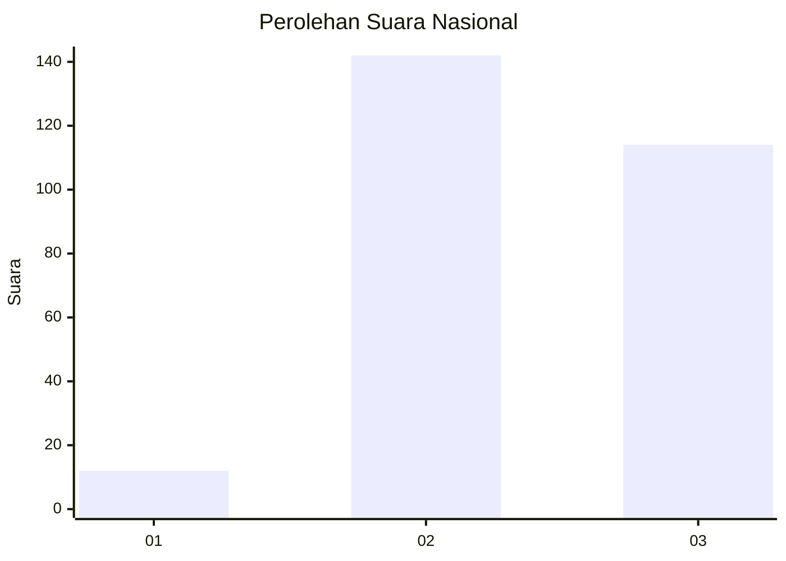
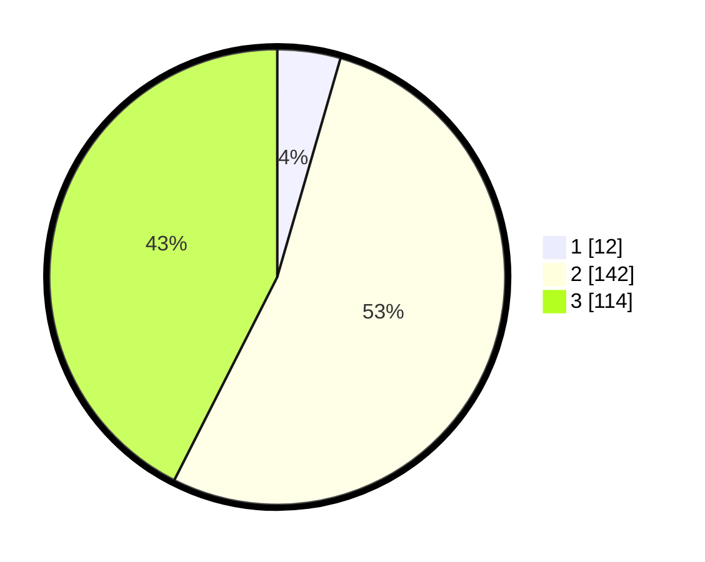

# Hasil

## Grafik

## Tabel

| No. | Nama Paslon    | Suara | Suara (raw) | Persentase |
|:--- |:-------------- | -----:| -----------:| ----------:|
| 1   | ANIES MUHAIMIN | 12    | [12][p-1]   | 4,48       |
| 2   | PRABOWO GIBRAN | 142   | [142][p-2]  | 52,99      |
| 3   | GANJAR MAHFUD  | 114   | [114][p-3]  | 42,54      |

[p-1]: https://github.com/gigit-pemilu/pemilu-2024/blob/main/pilpres/hitung-suara/sub/51-bali/sub/03-badung/sub/02-mengwi/sub/1016-lukluk/sub/021-tps/sub/paslon-1.txt
[p-2]: https://github.com/gigit-pemilu/pemilu-2024/blob/main/pilpres/hitung-suara/sub/51-bali/sub/03-badung/sub/02-mengwi/sub/1016-lukluk/sub/021-tps/sub/paslon-2.txt
[p-3]: https://github.com/gigit-pemilu/pemilu-2024/blob/main/pilpres/hitung-suara/sub/51-bali/sub/03-badung/sub/02-mengwi/sub/1016-lukluk/sub/021-tps/sub/paslon-3.txt

## Foto C Plano

https://sirekap-obj-formc.kpu.go.id/8ff0/pemilu/ppwp/51/03/02/10/16/5103021016021-20240214-141948--3678e281-bb9f-49c3-ab7c-0938f464ad6f.jpg

https://sirekap-obj-formc.kpu.go.id/8ff0/pemilu/ppwp/51/03/02/10/16/5103021016021-20240216-141626--3f3ed93e-2dc0-4ea0-948f-18477f9aa404.jpg

https://sirekap-obj-formc.kpu.go.id/8ff0/pemilu/ppwp/51/03/02/10/16/5103021016021-20240214-225637--df8339aa-e5fa-46b2-8333-b76620dee292.jpg

## Metadata

| Key        | Value               |
| ---------- | ------------------- |
| Time Stamp | 2024-02-21 21:00:04 |

## DATA PEMILIH TETAP

Jumlah pemilih dalam DPT: **287**.
 * L: **134**.
 * P: **153**.

## DATA PENGGUNA HAK PILIH

Jumlah pengguna hak pilih dalam DPT: **266**.
 * L: **124**.
 * P: **142**.

Jumlah pengguna hak pilih dalam DPTb: **2**.
 * L: **1**.
 * P: **1**.

Jumlah pengguna hak pilih dalam DPK: **2**.
 * L: **0**.
 * P: **2**.

Jumlah pengguna hak pilih: **270**.
 * L: **125**.
 * P: **145**.

## JUMLAH SUARA SAH DAN TIDAK SAH

JUMLAH SELURUH SUARA SAH: **268**.

JUMLAH SUARA TIDAK SAH: **2**.

JUMLAH SELURUH SUARA SAH DAN SUARA TIDAK SAH: **270**.

