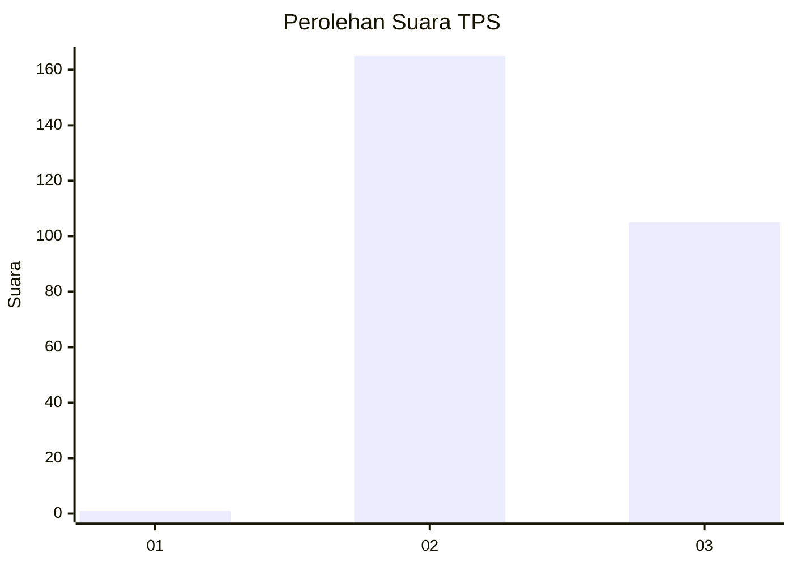
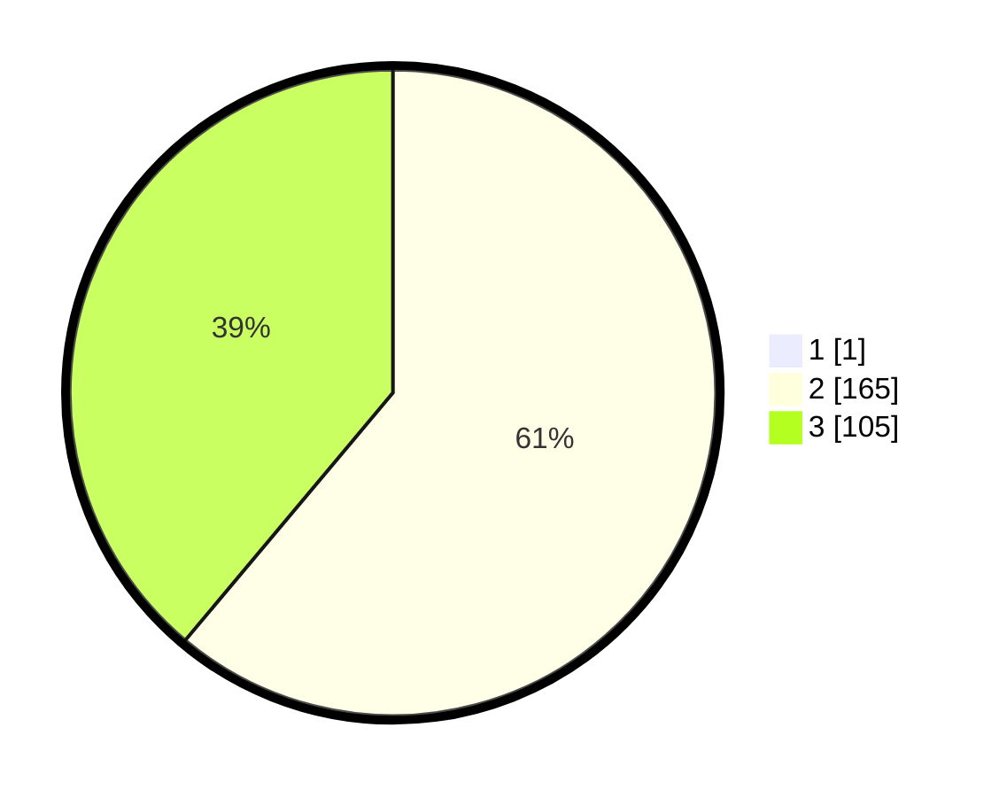

# Hasil

## Grafik

## Tabel

| No. | Nama Paslon    | Suara | Suara (raw) | Persentase |
|:--- |:-------------- | -----:| -----------:| ----------:|
| 1   | ANIES MUHAIMIN | 1     | [1][p-1]    | 0,37       |
| 2   | PRABOWO GIBRAN | 165   | [165][p-2]  | 60,89      |
| 3   | GANJAR MAHFUD  | 105   | [105][p-3]  | 38,75      |

[p-1]: https://github.com/gigit-pemilu/pemilu-2024-51-bali/blob/main/pilpres/hitung-suara/sub/51-bali/sub/03-badung/sub/02-mengwi/sub/2001-munggu/sub/002-tps/sub/paslon-1.txt
[p-2]: https://github.com/gigit-pemilu/pemilu-2024-51-bali/blob/main/pilpres/hitung-suara/sub/51-bali/sub/03-badung/sub/02-mengwi/sub/2001-munggu/sub/002-tps/sub/paslon-2.txt
[p-3]: https://github.com/gigit-pemilu/pemilu-2024-51-bali/blob/main/pilpres/hitung-suara/sub/51-bali/sub/03-badung/sub/02-mengwi/sub/2001-munggu/sub/002-tps/sub/paslon-3.txt

## Foto C Plano

https://sirekap-obj-formc.kpu.go.id/5373/pemilu/ppwp/51/03/02/20/01/5103022001002-20240215-010125--f597a658-8580-4a45-9bca-118c44f991ab.jpg

https://sirekap-obj-formc.kpu.go.id/5373/pemilu/ppwp/51/03/02/20/01/5103022001002-20240215-010139--b0cf9cc4-215b-4dcf-878e-2d24bbedf715.jpg

https://sirekap-obj-formc.kpu.go.id/5373/pemilu/ppwp/51/03/02/20/01/5103022001002-20240215-010151--e3d52d76-f26e-4e57-a605-491a3e7daff2.jpg

## Metadata

| Key        | Value               |
| ---------- | ------------------- |
| Time Stamp | 2024-02-15 12:00:28 |

## DATA PEMILIH TETAP

Jumlah pemilih dalam DPT: **274**.
 * L: **137**.
 * P: **737**.

## DATA PENGGUNA HAK PILIH

Jumlah pengguna hak pilih dalam DPT: **265**.
 * L: **132**.
 * P: **133**.

Jumlah pengguna hak pilih dalam DPTb: **3**.
 * L: **2**.
 * P: **1**.

Jumlah pengguna hak pilih dalam DPK: **4**.
 * L: **0**.
 * P: **4**.

Jumlah pengguna hak pilih: **272**.
 * L: **134**.
 * P: **138**.

## JUMLAH SUARA SAH DAN TIDAK SAH

JUMLAH SELURUH SUARA SAH: **271**.

JUMLAH SUARA TIDAK SAH: **1**.

JUMLAH SELURUH SUARA SAH DAN SUARA TIDAK SAH: **272**.

