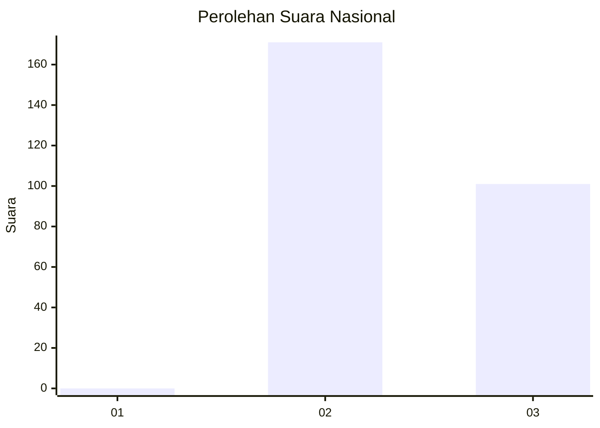
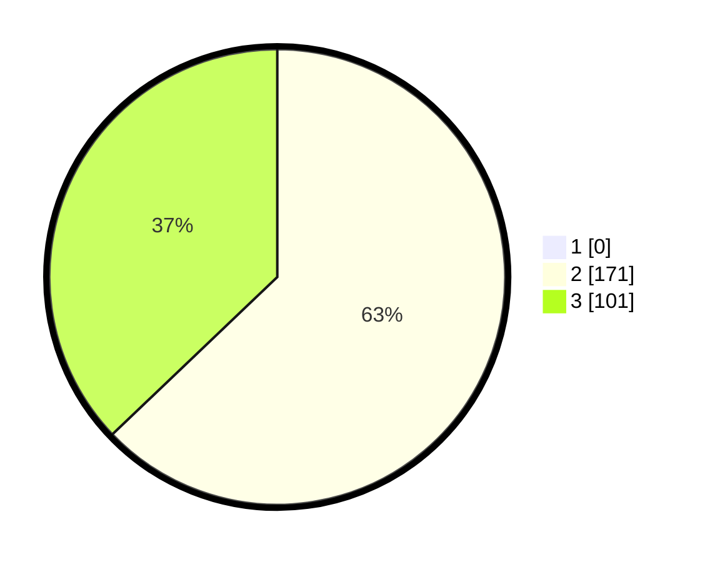

# Hasil

## Grafik

## Tabel

| No. | Nama Paslon    | Suara | Suara (raw) | Persentase |
|:--- |:-------------- | -----:| -----------:| ----------:|
| 1   | ANIES MUHAIMIN | 0     | [0][p-1]    | 0,00       |
| 2   | PRABOWO GIBRAN | 171   | [171][p-2]  | 62,87      |
| 3   | GANJAR MAHFUD  | 101   | [101][p-3]  | 37,13      |

[p-1]: https://github.com/gigit-pemilu/pemilu-2024/blob/main/pilpres/hitung-suara/sub/51-bali/sub/03-badung/sub/02-mengwi/sub/2001-munggu/sub/004-tps/sub/paslon-1.txt
[p-2]: https://github.com/gigit-pemilu/pemilu-2024/blob/main/pilpres/hitung-suara/sub/51-bali/sub/03-badung/sub/02-mengwi/sub/2001-munggu/sub/004-tps/sub/paslon-2.txt
[p-3]: https://github.com/gigit-pemilu/pemilu-2024/blob/main/pilpres/hitung-suara/sub/51-bali/sub/03-badung/sub/02-mengwi/sub/2001-munggu/sub/004-tps/sub/paslon-3.txt

## Foto C Plano

https://sirekap-obj-formc.kpu.go.id/38e3/pemilu/ppwp/51/03/02/20/01/5103022001004-20240214-204436--73966c26-dbc7-4a23-834e-443e2adbd1cf.jpg

https://sirekap-obj-formc.kpu.go.id/38e3/pemilu/ppwp/51/03/02/20/01/5103022001004-20240214-204302--22676712-7843-456e-801f-3d60c755ece0.jpg

https://sirekap-obj-formc.kpu.go.id/38e3/pemilu/ppwp/51/03/02/20/01/5103022001004-20240214-185224--9aaca98c-36a7-4956-ac60-7b978d50f1ad.jpg

## Metadata

| Key        | Value               |
| ---------- | ------------------- |
| Time Stamp | 2024-02-15 00:41:44 |

## DATA PEMILIH TETAP

Jumlah pemilih dalam DPT: **293**.
 * L: **142**.
 * P: **151**.

## DATA PENGGUNA HAK PILIH

Jumlah pengguna hak pilih dalam DPT: **274**.
 * L: **133**.
 * P: **141**.

Jumlah pengguna hak pilih dalam DPTb: **0**.
 * L: **0**.
 * P: **0**.

Jumlah pengguna hak pilih dalam DPK: **0**.
 * L: **0**.
 * P: **0**.

Jumlah pengguna hak pilih: **274**.
 * L: **133**.
 * P: **141**.

## JUMLAH SUARA SAH DAN TIDAK SAH

JUMLAH SELURUH SUARA SAH: **272**.

JUMLAH SUARA TIDAK SAH: **2**.

JUMLAH SELURUH SUARA SAH DAN SUARA TIDAK SAH: **274**.

