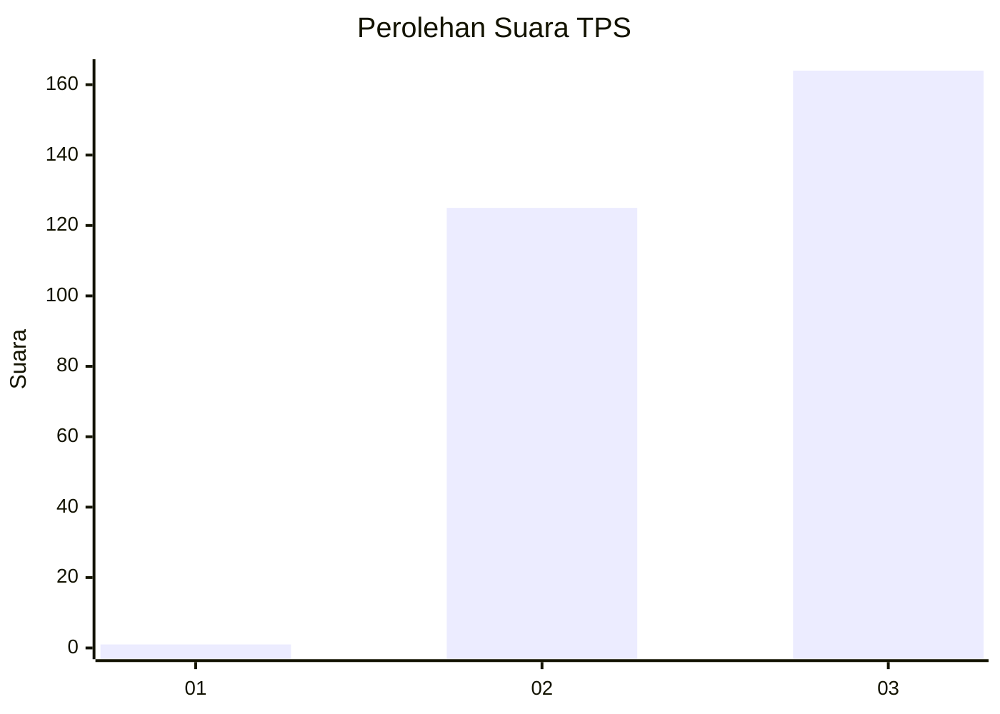
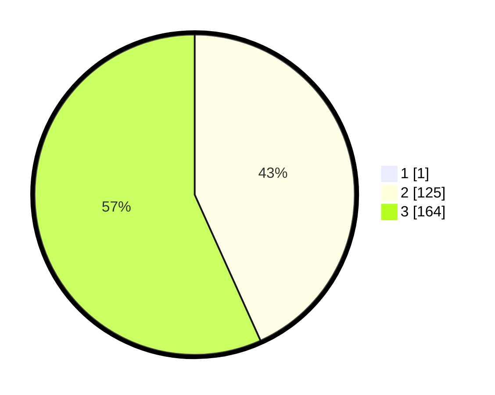

# Hasil

## Grafik

## Tabel

| No. | Nama Paslon    | Suara | Suara (raw) | Persentase |
|:--- |:-------------- | -----:| -----------:| ----------:|
| 1   | ANIES MUHAIMIN | 1     | [1][p-1]    | 0,34       |
| 2   | PRABOWO GIBRAN | 125   | [125][p-2]  | 43,10      |
| 3   | GANJAR MAHFUD  | 164   | [164][p-3]  | 56,55      |

[p-1]: https://github.com/gigit-pemilu/pemilu-2024-51-bali/blob/main/pilpres/hitung-suara/sub/51-bali/sub/03-badung/sub/02-mengwi/sub/2001-munggu/sub/007-tps/sub/paslon-1.txt
[p-2]: https://github.com/gigit-pemilu/pemilu-2024-51-bali/blob/main/pilpres/hitung-suara/sub/51-bali/sub/03-badung/sub/02-mengwi/sub/2001-munggu/sub/007-tps/sub/paslon-2.txt
[p-3]: https://github.com/gigit-pemilu/pemilu-2024-51-bali/blob/main/pilpres/hitung-suara/sub/51-bali/sub/03-badung/sub/02-mengwi/sub/2001-munggu/sub/007-tps/sub/paslon-3.txt

## Foto C Plano

https://sirekap-obj-formc.kpu.go.id/a401/pemilu/ppwp/51/03/02/20/01/5103022001007-20240215-113842--cd9248b3-c12e-415c-a809-d50394bb6167.jpg

https://sirekap-obj-formc.kpu.go.id/a401/pemilu/ppwp/51/03/02/20/01/5103022001007-20240216-084528--f9c1017f-81e9-4139-928e-3f83569ee418.jpg

https://sirekap-obj-formc.kpu.go.id/a401/pemilu/ppwp/51/03/02/20/01/5103022001007-20240216-084847--a234a250-96cb-4f23-97c7-c95cd8d559f4.jpg

## Metadata

| Key        | Value               |
| ---------- | ------------------- |
| Time Stamp | 2024-02-16 09:00:28 |

## DATA PEMILIH TETAP

Jumlah pemilih dalam DPT: **254**.
 * L: **125**.
 * P: **129**.

## DATA PENGGUNA HAK PILIH

Jumlah pengguna hak pilih dalam DPT: **244**.
 * L: **123**.
 * P: **121**.

Jumlah pengguna hak pilih dalam DPTb: **1**.
 * L: **1**.
 * P: **0**.

Jumlah pengguna hak pilih dalam DPK: **0**.
 * L: **0**.
 * P: **0**.

Jumlah pengguna hak pilih: **245**.
 * L: **124**.
 * P: **121**.

## JUMLAH SUARA SAH DAN TIDAK SAH

JUMLAH SELURUH SUARA SAH: **240**.

JUMLAH SUARA TIDAK SAH: **5**.

JUMLAH SELURUH SUARA SAH DAN SUARA TIDAK SAH: **245**.

