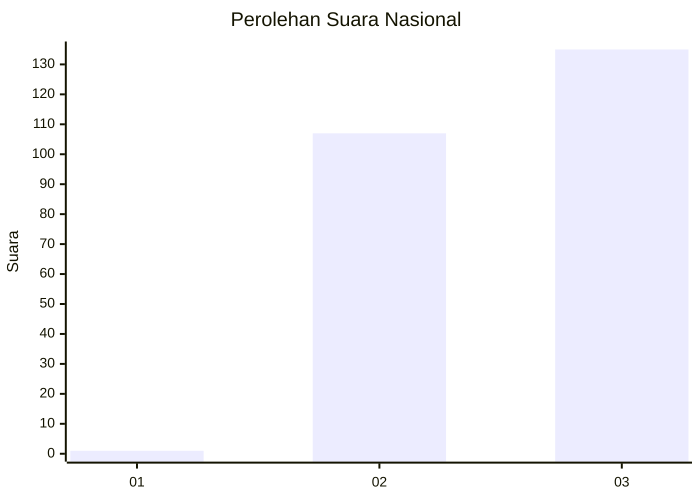
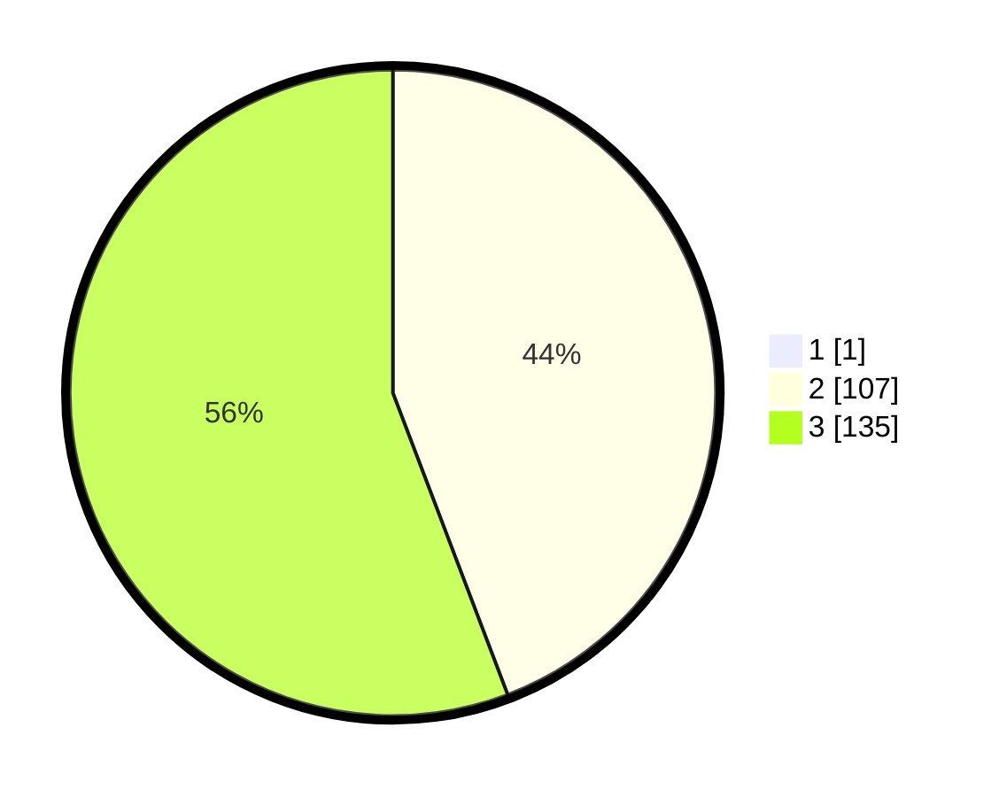

# Hasil

## Grafik

## Tabel

| No. | Nama Paslon    | Suara | Suara (raw) | Persentase |
|:--- |:-------------- | -----:| -----------:| ----------:|
| 1   | ANIES MUHAIMIN | 1     | [1][p-1]    | 0,41       |
| 2   | PRABOWO GIBRAN | 107   | [107][p-2]  | 44,03      |
| 3   | GANJAR MAHFUD  | 135   | [135][p-3]  | 55,56      |

[p-1]: https://github.com/gigit-pemilu/pemilu-2024/blob/main/pilpres/hitung-suara/sub/51-bali/sub/03-badung/sub/02-mengwi/sub/2001-munggu/sub/009-tps/sub/paslon-1.txt
[p-2]: https://github.com/gigit-pemilu/pemilu-2024/blob/main/pilpres/hitung-suara/sub/51-bali/sub/03-badung/sub/02-mengwi/sub/2001-munggu/sub/009-tps/sub/paslon-2.txt
[p-3]: https://github.com/gigit-pemilu/pemilu-2024/blob/main/pilpres/hitung-suara/sub/51-bali/sub/03-badung/sub/02-mengwi/sub/2001-munggu/sub/009-tps/sub/paslon-3.txt

## Foto C Plano

https://sirekap-obj-formc.kpu.go.id/735c/pemilu/ppwp/51/03/02/20/01/5103022001009-20240214-215930--2b6b74f7-8ba4-4fd9-9b7a-7a2fab5a584d.jpg

https://sirekap-obj-formc.kpu.go.id/735c/pemilu/ppwp/51/03/02/20/01/5103022001009-20240214-220021--e7edd6fb-c124-472c-9c60-fa82eb4037b4.jpg

https://sirekap-obj-formc.kpu.go.id/735c/pemilu/ppwp/51/03/02/20/01/5103022001009-20240214-220115--f5ae2be4-e19e-4127-af7f-78a9fc50183c.jpg

## Metadata

| Key        | Value               |
| ---------- | ------------------- |
| Time Stamp | 2024-02-25 22:00:00 |

