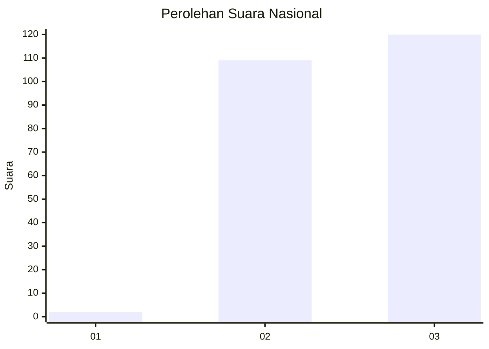
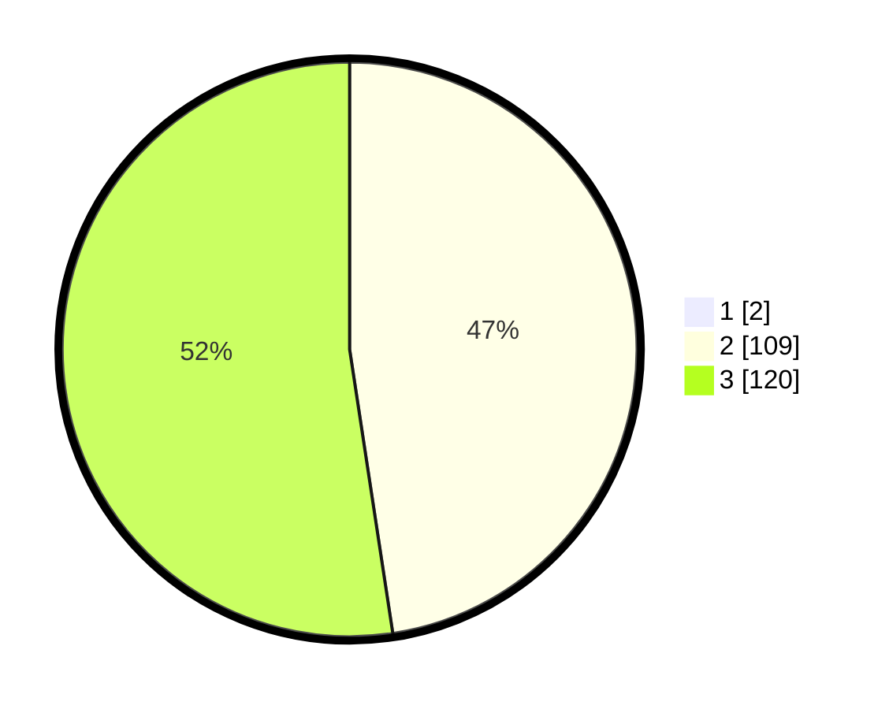

# Hasil

## Grafik

## Tabel

| No. | Nama Paslon    | Suara | Suara (raw) | Persentase |
|:--- |:-------------- | -----:| -----------:| ----------:|
| 1   | ANIES MUHAIMIN | 2     | [2][p-1]    | 0,87       |
| 2   | PRABOWO GIBRAN | 109   | [109][p-2]  | 47,19      |
| 3   | GANJAR MAHFUD  | 120   | [120][p-3]  | 51,95      |

[p-1]: https://github.com/gigit-pemilu/pemilu-2024/blob/main/pilpres/hitung-suara/sub/51-bali/sub/03-badung/sub/02-mengwi/sub/2001-munggu/sub/010-tps/sub/paslon-1.txt
[p-2]: https://github.com/gigit-pemilu/pemilu-2024/blob/main/pilpres/hitung-suara/sub/51-bali/sub/03-badung/sub/02-mengwi/sub/2001-munggu/sub/010-tps/sub/paslon-2.txt
[p-3]: https://github.com/gigit-pemilu/pemilu-2024/blob/main/pilpres/hitung-suara/sub/51-bali/sub/03-badung/sub/02-mengwi/sub/2001-munggu/sub/010-tps/sub/paslon-3.txt

## Foto C Plano

https://sirekap-obj-formc.kpu.go.id/f00d/pemilu/ppwp/51/03/02/20/01/5103022001010-20240217-081724--dd7cd6d2-27e7-4263-8e3c-5e101a4447e3.jpg

https://sirekap-obj-formc.kpu.go.id/f00d/pemilu/ppwp/51/03/02/20/01/5103022001010-20240214-225101--1dbebb8c-8a98-49a8-ba01-b181f5ebe040.jpg

https://sirekap-obj-formc.kpu.go.id/f00d/pemilu/ppwp/51/03/02/20/01/5103022001010-20240217-083348--1f0e0a1b-3fda-4b7b-98a5-e180d1b04487.jpg

## Metadata

| Key        | Value               |
| ---------- | ------------------- |
| Time Stamp | 2024-02-17 13:42:09 |

## DATA PEMILIH TETAP

Jumlah pemilih dalam DPT: **246**.
 * L: **119**.
 * P: **127**.

## DATA PENGGUNA HAK PILIH

Jumlah pengguna hak pilih dalam DPT: **236**.
 * L: **113**.
 * P: **123**.

Jumlah pengguna hak pilih dalam DPTb: **1**.
 * L: **1**.
 * P: **0**.

Jumlah pengguna hak pilih dalam DPK: **2**.
 * L: **1**.
 * P: **1**.

Jumlah pengguna hak pilih: **239**.
 * L: **115**.
 * P: **124**.

## JUMLAH SUARA SAH DAN TIDAK SAH

JUMLAH SELURUH SUARA SAH: **231**.

JUMLAH SUARA TIDAK SAH: **8**.

JUMLAH SELURUH SUARA SAH DAN SUARA TIDAK SAH: **239**.

