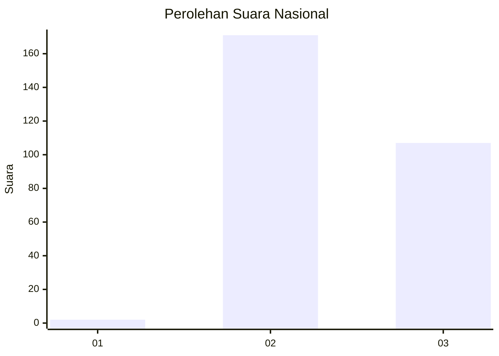
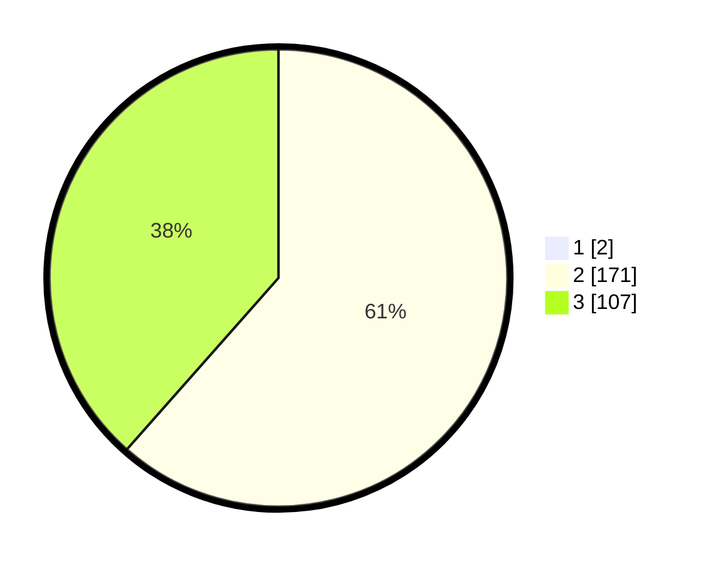

# Hasil

## Grafik

## Tabel

| No. | Nama Paslon    | Suara | Suara (raw) | Persentase |
|:--- |:-------------- | -----:| -----------:| ----------:|
| 1   | ANIES MUHAIMIN | 2     | [2][p-1]    | 0,71       |
| 2   | PRABOWO GIBRAN | 171   | [171][p-2]  | 61,07      |
| 3   | GANJAR MAHFUD  | 107   | [107][p-3]  | 38,21      |

[p-1]: https://github.com/gigit-pemilu/pemilu-2024/blob/main/pilpres/hitung-suara/sub/51-bali/sub/03-badung/sub/02-mengwi/sub/2001-munggu/sub/013-tps/sub/paslon-1.txt
[p-2]: https://github.com/gigit-pemilu/pemilu-2024/blob/main/pilpres/hitung-suara/sub/51-bali/sub/03-badung/sub/02-mengwi/sub/2001-munggu/sub/013-tps/sub/paslon-2.txt
[p-3]: https://github.com/gigit-pemilu/pemilu-2024/blob/main/pilpres/hitung-suara/sub/51-bali/sub/03-badung/sub/02-mengwi/sub/2001-munggu/sub/013-tps/sub/paslon-3.txt

## Foto C Plano

https://sirekap-obj-formc.kpu.go.id/f90e/pemilu/ppwp/51/03/02/20/01/5103022001013-20240214-203323--7f17786b-a2fa-4008-a754-9f7cbf3fbbb9.jpg

https://sirekap-obj-formc.kpu.go.id/f90e/pemilu/ppwp/51/03/02/20/01/5103022001013-20240214-221705--f59baee9-6ca6-4df5-9f1d-21c170d7d841.jpg

https://sirekap-obj-formc.kpu.go.id/f90e/pemilu/ppwp/51/03/02/20/01/5103022001013-20240214-203615--cc87fa64-c4bc-4e39-9d84-938a0d4dedc5.jpg

## Metadata

| Key        | Value               |
| ---------- | ------------------- |
| Time Stamp | 2024-02-21 15:00:00 |

## DATA PEMILIH TETAP

Jumlah pemilih dalam DPT: **288**.
 * L: **139**.
 * P: **149**.

## DATA PENGGUNA HAK PILIH

Jumlah pengguna hak pilih dalam DPT: **281**.
 * L: **140**.
 * P: **141**.

Jumlah pengguna hak pilih dalam DPTb: **0**.
 * L: **0**.
 * P: **0**.

Jumlah pengguna hak pilih dalam DPK: **1**.
 * L: **0**.
 * P: **1**.

Jumlah pengguna hak pilih: **282**.
 * L: **140**.
 * P: **142**.

## JUMLAH SUARA SAH DAN TIDAK SAH

JUMLAH SELURUH SUARA SAH: **280**.

JUMLAH SUARA TIDAK SAH: **2**.

JUMLAH SELURUH SUARA SAH DAN SUARA TIDAK SAH: **282**.

