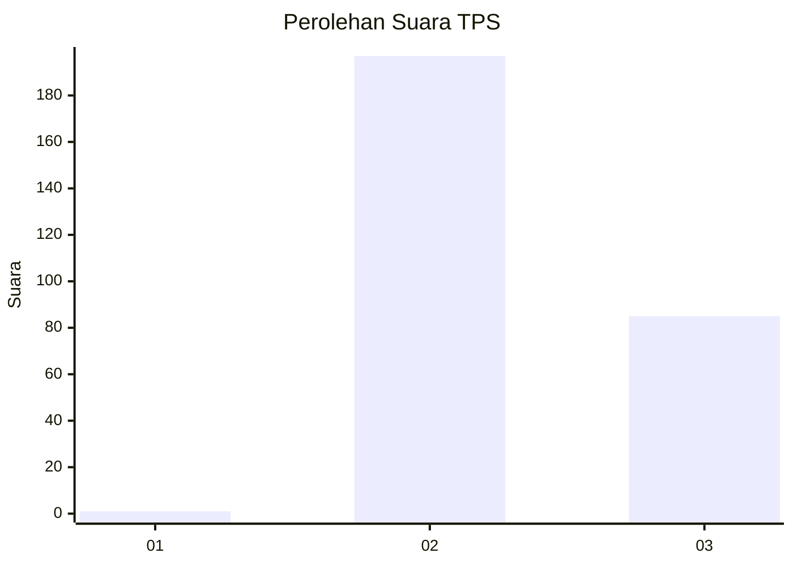
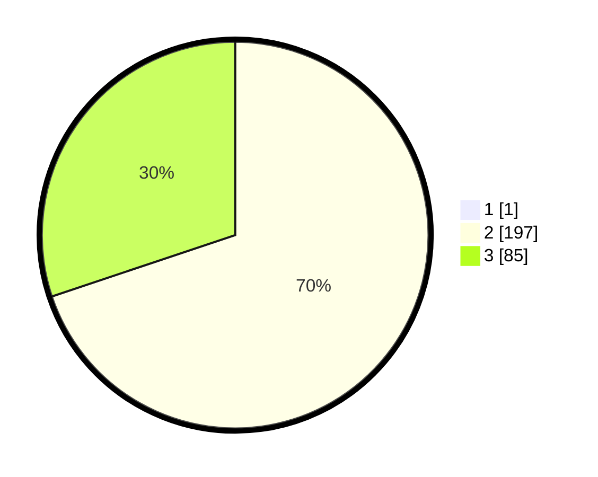

# Hasil

## Grafik

## Tabel

| No. | Nama Paslon    | Suara | Suara (raw) | Persentase |
|:--- |:-------------- | -----:| -----------:| ----------:|
| 1   | ANIES MUHAIMIN | 1     | [1][p-1]    | 0,35       |
| 2   | PRABOWO GIBRAN | 197   | [197][p-2]  | 69,61      |
| 3   | GANJAR MAHFUD  | 85    | [85][p-3]   | 30,04      |

[p-1]: https://github.com/gigit-pemilu/pemilu-2024-51-bali/blob/main/pilpres/hitung-suara/sub/51-bali/sub/03-badung/sub/02-mengwi/sub/2001-munggu/sub/015-tps/sub/paslon-1.txt
[p-2]: https://github.com/gigit-pemilu/pemilu-2024-51-bali/blob/main/pilpres/hitung-suara/sub/51-bali/sub/03-badung/sub/02-mengwi/sub/2001-munggu/sub/015-tps/sub/paslon-2.txt
[p-3]: https://github.com/gigit-pemilu/pemilu-2024-51-bali/blob/main/pilpres/hitung-suara/sub/51-bali/sub/03-badung/sub/02-mengwi/sub/2001-munggu/sub/015-tps/sub/paslon-3.txt

## Foto C Plano

https://sirekap-obj-formc.kpu.go.id/eaf4/pemilu/ppwp/51/03/02/20/01/5103022001015-20240216-104404--72ea9aba-10cb-484b-b595-1490d9a8136e.jpg

https://sirekap-obj-formc.kpu.go.id/eaf4/pemilu/ppwp/51/03/02/20/01/5103022001015-20240216-101034--74b9c623-1fdf-43a5-b691-0f01ec196bde.jpg

https://sirekap-obj-formc.kpu.go.id/eaf4/pemilu/ppwp/51/03/02/20/01/5103022001015-20240216-104408--21b98f72-4c67-410d-af48-13efc485d139.jpg

## Metadata

| Key        | Value               |
| ---------- | ------------------- |
| Time Stamp | 2024-02-22 11:00:00 |

## DATA PEMILIH TETAP

Jumlah pemilih dalam DPT: **291**.
 * L: **142**.
 * P: **149**.

## DATA PENGGUNA HAK PILIH

Jumlah pengguna hak pilih dalam DPT: **285**.
 * L: **141**.
 * P: **144**.

Jumlah pengguna hak pilih dalam DPTb: **0**.
 * L: **0**.
 * P: **0**.

Jumlah pengguna hak pilih dalam DPK: **1**.
 * L: **1**.
 * P: **0**.

Jumlah pengguna hak pilih: **286**.
 * L: **142**.
 * P: **144**.

## JUMLAH SUARA SAH DAN TIDAK SAH

JUMLAH SELURUH SUARA SAH: **283**.

JUMLAH SUARA TIDAK SAH: **3**.

JUMLAH SELURUH SUARA SAH DAN SUARA TIDAK SAH: **286**.

