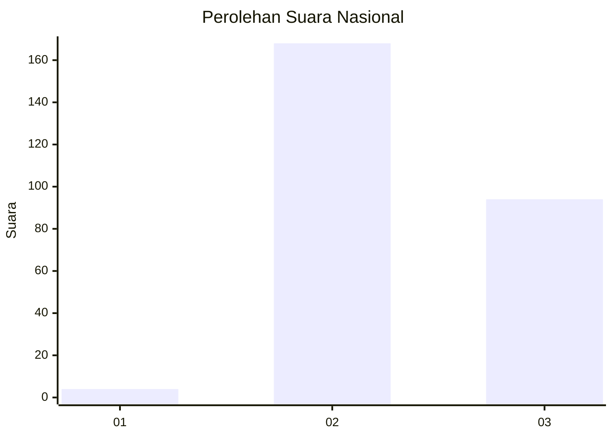
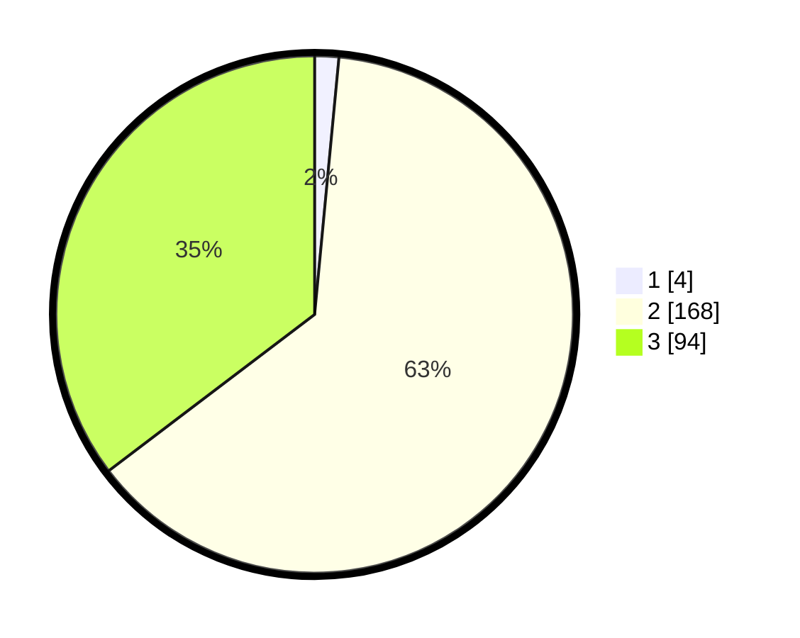

# Hasil

## Grafik

## Tabel

| No. | Nama Paslon    | Suara | Suara (raw) | Persentase |
|:--- |:-------------- | -----:| -----------:| ----------:|
| 1   | ANIES MUHAIMIN | 4     | [4][p-1]    | 1,50       |
| 2   | PRABOWO GIBRAN | 168   | [168][p-2]  | 63,16      |
| 3   | GANJAR MAHFUD  | 94    | [94][p-3]   | 35,34      |

[p-1]: https://github.com/gigit-pemilu/pemilu-2024/blob/main/pilpres/hitung-suara/sub/51-bali/sub/03-badung/sub/02-mengwi/sub/2001-munggu/sub/017-tps/sub/paslon-1.txt
[p-2]: https://github.com/gigit-pemilu/pemilu-2024/blob/main/pilpres/hitung-suara/sub/51-bali/sub/03-badung/sub/02-mengwi/sub/2001-munggu/sub/017-tps/sub/paslon-2.txt
[p-3]: https://github.com/gigit-pemilu/pemilu-2024/blob/main/pilpres/hitung-suara/sub/51-bali/sub/03-badung/sub/02-mengwi/sub/2001-munggu/sub/017-tps/sub/paslon-3.txt

## Foto C Plano

https://sirekap-obj-formc.kpu.go.id/fbb9/pemilu/ppwp/51/03/02/20/01/5103022001017-20240216-132613--63d6bccb-de96-4b9a-a21f-685d1add6ba0.jpg

https://sirekap-obj-formc.kpu.go.id/fbb9/pemilu/ppwp/51/03/02/20/01/5103022001017-20240214-141512--bdaebbb3-19b5-4918-81e9-77ede3f0b69d.jpg

https://sirekap-obj-formc.kpu.go.id/fbb9/pemilu/ppwp/51/03/02/20/01/5103022001017-20240216-132614--a544c9f6-7c82-46e6-b05e-44795b21028e.jpg

## Metadata

| Key        | Value               |
| ---------- | ------------------- |
| Time Stamp | 2024-02-25 22:00:00 |

## DATA PEMILIH TETAP

Jumlah pemilih dalam DPT: **297**.
 * L: **142**.
 * P: **155**.

## DATA PENGGUNA HAK PILIH

Jumlah pengguna hak pilih dalam DPT: **266**.
 * L: **130**.
 * P: **136**.

Jumlah pengguna hak pilih dalam DPTb: **0**.
 * L: **0**.
 * P: **0**.

Jumlah pengguna hak pilih dalam DPK: **1**.
 * L: **1**.
 * P: **0**.

Jumlah pengguna hak pilih: **267**.
 * L: **131**.
 * P: **136**.

## JUMLAH SUARA SAH DAN TIDAK SAH

JUMLAH SELURUH SUARA SAH: **0**.

JUMLAH SUARA TIDAK SAH: **0**.

JUMLAH SELURUH SUARA SAH DAN SUARA TIDAK SAH: **0**.

