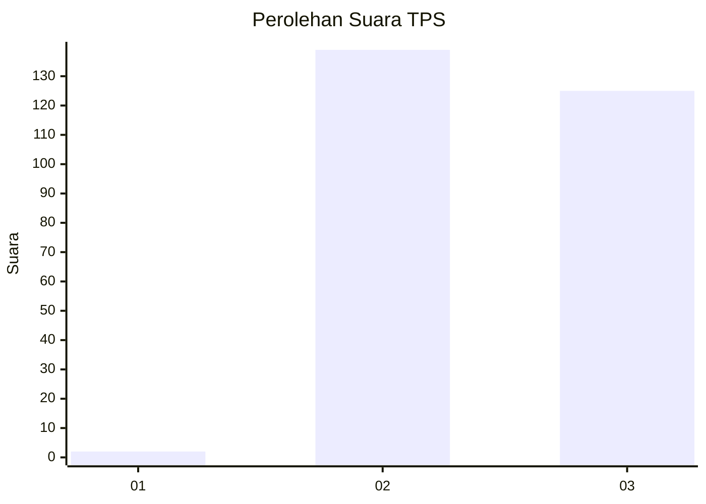
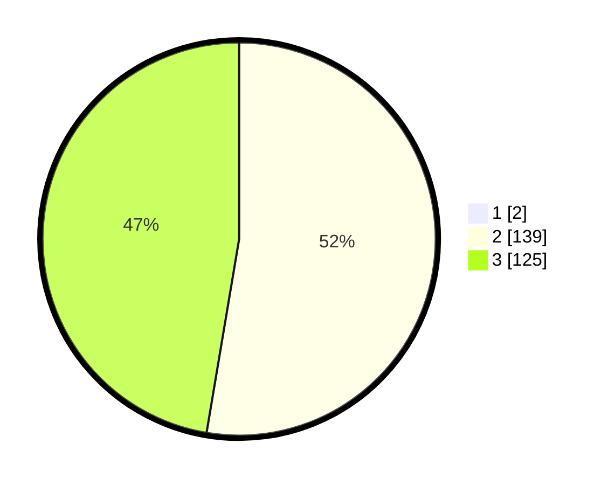

# Hasil

## Grafik

## Tabel

| No. | Nama Paslon    | Suara | Suara (raw) | Persentase |
|:--- |:-------------- | -----:| -----------:| ----------:|
| 1   | ANIES MUHAIMIN | 2     | [2][p-1]    | 0,75       |
| 2   | PRABOWO GIBRAN | 139   | [139][p-2]  | 52,26      |
| 3   | GANJAR MAHFUD  | 125   | [125][p-3]  | 46,99      |

[p-1]: https://github.com/gigit-pemilu/pemilu-2024-51-bali/blob/main/pilpres/hitung-suara/sub/51-bali/sub/03-badung/sub/02-mengwi/sub/2001-munggu/sub/019-tps/sub/paslon-1.txt
[p-2]: https://github.com/gigit-pemilu/pemilu-2024-51-bali/blob/main/pilpres/hitung-suara/sub/51-bali/sub/03-badung/sub/02-mengwi/sub/2001-munggu/sub/019-tps/sub/paslon-2.txt
[p-3]: https://github.com/gigit-pemilu/pemilu-2024-51-bali/blob/main/pilpres/hitung-suara/sub/51-bali/sub/03-badung/sub/02-mengwi/sub/2001-munggu/sub/019-tps/sub/paslon-3.txt

## Foto C Plano

https://sirekap-obj-formc.kpu.go.id/69ff/pemilu/ppwp/51/03/02/20/01/5103022001019-20240215-003209--35231729-16cf-4abc-beab-449ee04d02e7.jpg

https://sirekap-obj-formc.kpu.go.id/69ff/pemilu/ppwp/51/03/02/20/01/5103022001019-20240215-002518--b05625a0-0e8d-42e8-9b2f-012415eb8d72.jpg

https://sirekap-obj-formc.kpu.go.id/69ff/pemilu/ppwp/51/03/02/20/01/5103022001019-20240218-091424--08b19e7b-400b-4678-a033-7e2e9045e687.jpg

## Metadata

| Key        | Value               |
| ---------- | ------------------- |
| Time Stamp | 2024-02-21 22:00:00 |

## DATA PEMILIH TETAP

Jumlah pemilih dalam DPT: **290**.
 * L: **141**.
 * P: **149**.

## DATA PENGGUNA HAK PILIH

Jumlah pengguna hak pilih dalam DPT: **264**.
 * L: **133**.
 * P: **131**.

Jumlah pengguna hak pilih dalam DPTb: **6**.
 * L: **2**.
 * P: **4**.

Jumlah pengguna hak pilih dalam DPK: **1**.
 * L: **0**.
 * P: **1**.

Jumlah pengguna hak pilih: **271**.
 * L: **135**.
 * P: **136**.

## JUMLAH SUARA SAH DAN TIDAK SAH

JUMLAH SELURUH SUARA SAH: **266**.

JUMLAH SUARA TIDAK SAH: **5**.

JUMLAH SELURUH SUARA SAH DAN SUARA TIDAK SAH: **271**.

