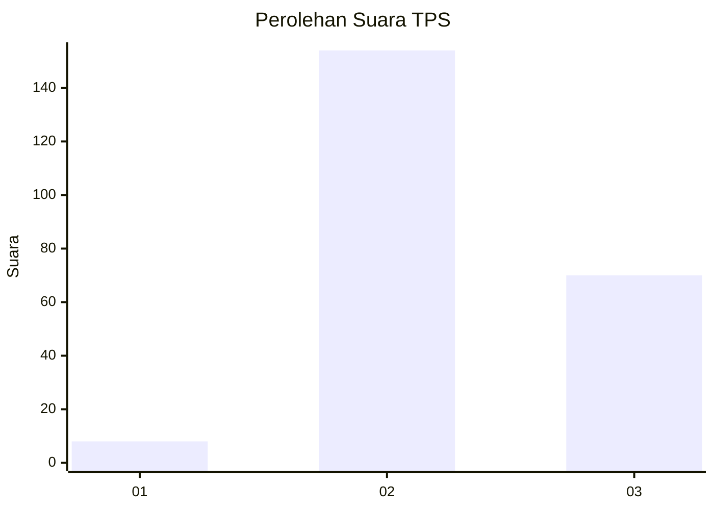

# Hasil

## Grafik

## Tabel

| No. | Nama Paslon    | Suara | Suara (raw) | Persentase |
|:--- |:-------------- | -----:| -----------:| ----------:|
| 1   | ANIES MUHAIMIN | 8     | [8][p-1]    | 3,45       |
| 2   | PRABOWO GIBRAN | 154   | [154][p-2]  | 66,38      |
| 3   | GANJAR MAHFUD  | 70    | [70][p-3]   | 30,17      |

[p-1]: https://github.com/gigit-pemilu/pemilu-2024-51-bali/blob/main/pilpres/hitung-suara/sub/51-bali/sub/03-badung/sub/02-mengwi/sub/2002-buduk/sub/002-tps/sub/paslon-1.txt
[p-2]: https://github.com/gigit-pemilu/pemilu-2024-51-bali/blob/main/pilpres/hitung-suara/sub/51-bali/sub/03-badung/sub/02-mengwi/sub/2002-buduk/sub/002-tps/sub/paslon-2.txt
[p-3]: https://github.com/gigit-pemilu/pemilu-2024-51-bali/blob/main/pilpres/hitung-suara/sub/51-bali/sub/03-badung/sub/02-mengwi/sub/2002-buduk/sub/002-tps/sub/paslon-3.txt

## Foto C Plano

https://sirekap-obj-formc.kpu.go.id/b709/pemilu/ppwp/51/03/02/20/02/5103022002002-20240214-204706--61e66c3f-11de-4cae-8fd2-b85e8a85853b.jpg

https://sirekap-obj-formc.kpu.go.id/b709/pemilu/ppwp/51/03/02/20/02/5103022002002-20240214-204709--2cbb41b7-cd73-49e8-ad1f-3c23e9a72537.jpg

https://sirekap-obj-formc.kpu.go.id/b709/pemilu/ppwp/51/03/02/20/02/5103022002002-20240214-204713--662d776c-d476-440e-ae28-3f5c9e9f2289.jpg

## Metadata

| Key        | Value               |
| ---------- | ------------------- |
| Time Stamp | 2024-02-15 00:41:44 |

## DATA PEMILIH TETAP

Jumlah pemilih dalam DPT: **253**.
 * L: **124**.
 * P: **129**.

## DATA PENGGUNA HAK PILIH

Jumlah pengguna hak pilih dalam DPT: **218**.
 * L: **106**.
 * P: **112**.

Jumlah pengguna hak pilih dalam DPTb: **6**.
 * L: **3**.
 * P: **3**.

Jumlah pengguna hak pilih dalam DPK: **8**.
 * L: **4**.
 * P: **4**.

Jumlah pengguna hak pilih: **232**.
 * L: **113**.
 * P: **119**.

## JUMLAH SUARA SAH DAN TIDAK SAH

JUMLAH SELURUH SUARA SAH: **232**.

JUMLAH SUARA TIDAK SAH: **0**.

JUMLAH SELURUH SUARA SAH DAN SUARA TIDAK SAH: **232**.

