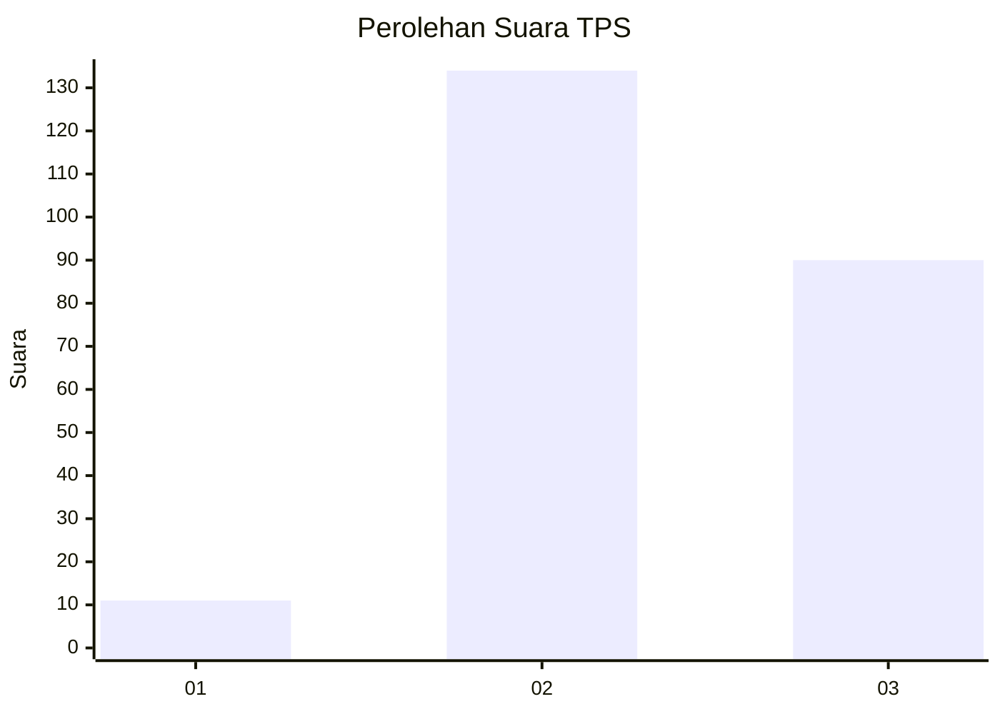
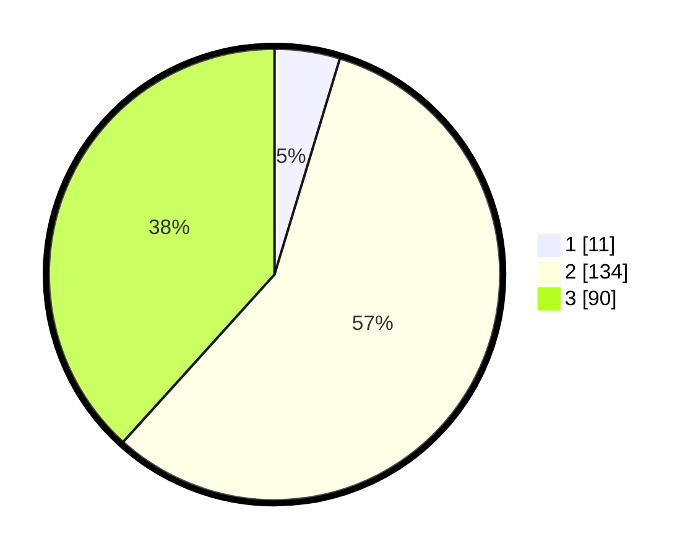

# Hasil

## Grafik

## Tabel

| No. | Nama Paslon    | Suara | Suara (raw) | Persentase |
|:--- |:-------------- | -----:| -----------:| ----------:|
| 1   | ANIES MUHAIMIN | 11    | [11][p-1]   | 4,68       |
| 2   | PRABOWO GIBRAN | 134   | [134][p-2]  | 57,02      |
| 3   | GANJAR MAHFUD  | 90    | [90][p-3]   | 38,30      |

[p-1]: https://github.com/gigit-pemilu/pemilu-2024-51-bali/blob/main/pilpres/hitung-suara/sub/51-bali/sub/03-badung/sub/02-mengwi/sub/2002-buduk/sub/003-tps/sub/paslon-1.txt
[p-2]: https://github.com/gigit-pemilu/pemilu-2024-51-bali/blob/main/pilpres/hitung-suara/sub/51-bali/sub/03-badung/sub/02-mengwi/sub/2002-buduk/sub/003-tps/sub/paslon-2.txt
[p-3]: https://github.com/gigit-pemilu/pemilu-2024-51-bali/blob/main/pilpres/hitung-suara/sub/51-bali/sub/03-badung/sub/02-mengwi/sub/2002-buduk/sub/003-tps/sub/paslon-3.txt

## Foto C Plano

https://sirekap-obj-formc.kpu.go.id/2491/pemilu/ppwp/51/03/02/20/02/5103022002003-20240214-222834--523e6be3-c7e0-44b5-a594-9d63e1522395.jpg

https://sirekap-obj-formc.kpu.go.id/2491/pemilu/ppwp/51/03/02/20/02/5103022002003-20240214-222846--c625e0b2-266f-4562-82f4-7c2c8ff049a0.jpg

https://sirekap-obj-formc.kpu.go.id/2491/pemilu/ppwp/51/03/02/20/02/5103022002003-20240214-222850--78a123f8-6f31-4f1c-b901-b3712caa2a19.jpg

## Metadata

| Key        | Value               |
| ---------- | ------------------- |
| Time Stamp | 2024-02-26 01:00:00 |

