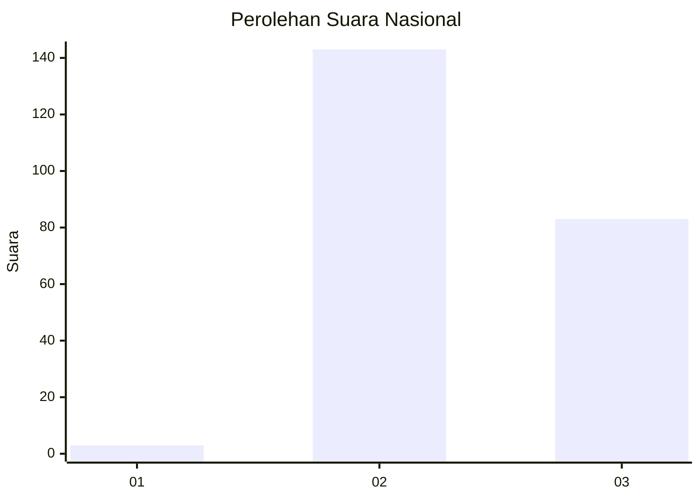
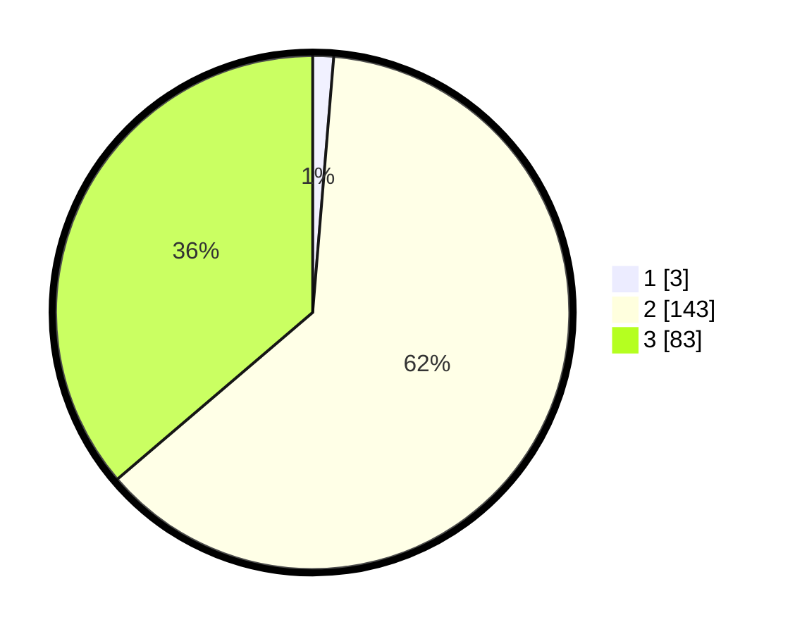

# Hasil

## Grafik

## Tabel

| No. | Nama Paslon    | Suara | Suara (raw) | Persentase |
|:--- |:-------------- | -----:| -----------:| ----------:|
| 1   | ANIES MUHAIMIN | 3     | [3][p-1]    | 1,31       |
| 2   | PRABOWO GIBRAN | 143   | [143][p-2]  | 62,45      |
| 3   | GANJAR MAHFUD  | 83    | [83][p-3]   | 36,24      |

[p-1]: https://github.com/gigit-pemilu/pemilu-2024/blob/main/pilpres/hitung-suara/sub/51-bali/sub/03-badung/sub/02-mengwi/sub/2002-buduk/sub/004-tps/sub/paslon-1.txt
[p-2]: https://github.com/gigit-pemilu/pemilu-2024/blob/main/pilpres/hitung-suara/sub/51-bali/sub/03-badung/sub/02-mengwi/sub/2002-buduk/sub/004-tps/sub/paslon-2.txt
[p-3]: https://github.com/gigit-pemilu/pemilu-2024/blob/main/pilpres/hitung-suara/sub/51-bali/sub/03-badung/sub/02-mengwi/sub/2002-buduk/sub/004-tps/sub/paslon-3.txt

## Foto C Plano

https://sirekap-obj-formc.kpu.go.id/ec8c/pemilu/ppwp/51/03/02/20/02/5103022002004-20240214-220035--64b241dd-e94e-4a60-b4c8-97d8456c68a3.jpg

https://sirekap-obj-formc.kpu.go.id/ec8c/pemilu/ppwp/51/03/02/20/02/5103022002004-20240214-220308--a8f81560-658b-478d-ab4e-be1b4590c66a.jpg

https://sirekap-obj-formc.kpu.go.id/ec8c/pemilu/ppwp/51/03/02/20/02/5103022002004-20240214-220457--d7149879-535a-4214-b9b9-839260685a99.jpg

## Metadata

| Key        | Value               |
| ---------- | ------------------- |
| Time Stamp | 2024-02-24 22:31:28 |

