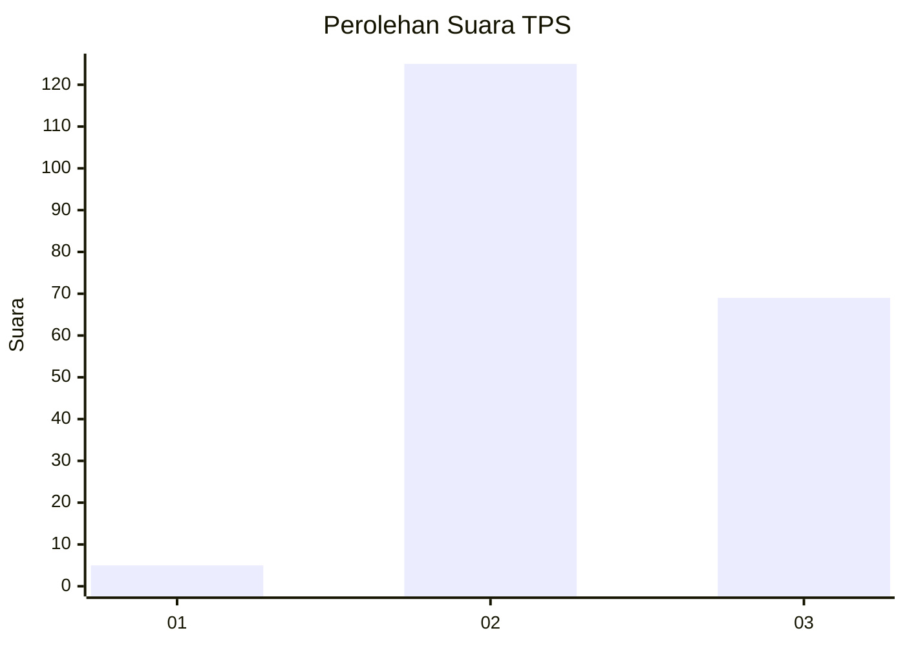
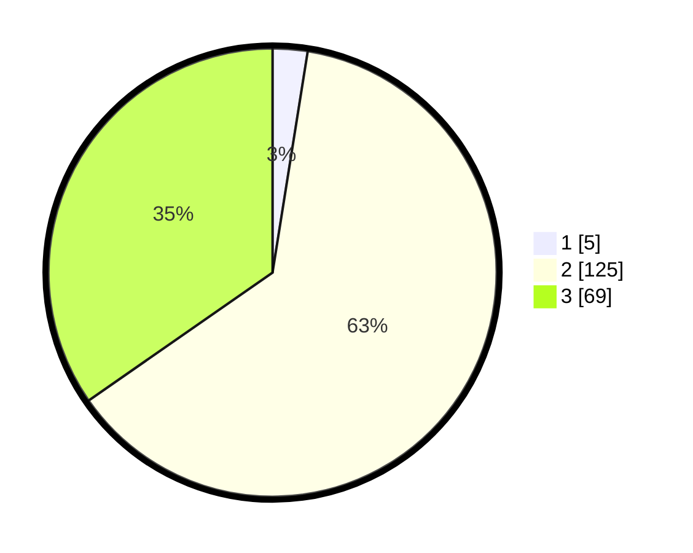

# Hasil

## Grafik

## Tabel

| No. | Nama Paslon    | Suara | Suara (raw) | Persentase |
|:--- |:-------------- | -----:| -----------:| ----------:|
| 1   | ANIES MUHAIMIN | 5     | [5][p-1]    | 2,51       |
| 2   | PRABOWO GIBRAN | 125   | [125][p-2]  | 62,81      |
| 3   | GANJAR MAHFUD  | 69    | [69][p-3]   | 34,67      |

[p-1]: https://github.com/gigit-pemilu/pemilu-2024-51-bali/blob/main/pilpres/hitung-suara/sub/51-bali/sub/03-badung/sub/02-mengwi/sub/2002-buduk/sub/005-tps/sub/paslon-1.txt
[p-2]: https://github.com/gigit-pemilu/pemilu-2024-51-bali/blob/main/pilpres/hitung-suara/sub/51-bali/sub/03-badung/sub/02-mengwi/sub/2002-buduk/sub/005-tps/sub/paslon-2.txt
[p-3]: https://github.com/gigit-pemilu/pemilu-2024-51-bali/blob/main/pilpres/hitung-suara/sub/51-bali/sub/03-badung/sub/02-mengwi/sub/2002-buduk/sub/005-tps/sub/paslon-3.txt

## Foto C Plano

https://sirekap-obj-formc.kpu.go.id/549d/pemilu/ppwp/51/03/02/20/02/5103022002005-20240215-041442--4294b505-f3ae-4f4f-9782-ed1b24a002a4.jpg

https://sirekap-obj-formc.kpu.go.id/549d/pemilu/ppwp/51/03/02/20/02/5103022002005-20240215-112238--8d8017d4-55e7-45b5-a1a7-8626b1dae9a8.jpg

https://sirekap-obj-formc.kpu.go.id/549d/pemilu/ppwp/51/03/02/20/02/5103022002005-20240215-112218--9577cd4e-06e4-41be-8c26-27166f94c82e.jpg

## Metadata

| Key        | Value               |
| ---------- | ------------------- |
| Time Stamp | 2024-02-24 22:31:28 |

