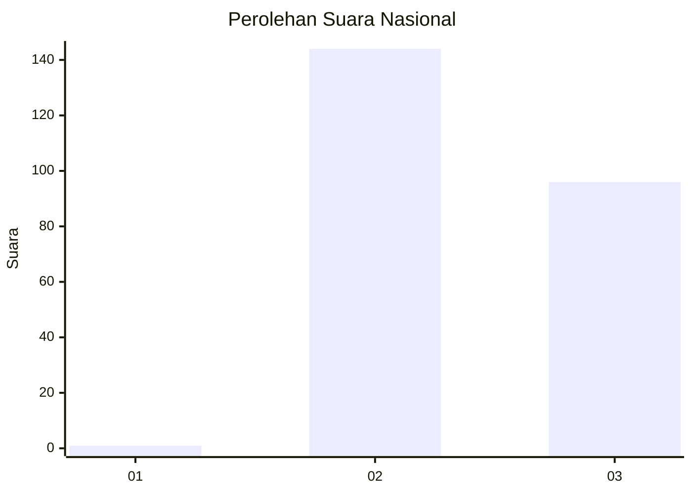
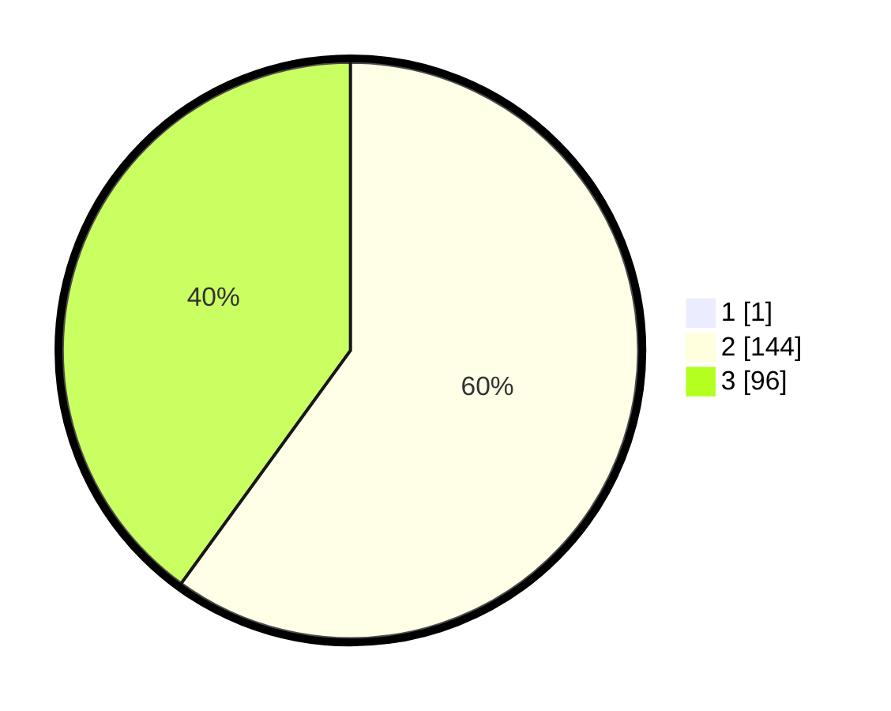

# Hasil

## Grafik

## Tabel

| No. | Nama Paslon    | Suara | Suara (raw) | Persentase |
|:--- |:-------------- | -----:| -----------:| ----------:|
| 1   | ANIES MUHAIMIN | 1     | [1][p-1]    | 0,41       |
| 2   | PRABOWO GIBRAN | 144   | [144][p-2]  | 59,75      |
| 3   | GANJAR MAHFUD  | 96    | [96][p-3]   | 39,83      |

[p-1]: https://github.com/gigit-pemilu/pemilu-2024/blob/main/pilpres/hitung-suara/sub/51-bali/sub/03-badung/sub/02-mengwi/sub/2002-buduk/sub/007-tps/sub/paslon-1.txt
[p-2]: https://github.com/gigit-pemilu/pemilu-2024/blob/main/pilpres/hitung-suara/sub/51-bali/sub/03-badung/sub/02-mengwi/sub/2002-buduk/sub/007-tps/sub/paslon-2.txt
[p-3]: https://github.com/gigit-pemilu/pemilu-2024/blob/main/pilpres/hitung-suara/sub/51-bali/sub/03-badung/sub/02-mengwi/sub/2002-buduk/sub/007-tps/sub/paslon-3.txt

## Foto C Plano

https://sirekap-obj-formc.kpu.go.id/b8cb/pemilu/ppwp/51/03/02/20/02/5103022002007-20240214-215706--e66e2dbe-031f-4f5b-8a8e-03d8ee8bc349.jpg

https://sirekap-obj-formc.kpu.go.id/b8cb/pemilu/ppwp/51/03/02/20/02/5103022002007-20240214-215834--b5d9bc50-3ac5-4745-a587-f4cca5d28f63.jpg

https://sirekap-obj-formc.kpu.go.id/b8cb/pemilu/ppwp/51/03/02/20/02/5103022002007-20240214-220058--fb57352f-3571-452d-9b45-3d6903adba58.jpg

## Metadata

| Key        | Value               |
| ---------- | ------------------- |
| Time Stamp | 2024-02-24 22:31:28 |

