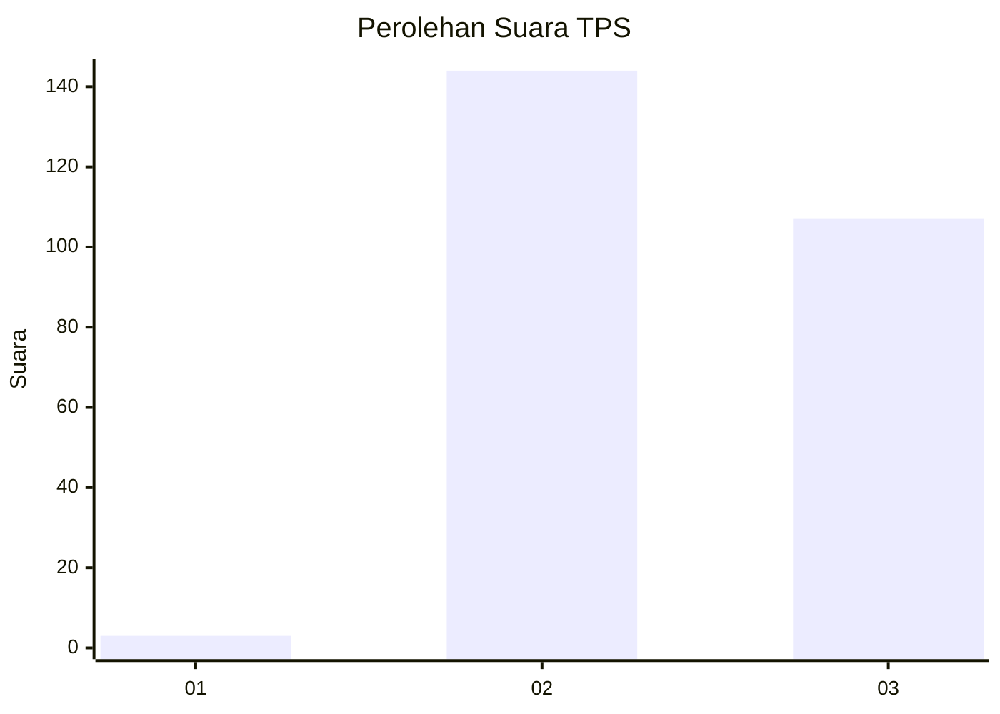
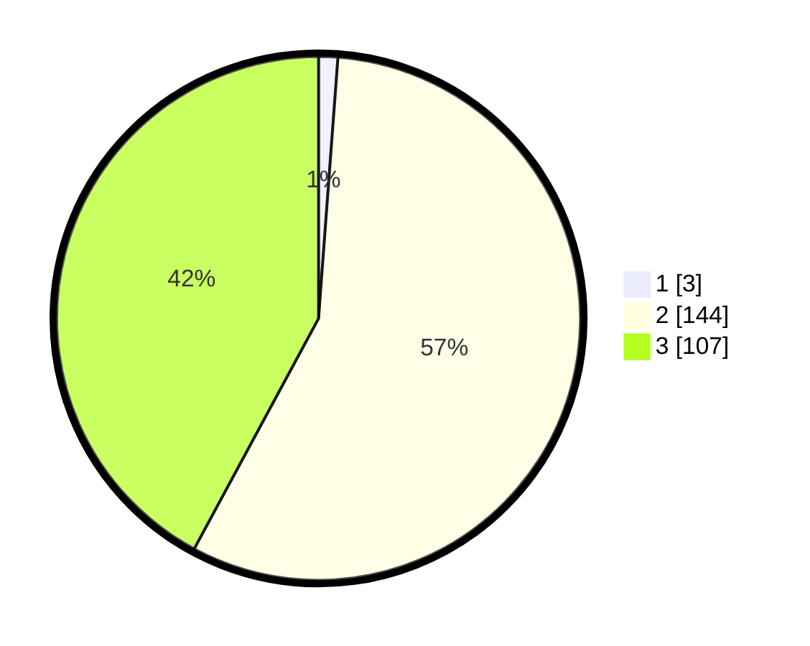

# Hasil

## Grafik

## Tabel

| No. | Nama Paslon    | Suara | Suara (raw) | Persentase |
|:--- |:-------------- | -----:| -----------:| ----------:|
| 1   | ANIES MUHAIMIN | 3     | [3][p-1]    | 1,18       |
| 2   | PRABOWO GIBRAN | 144   | [144][p-2]  | 56,69      |
| 3   | GANJAR MAHFUD  | 107   | [107][p-3]  | 42,13      |

[p-1]: https://github.com/gigit-pemilu/pemilu-2024-51-bali/blob/main/pilpres/hitung-suara/sub/51-bali/sub/03-badung/sub/02-mengwi/sub/2002-buduk/sub/009-tps/sub/paslon-1.txt
[p-2]: https://github.com/gigit-pemilu/pemilu-2024-51-bali/blob/main/pilpres/hitung-suara/sub/51-bali/sub/03-badung/sub/02-mengwi/sub/2002-buduk/sub/009-tps/sub/paslon-2.txt
[p-3]: https://github.com/gigit-pemilu/pemilu-2024-51-bali/blob/main/pilpres/hitung-suara/sub/51-bali/sub/03-badung/sub/02-mengwi/sub/2002-buduk/sub/009-tps/sub/paslon-3.txt

## Foto C Plano

https://sirekap-obj-formc.kpu.go.id/d0cb/pemilu/ppwp/51/03/02/20/02/5103022002009-20240214-222942--942d300a-7982-46f5-8352-af62cf9ccb09.jpg

https://sirekap-obj-formc.kpu.go.id/d0cb/pemilu/ppwp/51/03/02/20/02/5103022002009-20240214-223512--916d4173-cf4f-413d-bc7a-6fb3fcfa30d9.jpg

https://sirekap-obj-formc.kpu.go.id/d0cb/pemilu/ppwp/51/03/02/20/02/5103022002009-20240214-223613--9a4092da-76a4-4ad2-bcdb-ed011e6d2caf.jpg

## Metadata

| Key        | Value               |
| ---------- | ------------------- |
| Time Stamp | 2024-02-25 12:00:00 |

