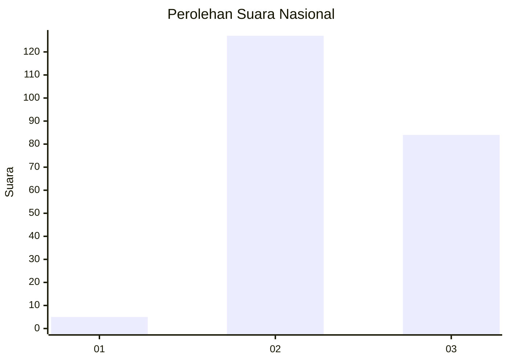
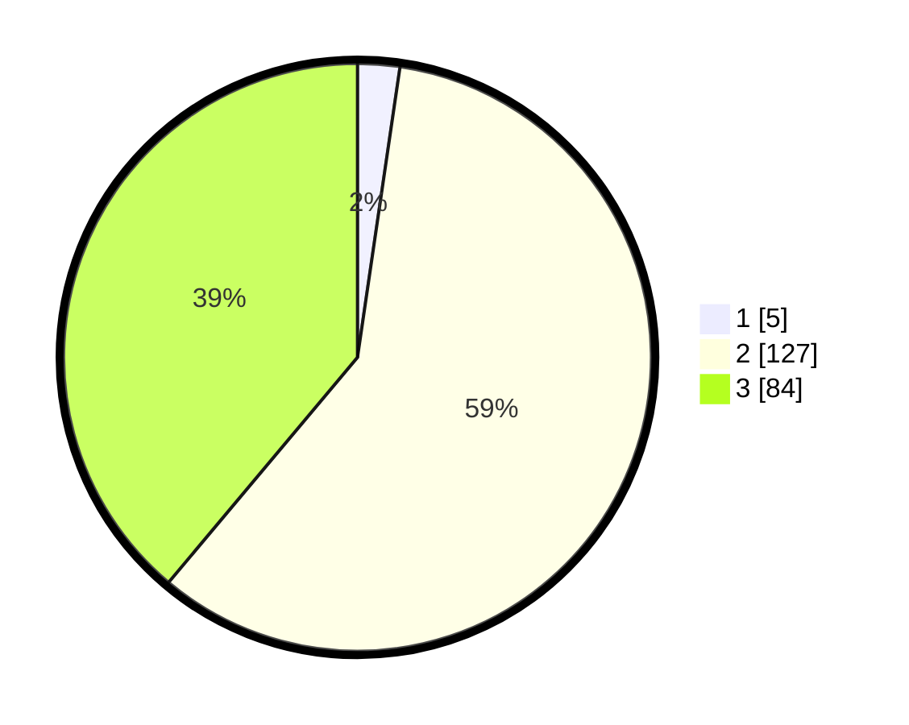

# Hasil

## Grafik

## Tabel

| No. | Nama Paslon    | Suara | Suara (raw) | Persentase |
|:--- |:-------------- | -----:| -----------:| ----------:|
| 1   | ANIES MUHAIMIN | 5     | [5][p-1]    | 2,31       |
| 2   | PRABOWO GIBRAN | 127   | [127][p-2]  | 58,80      |
| 3   | GANJAR MAHFUD  | 84    | [84][p-3]   | 38,89      |

[p-1]: https://github.com/gigit-pemilu/pemilu-2024/blob/main/pilpres/hitung-suara/sub/51-bali/sub/03-badung/sub/02-mengwi/sub/2002-buduk/sub/015-tps/sub/paslon-1.txt
[p-2]: https://github.com/gigit-pemilu/pemilu-2024/blob/main/pilpres/hitung-suara/sub/51-bali/sub/03-badung/sub/02-mengwi/sub/2002-buduk/sub/015-tps/sub/paslon-2.txt
[p-3]: https://github.com/gigit-pemilu/pemilu-2024/blob/main/pilpres/hitung-suara/sub/51-bali/sub/03-badung/sub/02-mengwi/sub/2002-buduk/sub/015-tps/sub/paslon-3.txt

## Foto C Plano

https://sirekap-obj-formc.kpu.go.id/62c2/pemilu/ppwp/51/03/02/20/02/5103022002015-20240214-220755--983ac4e2-5c87-4a0b-8fad-860a432b9305.jpg

https://sirekap-obj-formc.kpu.go.id/62c2/pemilu/ppwp/51/03/02/20/02/5103022002015-20240214-220943--88dd86ad-f09a-41a8-8b84-0db644c08a4c.jpg

https://sirekap-obj-formc.kpu.go.id/62c2/pemilu/ppwp/51/03/02/20/02/5103022002015-20240214-221236--a0062d86-9d4a-4fa4-bc14-cda9d78dab3e.jpg

## Metadata

| Key        | Value               |
| ---------- | ------------------- |
| Time Stamp | 2024-02-24 22:31:28 |

