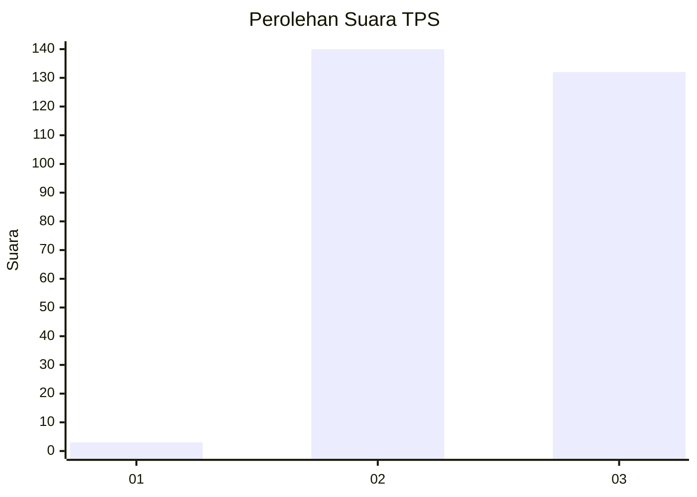
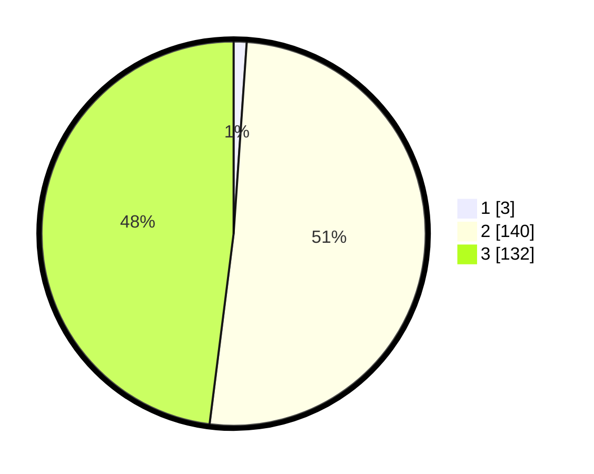

# Hasil

## Grafik

## Tabel

| No. | Nama Paslon    | Suara | Suara (raw) | Persentase |
|:--- |:-------------- | -----:| -----------:| ----------:|
| 1   | ANIES MUHAIMIN | 3     | [3][p-1]    | 1,09       |
| 2   | PRABOWO GIBRAN | 140   | [140][p-2]  | 50,91      |
| 3   | GANJAR MAHFUD  | 132   | [132][p-3]  | 48,00      |

[p-1]: https://github.com/gigit-pemilu/pemilu-2024-51-bali/blob/main/pilpres/hitung-suara/sub/51-bali/sub/03-badung/sub/02-mengwi/sub/2002-buduk/sub/016-tps/sub/paslon-1.txt
[p-2]: https://github.com/gigit-pemilu/pemilu-2024-51-bali/blob/main/pilpres/hitung-suara/sub/51-bali/sub/03-badung/sub/02-mengwi/sub/2002-buduk/sub/016-tps/sub/paslon-2.txt
[p-3]: https://github.com/gigit-pemilu/pemilu-2024-51-bali/blob/main/pilpres/hitung-suara/sub/51-bali/sub/03-badung/sub/02-mengwi/sub/2002-buduk/sub/016-tps/sub/paslon-3.txt

## Foto C Plano

https://sirekap-obj-formc.kpu.go.id/7075/pemilu/ppwp/51/03/02/20/02/5103022002016-20240215-004346--da61f268-1d95-47b5-8920-88cb614edf31.jpg

https://sirekap-obj-formc.kpu.go.id/7075/pemilu/ppwp/51/03/02/20/02/5103022002016-20240215-013159--0397974a-ba58-4165-bfb4-b98abe11a0dc.jpg

https://sirekap-obj-formc.kpu.go.id/7075/pemilu/ppwp/51/03/02/20/02/5103022002016-20240215-013206--1feb08e6-2401-4271-90f9-518bd54554ed.jpg

## Metadata

| Key        | Value               |
| ---------- | ------------------- |
| Time Stamp | 2024-02-15 22:40:13 |

## DATA PEMILIH TETAP

Jumlah pemilih dalam DPT: **297**.
 * L: **141**.
 * P: **156**.

## DATA PENGGUNA HAK PILIH

Jumlah pengguna hak pilih dalam DPT: **277**.
 * L: **131**.
 * P: **146**.

Jumlah pengguna hak pilih dalam DPTb: **2**.
 * L: **1**.
 * P: **1**.

Jumlah pengguna hak pilih dalam DPK: **0**.
 * L: **0**.
 * P: **0**.

Jumlah pengguna hak pilih: **279**.
 * L: **132**.
 * P: **147**.

## JUMLAH SUARA SAH DAN TIDAK SAH

JUMLAH SELURUH SUARA SAH: **275**.

JUMLAH SUARA TIDAK SAH: **4**.

JUMLAH SELURUH SUARA SAH DAN SUARA TIDAK SAH: **279**.

