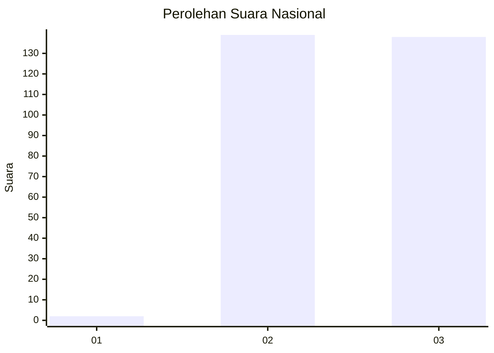
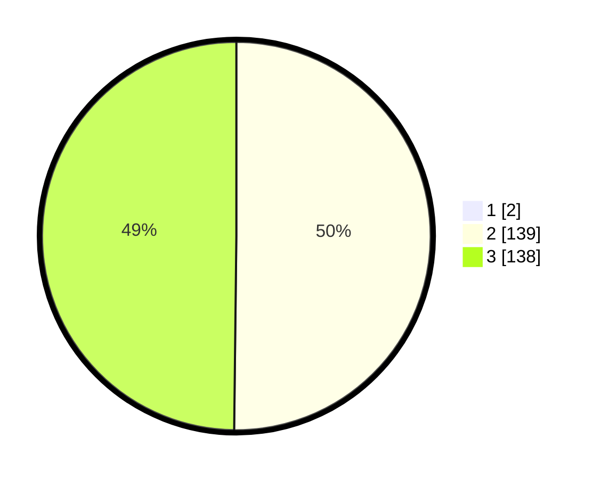

# Hasil

## Grafik

## Tabel

| No. | Nama Paslon    | Suara | Suara (raw) | Persentase |
|:--- |:-------------- | -----:| -----------:| ----------:|
| 1   | ANIES MUHAIMIN | 2     | [2][p-1]    | 0,72       |
| 2   | PRABOWO GIBRAN | 139   | [139][p-2]  | 49,82      |
| 3   | GANJAR MAHFUD  | 138   | [138][p-3]  | 49,46      |

[p-1]: https://github.com/gigit-pemilu/pemilu-2024/blob/main/pilpres/hitung-suara/sub/51-bali/sub/03-badung/sub/02-mengwi/sub/2002-buduk/sub/017-tps/sub/paslon-1.txt
[p-2]: https://github.com/gigit-pemilu/pemilu-2024/blob/main/pilpres/hitung-suara/sub/51-bali/sub/03-badung/sub/02-mengwi/sub/2002-buduk/sub/017-tps/sub/paslon-2.txt
[p-3]: https://github.com/gigit-pemilu/pemilu-2024/blob/main/pilpres/hitung-suara/sub/51-bali/sub/03-badung/sub/02-mengwi/sub/2002-buduk/sub/017-tps/sub/paslon-3.txt

## Foto C Plano

https://sirekap-obj-formc.kpu.go.id/f6e7/pemilu/ppwp/51/03/02/20/02/5103022002017-20240215-092402--01103b2d-4409-49ed-a4d5-4a8ecfa18b07.jpg

https://sirekap-obj-formc.kpu.go.id/f6e7/pemilu/ppwp/51/03/02/20/02/5103022002017-20240215-092405--6ec4d3e1-8546-4aa2-a5cf-7be5f8bafb9b.jpg

## Metadata

| Key        | Value               |
| ---------- | ------------------- |
| Time Stamp | 2024-02-21 21:00:04 |

