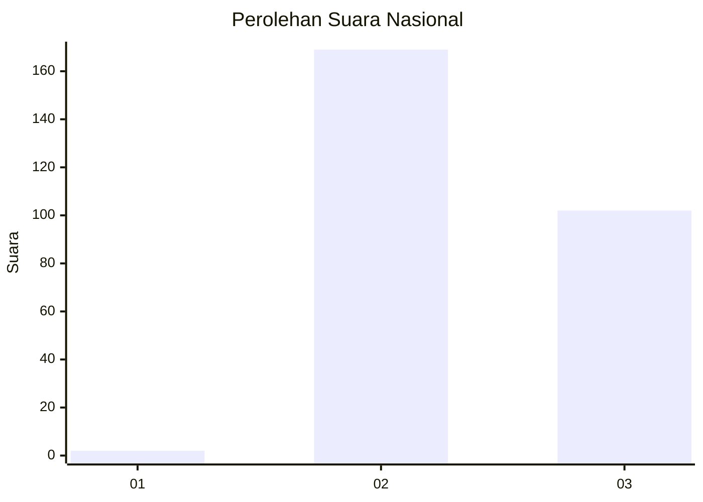
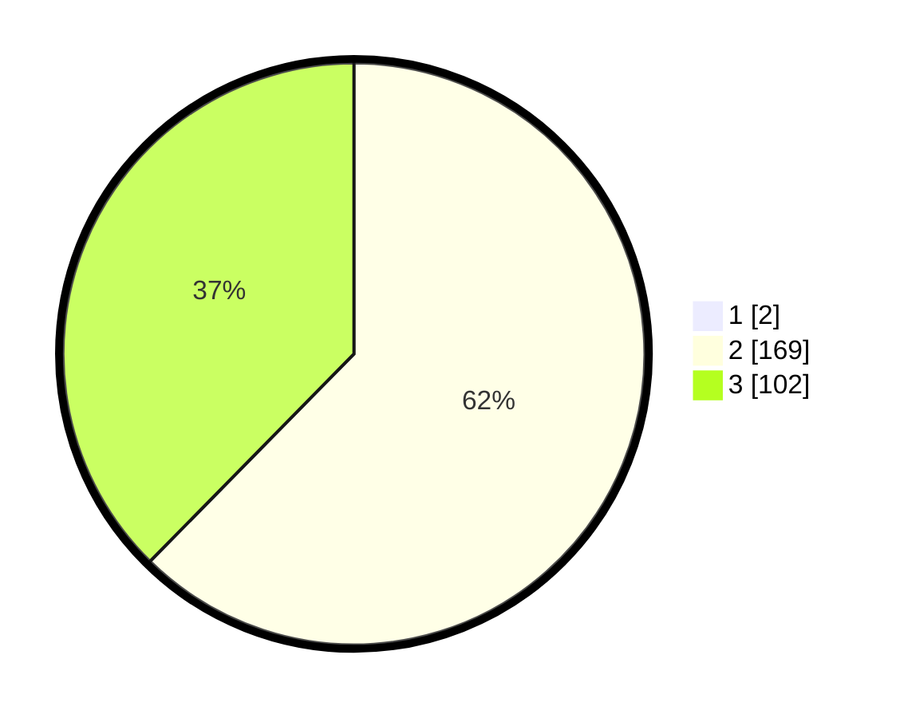

# Hasil

## Grafik

## Tabel

| No. | Nama Paslon    | Suara | Suara (raw) | Persentase |
|:--- |:-------------- | -----:| -----------:| ----------:|
| 1   | ANIES MUHAIMIN | 2     | [2][p-1]    | 0,73       |
| 2   | PRABOWO GIBRAN | 169   | [169][p-2]  | 61,90      |
| 3   | GANJAR MAHFUD  | 102   | [102][p-3]  | 37,36      |

[p-1]: https://github.com/gigit-pemilu/pemilu-2024/blob/main/pilpres/hitung-suara/sub/51-bali/sub/03-badung/sub/02-mengwi/sub/2002-buduk/sub/019-tps/sub/paslon-1.txt
[p-2]: https://github.com/gigit-pemilu/pemilu-2024/blob/main/pilpres/hitung-suara/sub/51-bali/sub/03-badung/sub/02-mengwi/sub/2002-buduk/sub/019-tps/sub/paslon-2.txt
[p-3]: https://github.com/gigit-pemilu/pemilu-2024/blob/main/pilpres/hitung-suara/sub/51-bali/sub/03-badung/sub/02-mengwi/sub/2002-buduk/sub/019-tps/sub/paslon-3.txt

## Foto C Plano

https://sirekap-obj-formc.kpu.go.id/e835/pemilu/ppwp/51/03/02/20/02/5103022002019-20240214-160118--e69d88af-5012-4881-8c0d-fc10c026da1d.jpg

https://sirekap-obj-formc.kpu.go.id/e835/pemilu/ppwp/51/03/02/20/02/5103022002019-20240214-155528--109e837f-3e5d-4445-ba59-e7f3ca806e63.jpg

https://sirekap-obj-formc.kpu.go.id/e835/pemilu/ppwp/51/03/02/20/02/5103022002019-20240214-155623--d773db43-205a-48dd-b396-80c06b2153af.jpg

## Metadata

| Key        | Value               |
| ---------- | ------------------- |
| Time Stamp | 2024-02-21 18:00:00 |

## DATA PEMILIH TETAP

Jumlah pemilih dalam DPT: **288**.
 * L: **131**.
 * P: **157**.

## DATA PENGGUNA HAK PILIH

Jumlah pengguna hak pilih dalam DPT: **275**.
 * L: **126**.
 * P: **149**.

Jumlah pengguna hak pilih dalam DPTb: **0**.
 * L: **0**.
 * P: **0**.

Jumlah pengguna hak pilih dalam DPK: **1**.
 * L: **1**.
 * P: **0**.

Jumlah pengguna hak pilih: **276**.
 * L: **127**.
 * P: **149**.

## JUMLAH SUARA SAH DAN TIDAK SAH

JUMLAH SELURUH SUARA SAH: **273**.

JUMLAH SUARA TIDAK SAH: **3**.

JUMLAH SELURUH SUARA SAH DAN SUARA TIDAK SAH: **276**.

