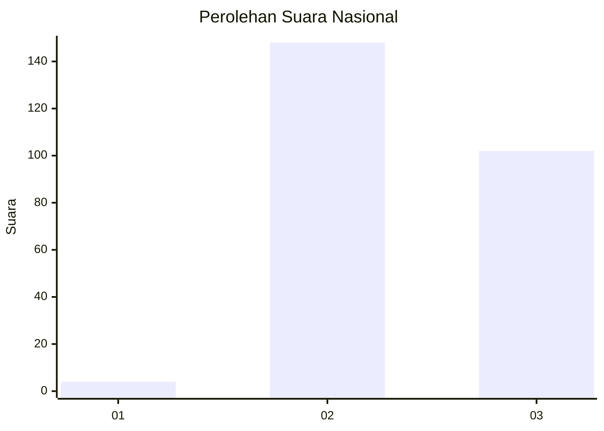
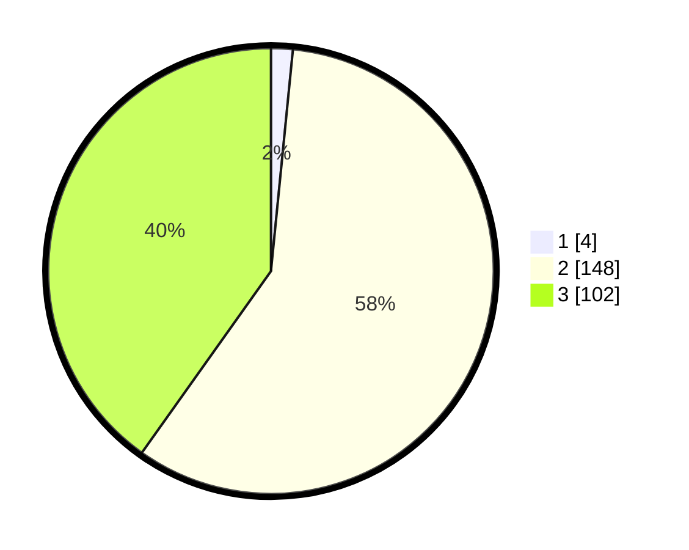

# Hasil

## Grafik

## Tabel

| No. | Nama Paslon    | Suara | Suara (raw) | Persentase |
|:--- |:-------------- | -----:| -----------:| ----------:|
| 1   | ANIES MUHAIMIN | 4     | [4][p-1]    | 1,57       |
| 2   | PRABOWO GIBRAN | 148   | [148][p-2]  | 58,27      |
| 3   | GANJAR MAHFUD  | 102   | [102][p-3]  | 40,16      |

[p-1]: https://github.com/gigit-pemilu/pemilu-2024/blob/main/pilpres/hitung-suara/sub/51-bali/sub/03-badung/sub/02-mengwi/sub/2002-buduk/sub/021-tps/sub/paslon-1.txt
[p-2]: https://github.com/gigit-pemilu/pemilu-2024/blob/main/pilpres/hitung-suara/sub/51-bali/sub/03-badung/sub/02-mengwi/sub/2002-buduk/sub/021-tps/sub/paslon-2.txt
[p-3]: https://github.com/gigit-pemilu/pemilu-2024/blob/main/pilpres/hitung-suara/sub/51-bali/sub/03-badung/sub/02-mengwi/sub/2002-buduk/sub/021-tps/sub/paslon-3.txt

## Foto C Plano

https://sirekap-obj-formc.kpu.go.id/e0d9/pemilu/ppwp/51/03/02/20/02/5103022002021-20240216-204647--d5ccd808-c6ba-4b59-bb31-967c4fc060c8.jpg

https://sirekap-obj-formc.kpu.go.id/e0d9/pemilu/ppwp/51/03/02/20/02/5103022002021-20240216-203936--74d11cdc-88f9-437d-8418-a097f7a8b4ac.jpg

https://sirekap-obj-formc.kpu.go.id/e0d9/pemilu/ppwp/51/03/02/20/02/5103022002021-20240216-204923--fe92a788-2e69-4787-a0b6-98e95fa2c51a.jpg

## Metadata

| Key        | Value               |
| ---------- | ------------------- |
| Time Stamp | 2024-02-24 22:31:28 |

