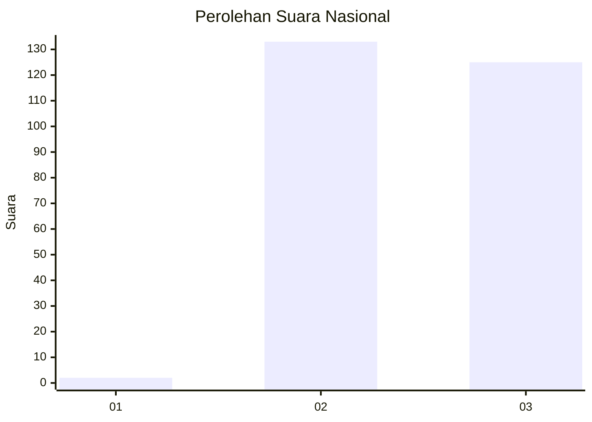
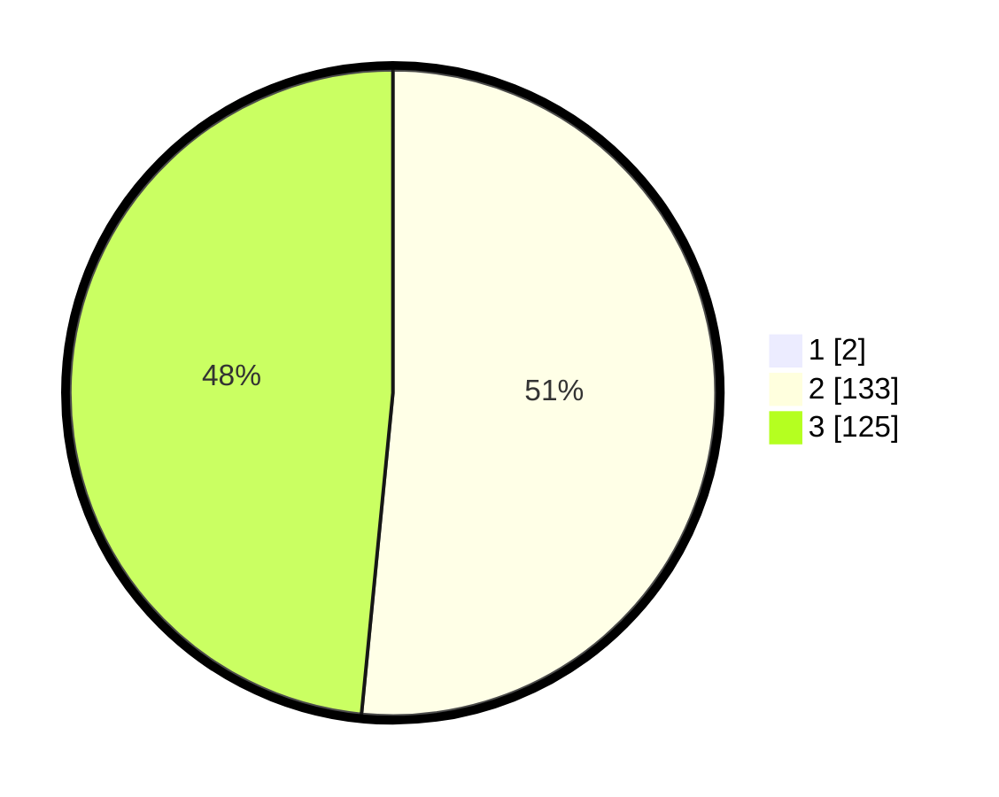

# Hasil

## Grafik

## Tabel

| No. | Nama Paslon    | Suara | Suara (raw) | Persentase |
|:--- |:-------------- | -----:| -----------:| ----------:|
| 1   | ANIES MUHAIMIN | 2     | [2][p-1]    | 0,77       |
| 2   | PRABOWO GIBRAN | 133   | [133][p-2]  | 51,15      |
| 3   | GANJAR MAHFUD  | 125   | [125][p-3]  | 48,08      |

[p-1]: https://github.com/gigit-pemilu/pemilu-2024/blob/main/pilpres/hitung-suara/sub/51-bali/sub/03-badung/sub/02-mengwi/sub/2002-buduk/sub/022-tps/sub/paslon-1.txt
[p-2]: https://github.com/gigit-pemilu/pemilu-2024/blob/main/pilpres/hitung-suara/sub/51-bali/sub/03-badung/sub/02-mengwi/sub/2002-buduk/sub/022-tps/sub/paslon-2.txt
[p-3]: https://github.com/gigit-pemilu/pemilu-2024/blob/main/pilpres/hitung-suara/sub/51-bali/sub/03-badung/sub/02-mengwi/sub/2002-buduk/sub/022-tps/sub/paslon-3.txt

## Foto C Plano

https://sirekap-obj-formc.kpu.go.id/ad06/pemilu/ppwp/51/03/02/20/02/5103022002022-20240215-033925--5638952c-f4e3-4551-8a89-94dcf4161c15.jpg

https://sirekap-obj-formc.kpu.go.id/ad06/pemilu/ppwp/51/03/02/20/02/5103022002022-20240215-034011--a75137b3-3f0b-4485-9b6e-55f52848ffcb.jpg

https://sirekap-obj-formc.kpu.go.id/ad06/pemilu/ppwp/51/03/02/20/02/5103022002022-20240215-034040--c04c4986-2190-4c68-a5ce-d3d0dc927a3d.jpg

## Metadata

| Key        | Value               |
| ---------- | ------------------- |
| Time Stamp | 2024-02-21 19:00:00 |

## DATA PEMILIH TETAP

Jumlah pemilih dalam DPT: **294**.
 * L: **138**.
 * P: **156**.

## DATA PENGGUNA HAK PILIH

Jumlah pengguna hak pilih dalam DPT: **261**.
 * L: **120**.
 * P: **141**.

Jumlah pengguna hak pilih dalam DPTb: **2**.
 * L: **1**.
 * P: **1**.

Jumlah pengguna hak pilih dalam DPK: **1**.
 * L: **0**.
 * P: **1**.

Jumlah pengguna hak pilih: **264**.
 * L: **121**.
 * P: **143**.

## JUMLAH SUARA SAH DAN TIDAK SAH

JUMLAH SELURUH SUARA SAH: **260**.

JUMLAH SUARA TIDAK SAH: **4**.

JUMLAH SELURUH SUARA SAH DAN SUARA TIDAK SAH: **264**.

