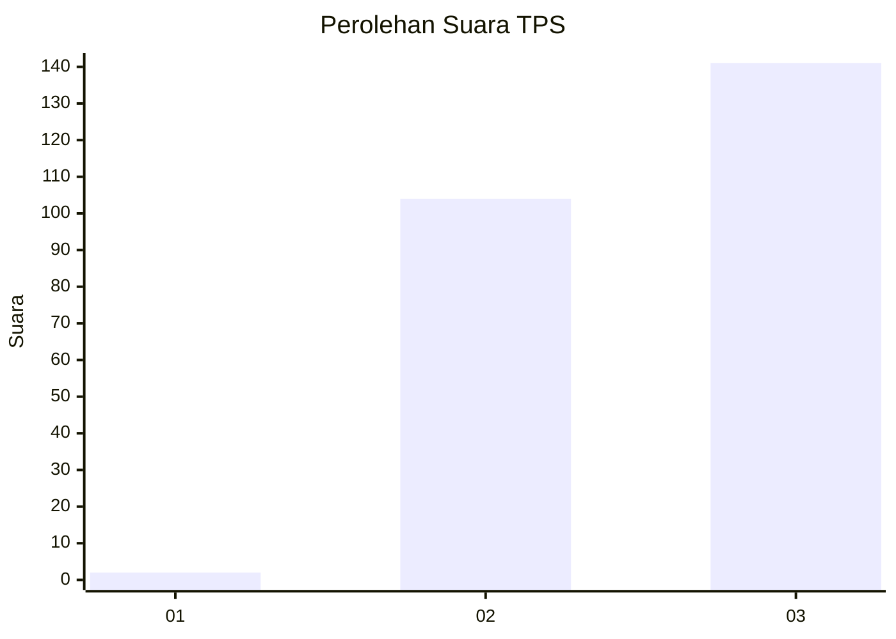
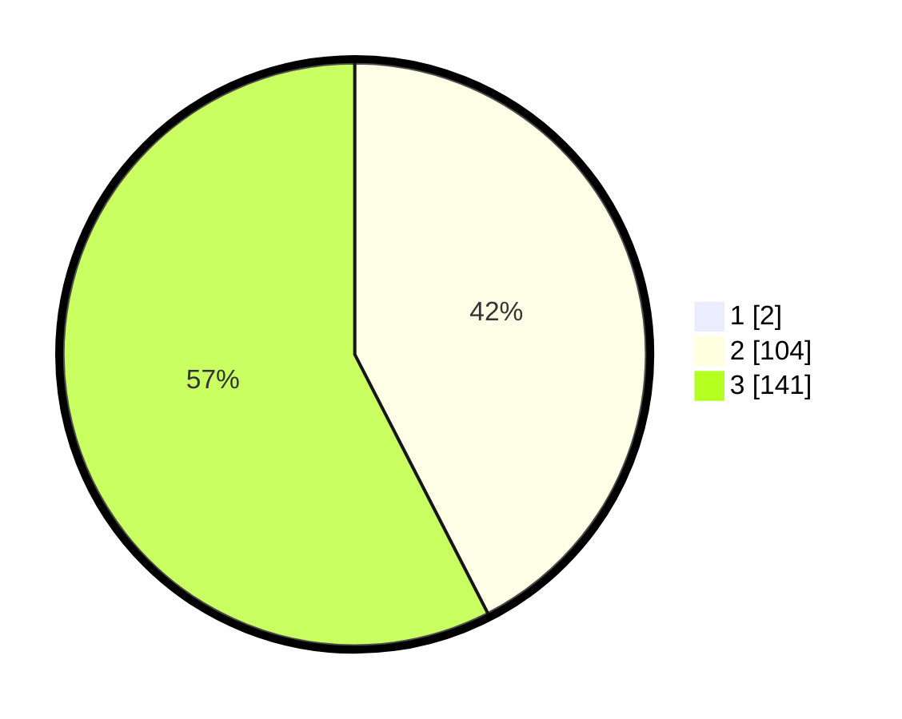

# Hasil

## Grafik

## Tabel

| No. | Nama Paslon    | Suara | Suara (raw) | Persentase |
|:--- |:-------------- | -----:| -----------:| ----------:|
| 1   | ANIES MUHAIMIN | 2     | [2][p-1]    | 0,81       |
| 2   | PRABOWO GIBRAN | 104   | [104][p-2]  | 42,11      |
| 3   | GANJAR MAHFUD  | 141   | [141][p-3]  | 57,09      |

[p-1]: https://github.com/gigit-pemilu/pemilu-2024-51-bali/blob/main/pilpres/hitung-suara/sub/51-bali/sub/03-badung/sub/02-mengwi/sub/2002-buduk/sub/026-tps/sub/paslon-1.txt
[p-2]: https://github.com/gigit-pemilu/pemilu-2024-51-bali/blob/main/pilpres/hitung-suara/sub/51-bali/sub/03-badung/sub/02-mengwi/sub/2002-buduk/sub/026-tps/sub/paslon-2.txt
[p-3]: https://github.com/gigit-pemilu/pemilu-2024-51-bali/blob/main/pilpres/hitung-suara/sub/51-bali/sub/03-badung/sub/02-mengwi/sub/2002-buduk/sub/026-tps/sub/paslon-3.txt

## Foto C Plano

https://sirekap-obj-formc.kpu.go.id/d136/pemilu/ppwp/51/03/02/20/02/5103022002026-20240215-025059--4e5c67b9-75b5-469b-aaab-e3ad1b6b9411.jpg

https://sirekap-obj-formc.kpu.go.id/d136/pemilu/ppwp/51/03/02/20/02/5103022002026-20240215-025104--78c98f5f-264c-4cb3-9fed-4c83eff86b97.jpg

https://sirekap-obj-formc.kpu.go.id/d136/pemilu/ppwp/51/03/02/20/02/5103022002026-20240215-025108--ba73cb9d-74d6-44c9-8d16-b9643fc7c3a4.jpg

## Metadata

| Key        | Value               |
| ---------- | ------------------- |
| Time Stamp | 2024-02-24 22:31:28 |

