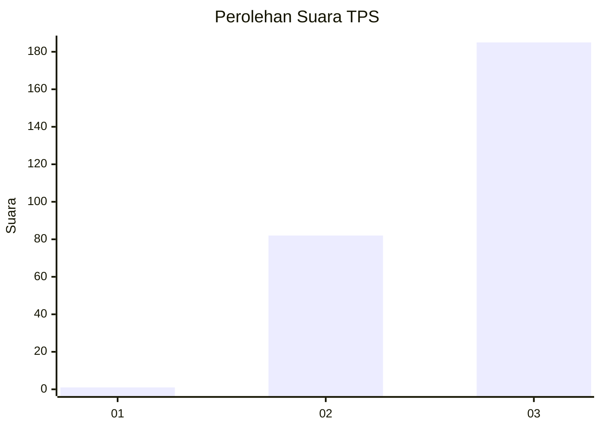
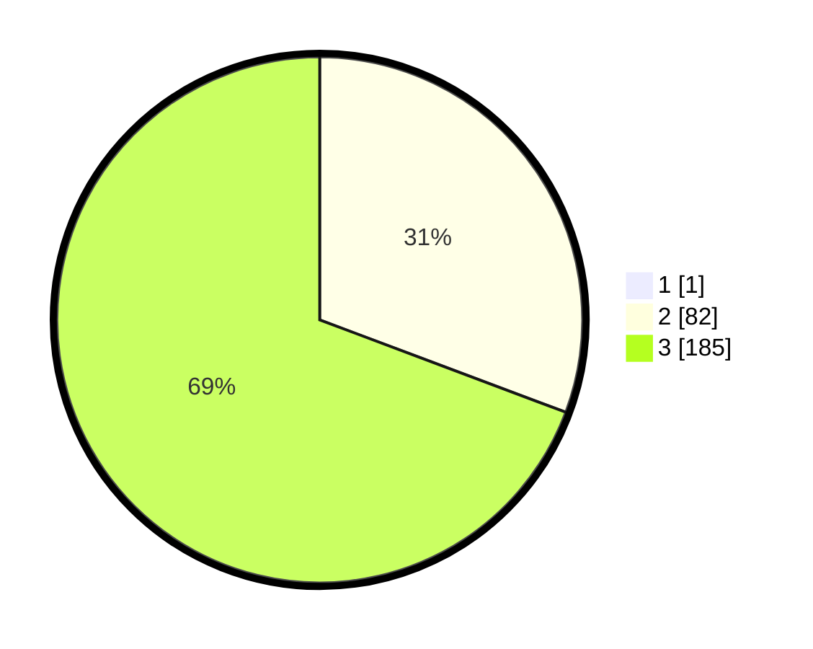

# Hasil

## Grafik

## Tabel

| No. | Nama Paslon    | Suara | Suara (raw) | Persentase |
|:--- |:-------------- | -----:| -----------:| ----------:|
| 1   | ANIES MUHAIMIN | 1     | [1][p-1]    | 0,37       |
| 2   | PRABOWO GIBRAN | 82    | [82][p-2]   | 30,60      |
| 3   | GANJAR MAHFUD  | 185   | [185][p-3]  | 69,03      |

[p-1]: https://github.com/gigit-pemilu/pemilu-2024-51-bali/blob/main/pilpres/hitung-suara/sub/51-bali/sub/03-badung/sub/02-mengwi/sub/2003-mengwitani/sub/001-tps/sub/paslon-1.txt
[p-2]: https://github.com/gigit-pemilu/pemilu-2024-51-bali/blob/main/pilpres/hitung-suara/sub/51-bali/sub/03-badung/sub/02-mengwi/sub/2003-mengwitani/sub/001-tps/sub/paslon-2.txt
[p-3]: https://github.com/gigit-pemilu/pemilu-2024-51-bali/blob/main/pilpres/hitung-suara/sub/51-bali/sub/03-badung/sub/02-mengwi/sub/2003-mengwitani/sub/001-tps/sub/paslon-3.txt

## Foto C Plano

https://sirekap-obj-formc.kpu.go.id/da67/pemilu/ppwp/51/03/02/20/03/5103022003001-20240214-222806--e0060f17-8943-46da-adec-5314c20d2823.jpg

https://sirekap-obj-formc.kpu.go.id/da67/pemilu/ppwp/51/03/02/20/03/5103022003001-20240217-181407--b16901ec-77e4-44c7-9494-b64707b667fd.jpg

https://sirekap-obj-formc.kpu.go.id/da67/pemilu/ppwp/51/03/02/20/03/5103022003001-20240214-222908--c430c35a-0331-4a04-94e5-b83fe88f9042.jpg

## Metadata

| Key        | Value               |
| ---------- | ------------------- |
| Time Stamp | 2024-02-24 22:31:28 |

