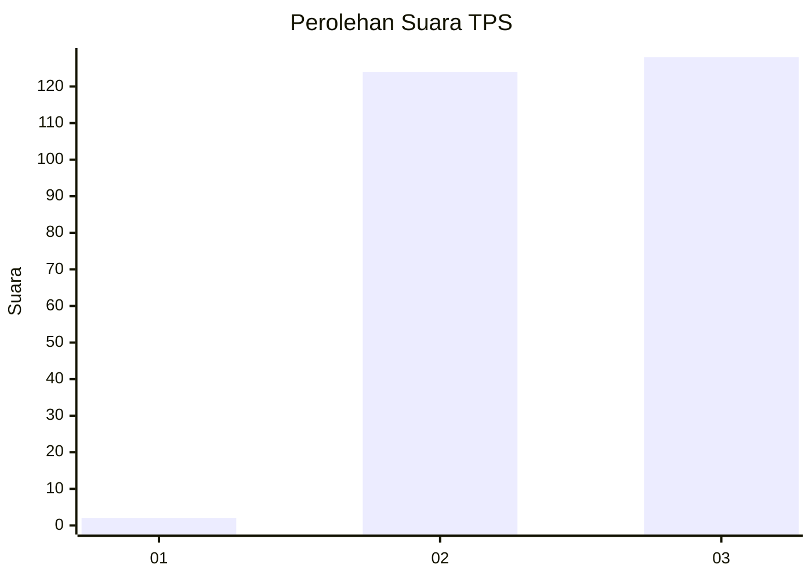
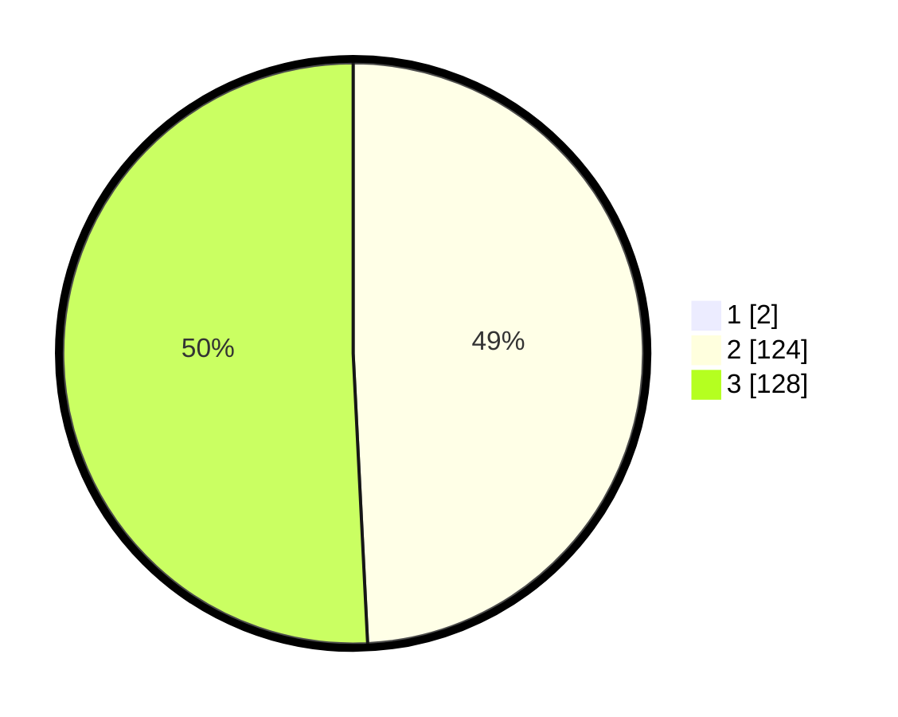

# Hasil

## Grafik

## Tabel

| No. | Nama Paslon    | Suara | Suara (raw) | Persentase |
|:--- |:-------------- | -----:| -----------:| ----------:|
| 1   | ANIES MUHAIMIN | 2     | [2][p-1]    | 0,79       |
| 2   | PRABOWO GIBRAN | 124   | [124][p-2]  | 48,82      |
| 3   | GANJAR MAHFUD  | 128   | [128][p-3]  | 50,39      |

[p-1]: https://github.com/gigit-pemilu/pemilu-2024-51-bali/blob/main/pilpres/hitung-suara/sub/51-bali/sub/03-badung/sub/02-mengwi/sub/2003-mengwitani/sub/003-tps/sub/paslon-1.txt
[p-2]: https://github.com/gigit-pemilu/pemilu-2024-51-bali/blob/main/pilpres/hitung-suara/sub/51-bali/sub/03-badung/sub/02-mengwi/sub/2003-mengwitani/sub/003-tps/sub/paslon-2.txt
[p-3]: https://github.com/gigit-pemilu/pemilu-2024-51-bali/blob/main/pilpres/hitung-suara/sub/51-bali/sub/03-badung/sub/02-mengwi/sub/2003-mengwitani/sub/003-tps/sub/paslon-3.txt

## Foto C Plano

https://sirekap-obj-formc.kpu.go.id/f46a/pemilu/ppwp/51/03/02/20/03/5103022003003-20240216-210059--5e7772f3-fe34-4a5b-92a8-cc0996e894db.jpg

https://sirekap-obj-formc.kpu.go.id/f46a/pemilu/ppwp/51/03/02/20/03/5103022003003-20240215-001025--7d4938bb-62ad-4694-98a7-846e4439cefd.jpg

https://sirekap-obj-formc.kpu.go.id/f46a/pemilu/ppwp/51/03/02/20/03/5103022003003-20240215-001039--7fa71844-3c26-46c9-8282-28929895a396.jpg

## Metadata

| Key        | Value               |
| ---------- | ------------------- |
| Time Stamp | 2024-02-16 22:01:00 |

## DATA PEMILIH TETAP

Jumlah pemilih dalam DPT: **272**.
 * L: **137**.
 * P: **135**.

## DATA PENGGUNA HAK PILIH

Jumlah pengguna hak pilih dalam DPT: **258**.
 * L: **131**.
 * P: **127**.

Jumlah pengguna hak pilih dalam DPTb: **0**.
 * L: **0**.
 * P: **0**.

Jumlah pengguna hak pilih dalam DPK: **1**.
 * L: **0**.
 * P: **1**.

Jumlah pengguna hak pilih: **259**.
 * L: **131**.
 * P: **128**.

## JUMLAH SUARA SAH DAN TIDAK SAH

JUMLAH SELURUH SUARA SAH: **254**.

JUMLAH SUARA TIDAK SAH: **5**.

JUMLAH SELURUH SUARA SAH DAN SUARA TIDAK SAH: **259**.

