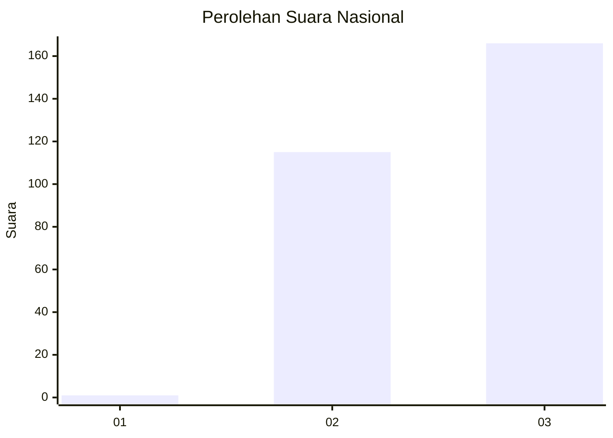
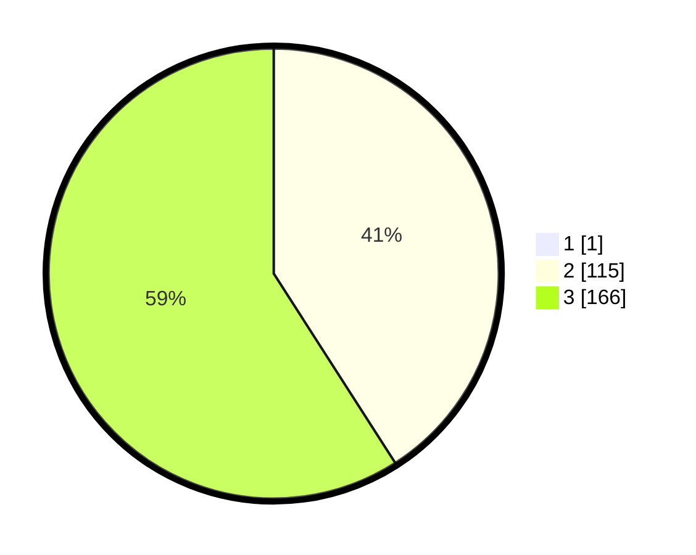

# Hasil

## Grafik

## Tabel

| No. | Nama Paslon    | Suara | Suara (raw) | Persentase |
|:--- |:-------------- | -----:| -----------:| ----------:|
| 1   | ANIES MUHAIMIN | 1     | [1][p-1]    | 0,35       |
| 2   | PRABOWO GIBRAN | 115   | [115][p-2]  | 40,78      |
| 3   | GANJAR MAHFUD  | 166   | [166][p-3]  | 58,87      |

[p-1]: https://github.com/gigit-pemilu/pemilu-2024/blob/main/pilpres/hitung-suara/sub/51-bali/sub/03-badung/sub/02-mengwi/sub/2003-mengwitani/sub/007-tps/sub/paslon-1.txt
[p-2]: https://github.com/gigit-pemilu/pemilu-2024/blob/main/pilpres/hitung-suara/sub/51-bali/sub/03-badung/sub/02-mengwi/sub/2003-mengwitani/sub/007-tps/sub/paslon-2.txt
[p-3]: https://github.com/gigit-pemilu/pemilu-2024/blob/main/pilpres/hitung-suara/sub/51-bali/sub/03-badung/sub/02-mengwi/sub/2003-mengwitani/sub/007-tps/sub/paslon-3.txt

## Foto C Plano

https://sirekap-obj-formc.kpu.go.id/3c07/pemilu/ppwp/51/03/02/20/03/5103022003007-20240214-215514--6ff2e8c5-5bb9-445c-b306-2c1e09982380.jpg

https://sirekap-obj-formc.kpu.go.id/3c07/pemilu/ppwp/51/03/02/20/03/5103022003007-20240214-215559--6c9f9c67-afb3-4798-89f8-dc280f6e3cdc.jpg

https://sirekap-obj-formc.kpu.go.id/3c07/pemilu/ppwp/51/03/02/20/03/5103022003007-20240214-215644--c13f9bba-c377-47c5-ac94-34e563f6124d.jpg

## Metadata

| Key        | Value               |
| ---------- | ------------------- |
| Time Stamp | 2024-02-24 22:31:28 |

