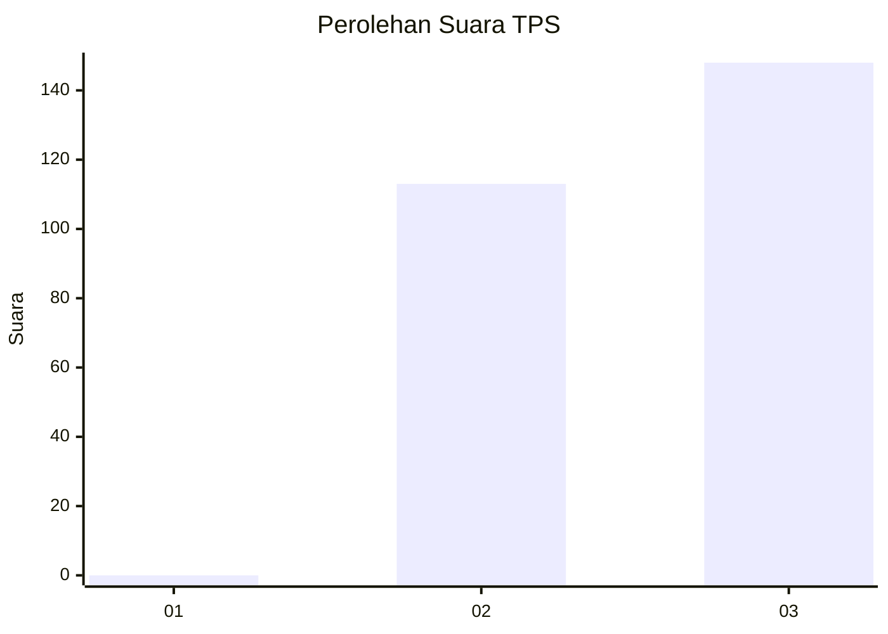
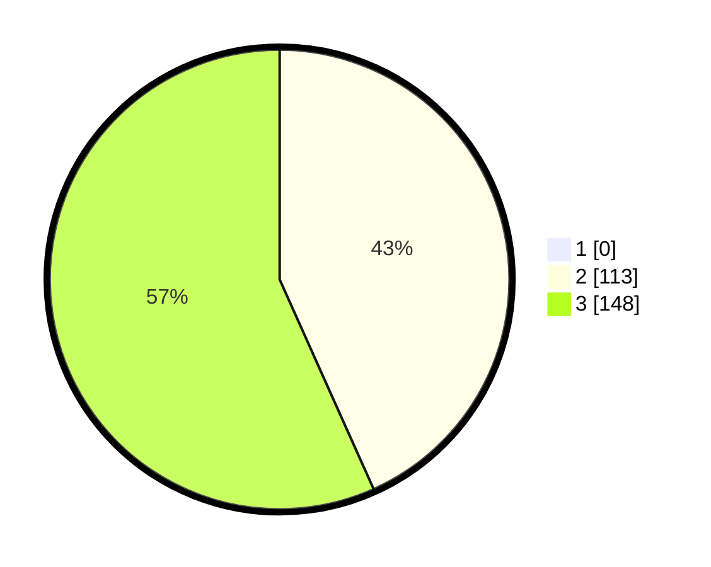

# Hasil

## Grafik

## Tabel

| No. | Nama Paslon    | Suara | Suara (raw) | Persentase |
|:--- |:-------------- | -----:| -----------:| ----------:|
| 1   | ANIES MUHAIMIN | 0     | [0][p-1]    | 0,00       |
| 2   | PRABOWO GIBRAN | 113   | [113][p-2]  | 43,30      |
| 3   | GANJAR MAHFUD  | 148   | [148][p-3]  | 56,70      |

[p-1]: https://github.com/gigit-pemilu/pemilu-2024-51-bali/blob/main/pilpres/hitung-suara/sub/51-bali/sub/03-badung/sub/02-mengwi/sub/2003-mengwitani/sub/012-tps/sub/paslon-1.txt
[p-2]: https://github.com/gigit-pemilu/pemilu-2024-51-bali/blob/main/pilpres/hitung-suara/sub/51-bali/sub/03-badung/sub/02-mengwi/sub/2003-mengwitani/sub/012-tps/sub/paslon-2.txt
[p-3]: https://github.com/gigit-pemilu/pemilu-2024-51-bali/blob/main/pilpres/hitung-suara/sub/51-bali/sub/03-badung/sub/02-mengwi/sub/2003-mengwitani/sub/012-tps/sub/paslon-3.txt

## Foto C Plano

https://sirekap-obj-formc.kpu.go.id/ddb2/pemilu/ppwp/51/03/02/20/03/5103022003012-20240216-102421--a6cdb835-3d39-4b94-ba28-394cd9ed5168.jpg

https://sirekap-obj-formc.kpu.go.id/ddb2/pemilu/ppwp/51/03/02/20/03/5103022003012-20240216-102559--acb023fe-c8d5-47a7-9a7d-56df125f1ddd.jpg

https://sirekap-obj-formc.kpu.go.id/ddb2/pemilu/ppwp/51/03/02/20/03/5103022003012-20240216-103146--8326ab81-542c-48ca-a5fe-751c45b6cd0b.jpg

## Metadata

| Key        | Value               |
| ---------- | ------------------- |
| Time Stamp | 2024-02-21 17:00:00 |

## DATA PEMILIH TETAP

Jumlah pemilih dalam DPT: **259**.
 * L: **130**.
 * P: **129**.

## DATA PENGGUNA HAK PILIH

Jumlah pengguna hak pilih dalam DPT: **247**.
 * L: **125**.
 * P: **122**.

Jumlah pengguna hak pilih dalam DPTb: **10**.
 * L: **4**.
 * P: **6**.

Jumlah pengguna hak pilih dalam DPK: **5**.
 * L: **1**.
 * P: **4**.

Jumlah pengguna hak pilih: **262**.
 * L: **130**.
 * P: **132**.

## JUMLAH SUARA SAH DAN TIDAK SAH

JUMLAH SELURUH SUARA SAH: **261**.

JUMLAH SUARA TIDAK SAH: **1**.

JUMLAH SELURUH SUARA SAH DAN SUARA TIDAK SAH: **262**.

