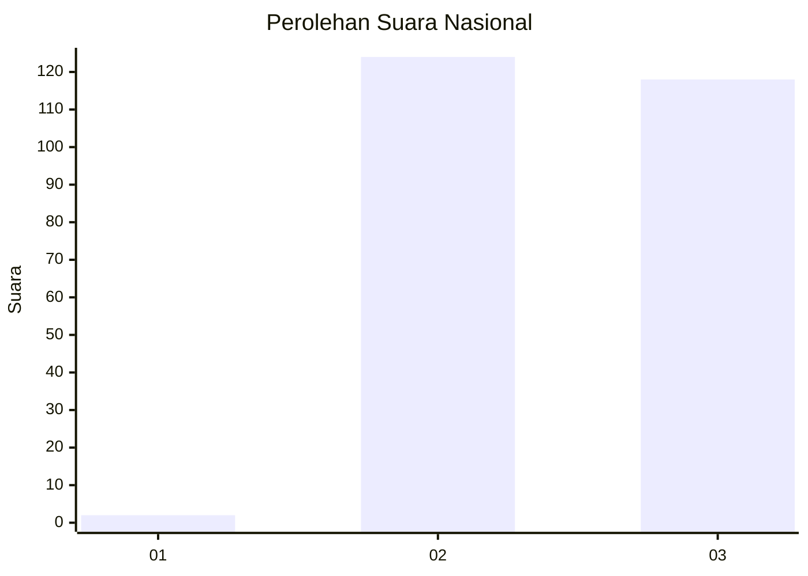
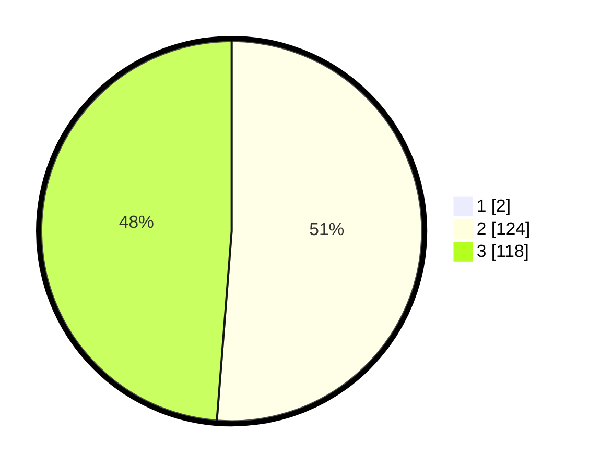

# Hasil

## Grafik

## Tabel

| No. | Nama Paslon    | Suara | Suara (raw) | Persentase |
|:--- |:-------------- | -----:| -----------:| ----------:|
| 1   | ANIES MUHAIMIN | 2     | [2][p-1]    | 0,82       |
| 2   | PRABOWO GIBRAN | 124   | [124][p-2]  | 50,82      |
| 3   | GANJAR MAHFUD  | 118   | [118][p-3]  | 48,36      |

[p-1]: https://github.com/gigit-pemilu/pemilu-2024/blob/main/pilpres/hitung-suara/sub/51-bali/sub/03-badung/sub/02-mengwi/sub/2003-mengwitani/sub/013-tps/sub/paslon-1.txt
[p-2]: https://github.com/gigit-pemilu/pemilu-2024/blob/main/pilpres/hitung-suara/sub/51-bali/sub/03-badung/sub/02-mengwi/sub/2003-mengwitani/sub/013-tps/sub/paslon-2.txt
[p-3]: https://github.com/gigit-pemilu/pemilu-2024/blob/main/pilpres/hitung-suara/sub/51-bali/sub/03-badung/sub/02-mengwi/sub/2003-mengwitani/sub/013-tps/sub/paslon-3.txt

## Foto C Plano

https://sirekap-obj-formc.kpu.go.id/a794/pemilu/ppwp/51/03/02/20/03/5103022003013-20240214-215902--ab9f735e-2429-443f-90a8-7ba52af53da9.jpg

https://sirekap-obj-formc.kpu.go.id/a794/pemilu/ppwp/51/03/02/20/03/5103022003013-20240214-220010--50d064f7-b96a-48ce-b3e0-7e070842f972.jpg

https://sirekap-obj-formc.kpu.go.id/a794/pemilu/ppwp/51/03/02/20/03/5103022003013-20240214-220101--4b352e91-227c-485c-9932-956be548ea5d.jpg

## Metadata

| Key        | Value               |
| ---------- | ------------------- |
| Time Stamp | 2024-02-24 22:31:28 |

