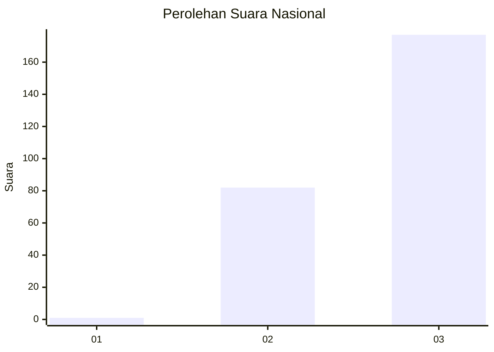
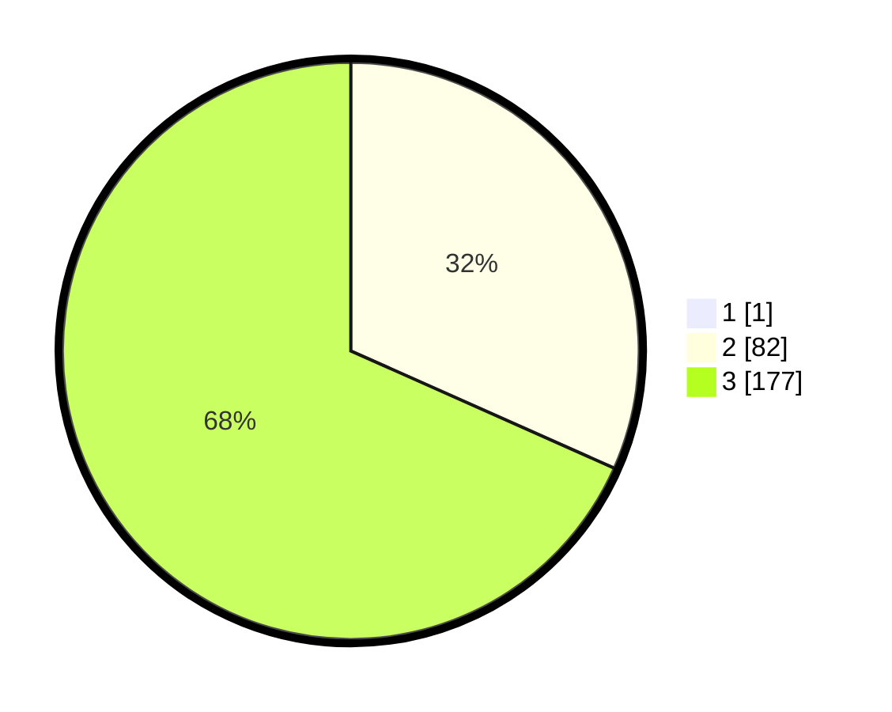

# Hasil

## Grafik

## Tabel

| No. | Nama Paslon    | Suara | Suara (raw) | Persentase |
|:--- |:-------------- | -----:| -----------:| ----------:|
| 1   | ANIES MUHAIMIN | 1     | [1][p-1]    | 0,38       |
| 2   | PRABOWO GIBRAN | 82    | [82][p-2]   | 31,54      |
| 3   | GANJAR MAHFUD  | 177   | [177][p-3]  | 68,08      |

[p-1]: https://github.com/gigit-pemilu/pemilu-2024/blob/main/pilpres/hitung-suara/sub/51-bali/sub/03-badung/sub/02-mengwi/sub/2003-mengwitani/sub/015-tps/sub/paslon-1.txt
[p-2]: https://github.com/gigit-pemilu/pemilu-2024/blob/main/pilpres/hitung-suara/sub/51-bali/sub/03-badung/sub/02-mengwi/sub/2003-mengwitani/sub/015-tps/sub/paslon-2.txt
[p-3]: https://github.com/gigit-pemilu/pemilu-2024/blob/main/pilpres/hitung-suara/sub/51-bali/sub/03-badung/sub/02-mengwi/sub/2003-mengwitani/sub/015-tps/sub/paslon-3.txt

## Foto C Plano

https://sirekap-obj-formc.kpu.go.id/9487/pemilu/ppwp/51/03/02/20/03/5103022003015-20240214-221908--518c8ed4-6b45-4835-a467-3486f7b70fc8.jpg

https://sirekap-obj-formc.kpu.go.id/9487/pemilu/ppwp/51/03/02/20/03/5103022003015-20240214-222230--d3bc0ee2-373b-42b4-b28f-f2874fea7e82.jpg

https://sirekap-obj-formc.kpu.go.id/9487/pemilu/ppwp/51/03/02/20/03/5103022003015-20240214-222528--c749a703-92a9-4b0e-85ce-ae81c4893200.jpg

## Metadata

| Key        | Value               |
| ---------- | ------------------- |
| Time Stamp | 2024-02-15 21:01:18 |

## DATA PEMILIH TETAP

Jumlah pemilih dalam DPT: **265**.
 * L: **128**.
 * P: **137**.

## DATA PENGGUNA HAK PILIH

Jumlah pengguna hak pilih dalam DPT: **261**.
 * L: **125**.
 * P: **136**.

Jumlah pengguna hak pilih dalam DPTb: **1**.
 * L: **1**.
 * P: **0**.

Jumlah pengguna hak pilih dalam DPK: **0**.
 * L: **0**.
 * P: **0**.

Jumlah pengguna hak pilih: **262**.
 * L: **126**.
 * P: **136**.

## JUMLAH SUARA SAH DAN TIDAK SAH

JUMLAH SELURUH SUARA SAH: **260**.

JUMLAH SUARA TIDAK SAH: **2**.

JUMLAH SELURUH SUARA SAH DAN SUARA TIDAK SAH: **262**.

