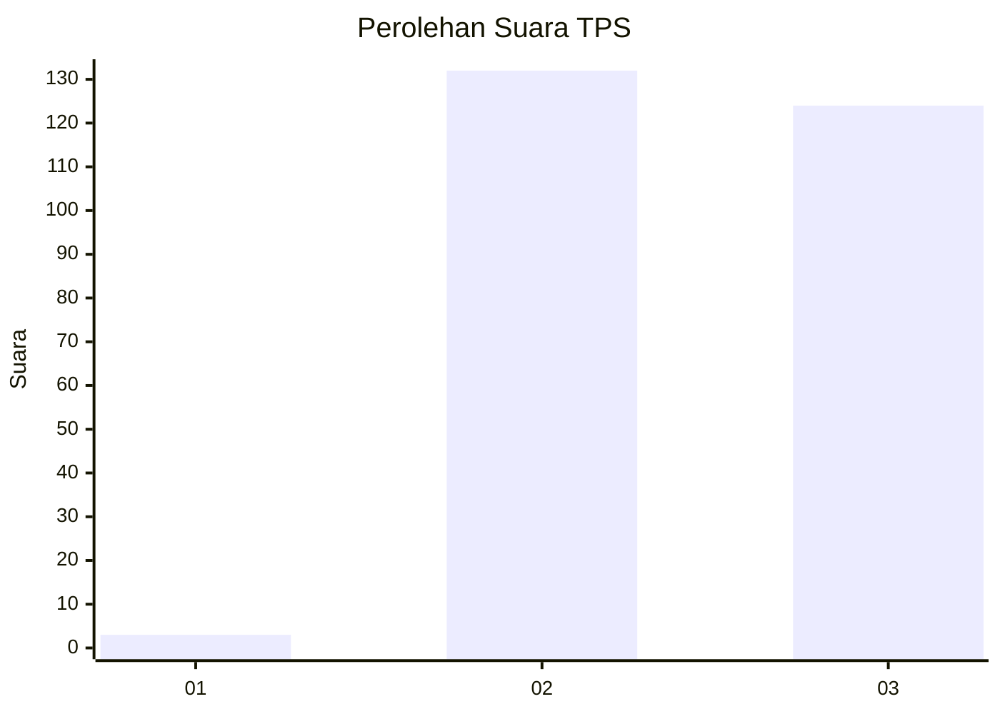
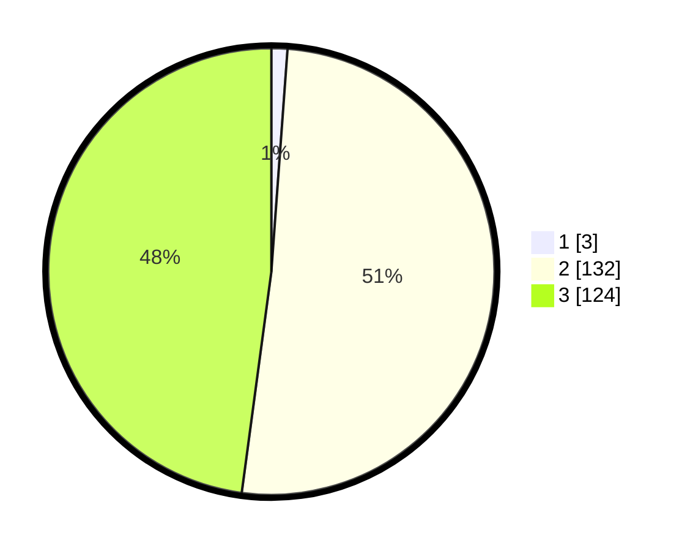

# Hasil

## Grafik

## Tabel

| No. | Nama Paslon    | Suara | Suara (raw) | Persentase |
|:--- |:-------------- | -----:| -----------:| ----------:|
| 1   | ANIES MUHAIMIN | 3     | [3][p-1]    | 1,16       |
| 2   | PRABOWO GIBRAN | 132   | [132][p-2]  | 50,97      |
| 3   | GANJAR MAHFUD  | 124   | [124][p-3]  | 47,88      |

[p-1]: https://github.com/gigit-pemilu/pemilu-2024-51-bali/blob/main/pilpres/hitung-suara/sub/51-bali/sub/03-badung/sub/02-mengwi/sub/2003-mengwitani/sub/018-tps/sub/paslon-1.txt
[p-2]: https://github.com/gigit-pemilu/pemilu-2024-51-bali/blob/main/pilpres/hitung-suara/sub/51-bali/sub/03-badung/sub/02-mengwi/sub/2003-mengwitani/sub/018-tps/sub/paslon-2.txt
[p-3]: https://github.com/gigit-pemilu/pemilu-2024-51-bali/blob/main/pilpres/hitung-suara/sub/51-bali/sub/03-badung/sub/02-mengwi/sub/2003-mengwitani/sub/018-tps/sub/paslon-3.txt

## Foto C Plano

https://sirekap-obj-formc.kpu.go.id/687e/pemilu/ppwp/51/03/02/20/03/5103022003018-20240214-213249--ae23898c-0a18-4a1d-8ddf-e8d6767f9ca9.jpg

https://sirekap-obj-formc.kpu.go.id/687e/pemilu/ppwp/51/03/02/20/03/5103022003018-20240214-213258--76d7604f-18a5-462a-9250-872e3ef593b3.jpg

https://sirekap-obj-formc.kpu.go.id/687e/pemilu/ppwp/51/03/02/20/03/5103022003018-20240214-213301--08d0f6e8-5063-43de-ac02-f63e8925ad16.jpg

## Metadata

| Key        | Value               |
| ---------- | ------------------- |
| Time Stamp | 2024-02-24 22:31:28 |

