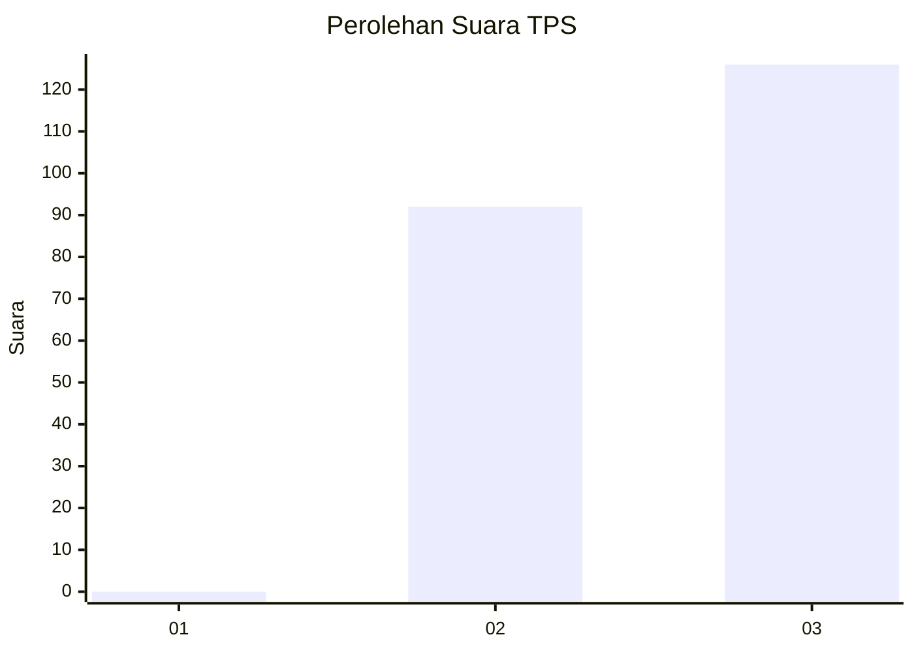
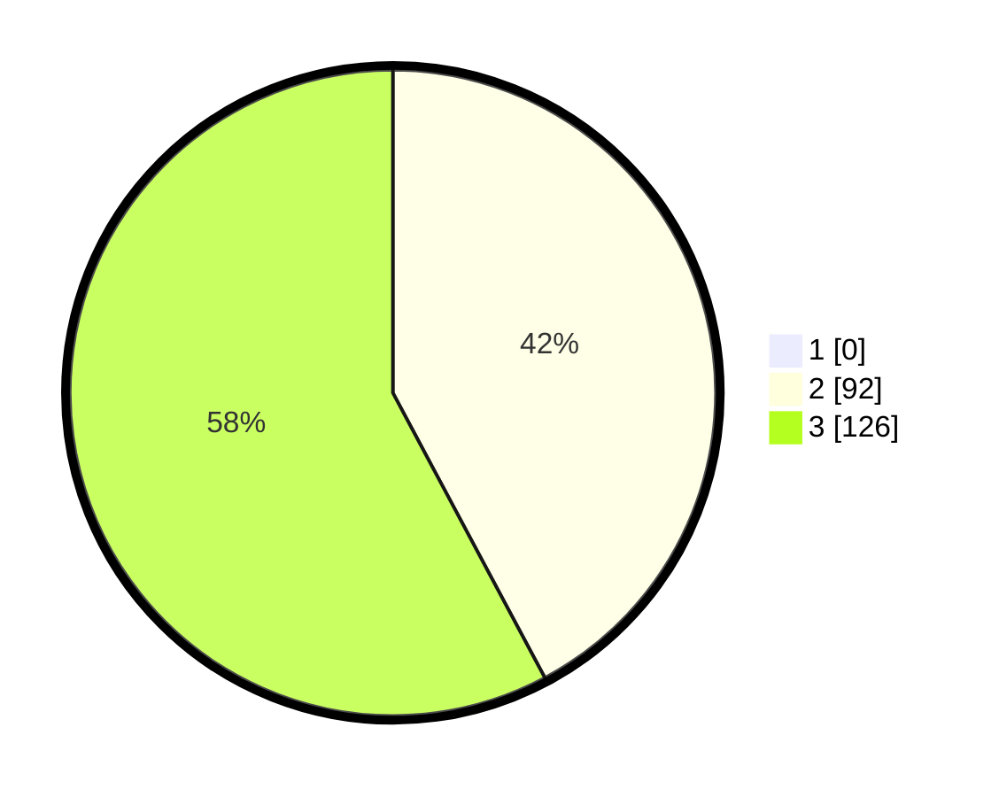

# Hasil

## Grafik

## Tabel

| No. | Nama Paslon    | Suara | Suara (raw) | Persentase |
|:--- |:-------------- | -----:| -----------:| ----------:|
| 1   | ANIES MUHAIMIN | 0     | [0][p-1]    | 0,00       |
| 2   | PRABOWO GIBRAN | 92    | [92][p-2]   | 42,20      |
| 3   | GANJAR MAHFUD  | 126   | [126][p-3]  | 57,80      |

[p-1]: https://github.com/gigit-pemilu/pemilu-2024-51-bali/blob/main/pilpres/hitung-suara/sub/51-bali/sub/03-badung/sub/02-mengwi/sub/2003-mengwitani/sub/021-tps/sub/paslon-1.txt
[p-2]: https://github.com/gigit-pemilu/pemilu-2024-51-bali/blob/main/pilpres/hitung-suara/sub/51-bali/sub/03-badung/sub/02-mengwi/sub/2003-mengwitani/sub/021-tps/sub/paslon-2.txt
[p-3]: https://github.com/gigit-pemilu/pemilu-2024-51-bali/blob/main/pilpres/hitung-suara/sub/51-bali/sub/03-badung/sub/02-mengwi/sub/2003-mengwitani/sub/021-tps/sub/paslon-3.txt

## Foto C Plano

https://sirekap-obj-formc.kpu.go.id/be18/pemilu/ppwp/51/03/02/20/03/5103022003021-20240221-113123--965c6346-73ca-4b74-811e-37550f7a6034.jpg

https://sirekap-obj-formc.kpu.go.id/be18/pemilu/ppwp/51/03/02/20/03/5103022003021-20240221-113454--2a3a1e77-3082-497e-b07e-b5a93e2f59c1.jpg

https://sirekap-obj-formc.kpu.go.id/be18/pemilu/ppwp/51/03/02/20/03/5103022003021-20240214-132039--af0dc255-987f-4720-8ed2-6d24f181ff70.jpg

## Metadata

| Key        | Value               |
| ---------- | ------------------- |
| Time Stamp | 2024-02-26 17:00:04 |

