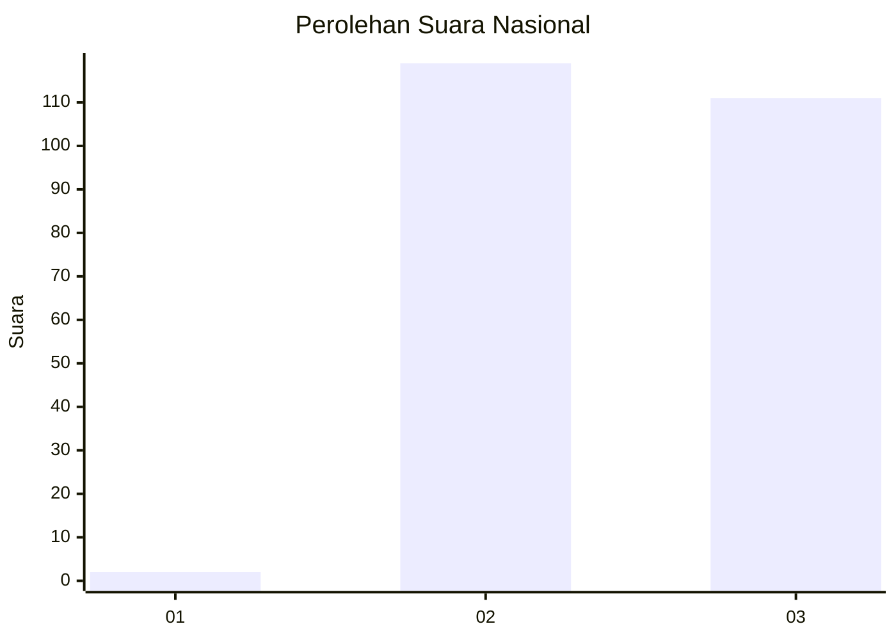
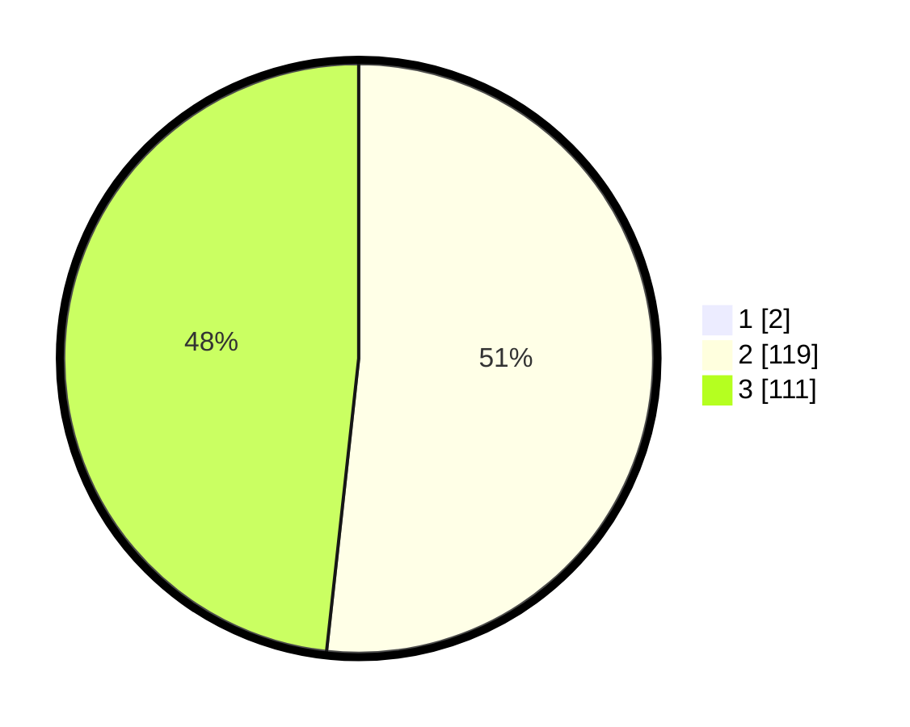

# Hasil

## Grafik

## Tabel

| No. | Nama Paslon    | Suara | Suara (raw) | Persentase |
|:--- |:-------------- | -----:| -----------:| ----------:|
| 1   | ANIES MUHAIMIN | 2     | [2][p-1]    | 0,86       |
| 2   | PRABOWO GIBRAN | 119   | [119][p-2]  | 51,29      |
| 3   | GANJAR MAHFUD  | 111   | [111][p-3]  | 47,84      |

[p-1]: https://github.com/gigit-pemilu/pemilu-2024/blob/main/pilpres/hitung-suara/sub/51-bali/sub/03-badung/sub/02-mengwi/sub/2003-mengwitani/sub/022-tps/sub/paslon-1.txt
[p-2]: https://github.com/gigit-pemilu/pemilu-2024/blob/main/pilpres/hitung-suara/sub/51-bali/sub/03-badung/sub/02-mengwi/sub/2003-mengwitani/sub/022-tps/sub/paslon-2.txt
[p-3]: https://github.com/gigit-pemilu/pemilu-2024/blob/main/pilpres/hitung-suara/sub/51-bali/sub/03-badung/sub/02-mengwi/sub/2003-mengwitani/sub/022-tps/sub/paslon-3.txt

## Foto C Plano

https://sirekap-obj-formc.kpu.go.id/608c/pemilu/ppwp/51/03/02/20/03/5103022003022-20240214-204158--41473629-49e1-4ab3-a1fb-3677a599c9bb.jpg

https://sirekap-obj-formc.kpu.go.id/608c/pemilu/ppwp/51/03/02/20/03/5103022003022-20240214-204239--6bf9261b-31fb-4115-809c-db05b0801f38.jpg

https://sirekap-obj-formc.kpu.go.id/608c/pemilu/ppwp/51/03/02/20/03/5103022003022-20240214-204316--cf031a86-d3a9-420a-af11-6999c21d7fdc.jpg

## Metadata

| Key        | Value               |
| ---------- | ------------------- |
| Time Stamp | 2024-02-24 22:31:28 |

