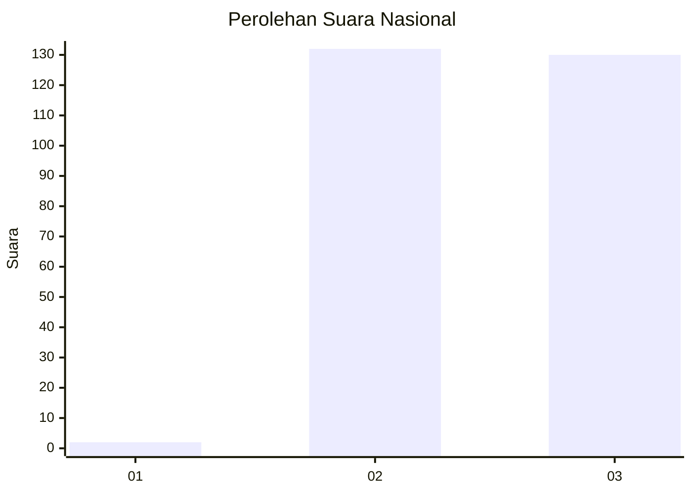
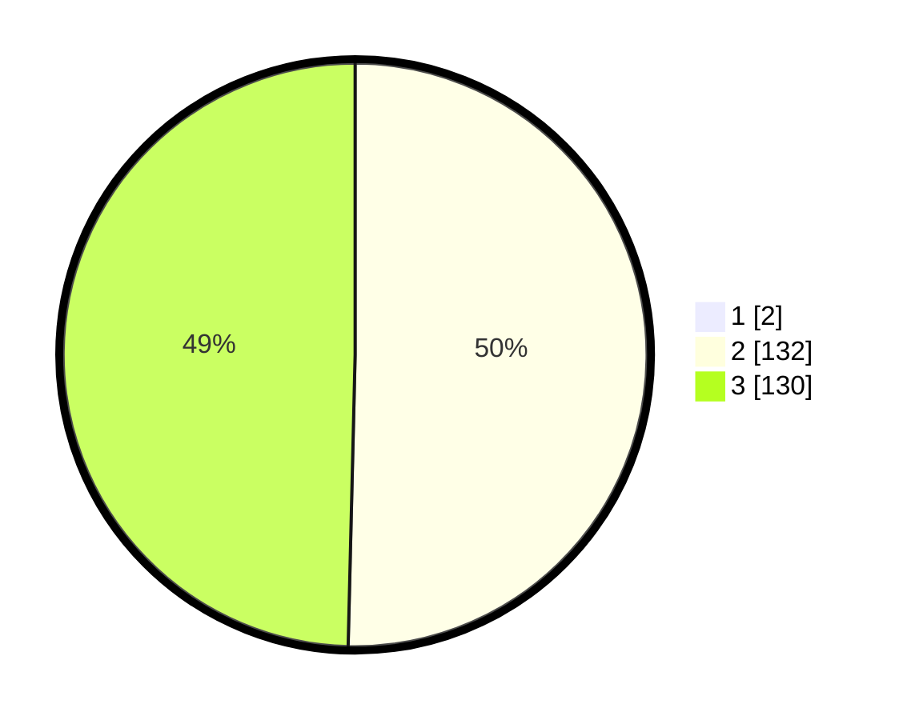

# Hasil

## Grafik

## Tabel

| No. | Nama Paslon    | Suara | Suara (raw) | Persentase |
|:--- |:-------------- | -----:| -----------:| ----------:|
| 1   | ANIES MUHAIMIN | 2     | [2][p-1]    | 0,76       |
| 2   | PRABOWO GIBRAN | 132   | [132][p-2]  | 50,00      |
| 3   | GANJAR MAHFUD  | 130   | [130][p-3]  | 49,24      |

[p-1]: https://github.com/gigit-pemilu/pemilu-2024/blob/main/pilpres/hitung-suara/sub/51-bali/sub/03-badung/sub/02-mengwi/sub/2003-mengwitani/sub/023-tps/sub/paslon-1.txt
[p-2]: https://github.com/gigit-pemilu/pemilu-2024/blob/main/pilpres/hitung-suara/sub/51-bali/sub/03-badung/sub/02-mengwi/sub/2003-mengwitani/sub/023-tps/sub/paslon-2.txt
[p-3]: https://github.com/gigit-pemilu/pemilu-2024/blob/main/pilpres/hitung-suara/sub/51-bali/sub/03-badung/sub/02-mengwi/sub/2003-mengwitani/sub/023-tps/sub/paslon-3.txt

## Foto C Plano

https://sirekap-obj-formc.kpu.go.id/1559/pemilu/ppwp/51/03/02/20/03/5103022003023-20240214-221627--5d93b787-ce80-4b8c-abe6-5a65857a305c.jpg

https://sirekap-obj-formc.kpu.go.id/1559/pemilu/ppwp/51/03/02/20/03/5103022003023-20240214-222122--2675ec9c-332a-4bcd-b107-2c25c6b04fc6.jpg

https://sirekap-obj-formc.kpu.go.id/1559/pemilu/ppwp/51/03/02/20/03/5103022003023-20240214-221810--52c2e894-20e0-4a17-bb47-376543d53fba.jpg

## Metadata

| Key        | Value               |
| ---------- | ------------------- |
| Time Stamp | 2024-02-24 22:31:28 |

