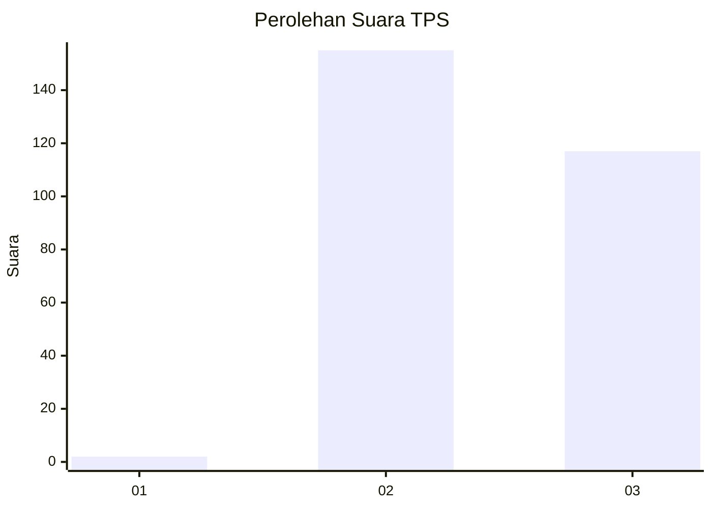
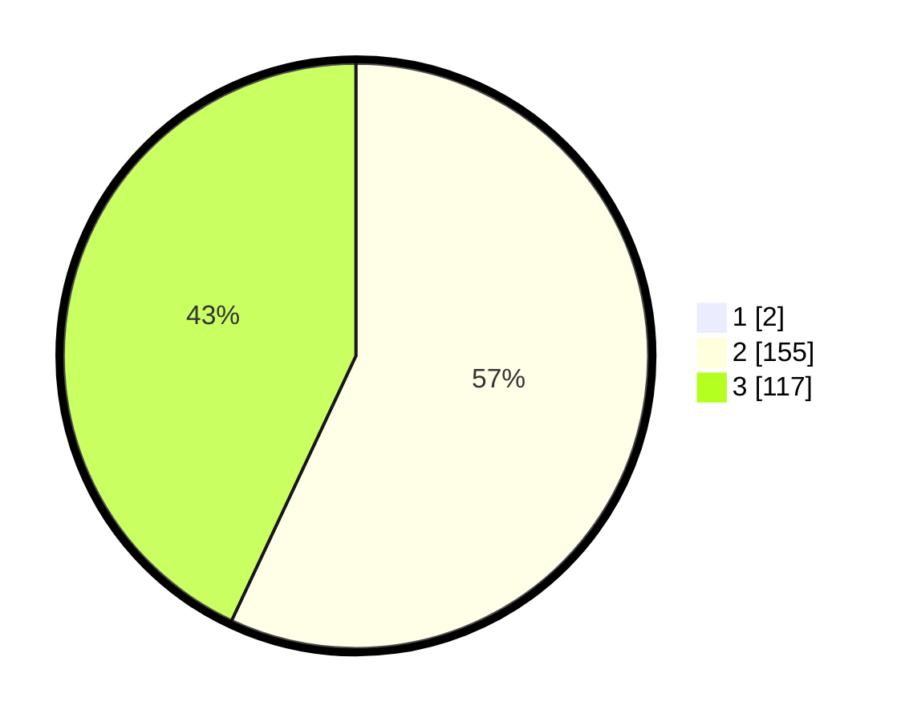

# Hasil

## Grafik

## Tabel

| No. | Nama Paslon    | Suara | Suara (raw) | Persentase |
|:--- |:-------------- | -----:| -----------:| ----------:|
| 1   | ANIES MUHAIMIN | 2     | [2][p-1]    | 0,73       |
| 2   | PRABOWO GIBRAN | 155   | [155][p-2]  | 56,57      |
| 3   | GANJAR MAHFUD  | 117   | [117][p-3]  | 42,70      |

[p-1]: https://github.com/gigit-pemilu/pemilu-2024-51-bali/blob/main/pilpres/hitung-suara/sub/51-bali/sub/03-badung/sub/02-mengwi/sub/2003-mengwitani/sub/024-tps/sub/paslon-1.txt
[p-2]: https://github.com/gigit-pemilu/pemilu-2024-51-bali/blob/main/pilpres/hitung-suara/sub/51-bali/sub/03-badung/sub/02-mengwi/sub/2003-mengwitani/sub/024-tps/sub/paslon-2.txt
[p-3]: https://github.com/gigit-pemilu/pemilu-2024-51-bali/blob/main/pilpres/hitung-suara/sub/51-bali/sub/03-badung/sub/02-mengwi/sub/2003-mengwitani/sub/024-tps/sub/paslon-3.txt

## Foto C Plano

https://sirekap-obj-formc.kpu.go.id/28bd/pemilu/ppwp/51/03/02/20/03/5103022003024-20240216-223116--12511d7d-bea0-4216-a82d-49fa22909b0b.jpg

https://sirekap-obj-formc.kpu.go.id/28bd/pemilu/ppwp/51/03/02/20/03/5103022003024-20240216-223118--1b1f766d-4508-487c-96c4-4dbffa90209e.jpg

https://sirekap-obj-formc.kpu.go.id/28bd/pemilu/ppwp/51/03/02/20/03/5103022003024-20240216-223117--6b7c6e3c-3f1e-4d25-a59e-1089d8eb766b.jpg

## Metadata

| Key        | Value               |
| ---------- | ------------------- |
| Time Stamp | 2024-02-21 21:00:04 |

## DATA PEMILIH TETAP

Jumlah pemilih dalam DPT: **297**.
 * L: **137**.
 * P: **160**.

## DATA PENGGUNA HAK PILIH

Jumlah pengguna hak pilih dalam DPT: **281**.
 * L: **133**.
 * P: **148**.

Jumlah pengguna hak pilih dalam DPTb: **0**.
 * L: **0**.
 * P: **0**.

Jumlah pengguna hak pilih dalam DPK: **0**.
 * L: **0**.
 * P: **0**.

Jumlah pengguna hak pilih: **281**.
 * L: **133**.
 * P: **148**.

## JUMLAH SUARA SAH DAN TIDAK SAH

JUMLAH SELURUH SUARA SAH: **274**.

JUMLAH SUARA TIDAK SAH: **7**.

JUMLAH SELURUH SUARA SAH DAN SUARA TIDAK SAH: **281**.

