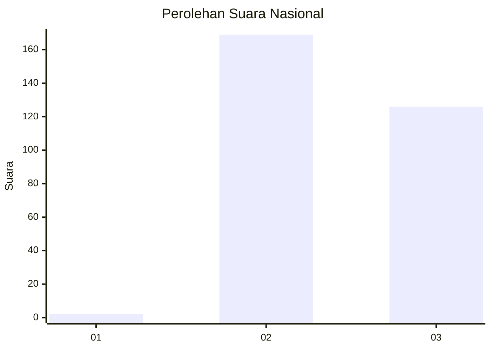
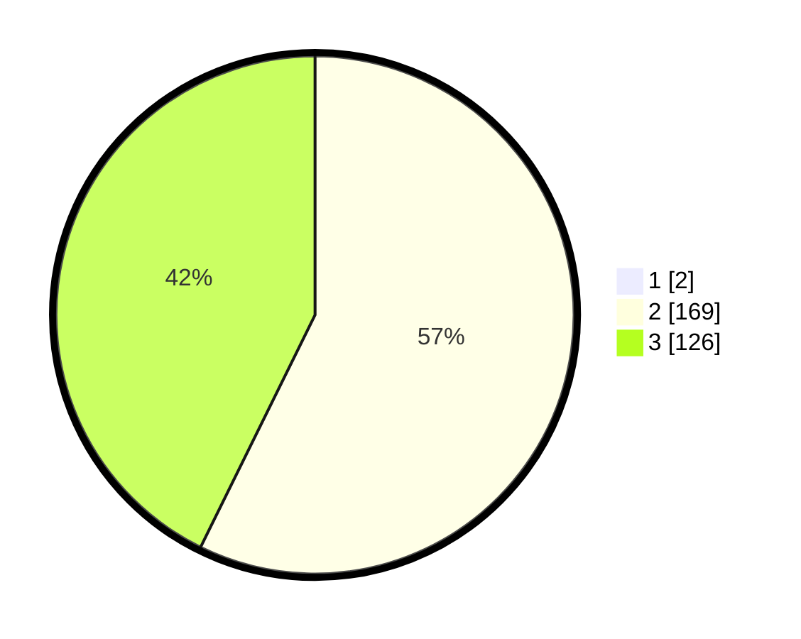

# Hasil

## Grafik

## Tabel

| No. | Nama Paslon    | Suara | Suara (raw) | Persentase |
|:--- |:-------------- | -----:| -----------:| ----------:|
| 1   | ANIES MUHAIMIN | 2     | [2][p-1]    | 0,67       |
| 2   | PRABOWO GIBRAN | 169   | [169][p-2]  | 56,90      |
| 3   | GANJAR MAHFUD  | 126   | [126][p-3]  | 42,42      |

[p-1]: https://github.com/gigit-pemilu/pemilu-2024/blob/main/pilpres/hitung-suara/sub/51-bali/sub/03-badung/sub/02-mengwi/sub/2006-penarungan/sub/001-tps/sub/paslon-1.txt
[p-2]: https://github.com/gigit-pemilu/pemilu-2024/blob/main/pilpres/hitung-suara/sub/51-bali/sub/03-badung/sub/02-mengwi/sub/2006-penarungan/sub/001-tps/sub/paslon-2.txt
[p-3]: https://github.com/gigit-pemilu/pemilu-2024/blob/main/pilpres/hitung-suara/sub/51-bali/sub/03-badung/sub/02-mengwi/sub/2006-penarungan/sub/001-tps/sub/paslon-3.txt

## Foto C Plano

https://sirekap-obj-formc.kpu.go.id/6257/pemilu/ppwp/51/03/02/20/06/5103022006001-20240216-032550--983380fd-fd6a-4997-953b-62d28fb823c1.jpg

https://sirekap-obj-formc.kpu.go.id/6257/pemilu/ppwp/51/03/02/20/06/5103022006001-20240216-032539--db58dc99-5737-40a7-8758-214f9d93fd61.jpg

https://sirekap-obj-formc.kpu.go.id/6257/pemilu/ppwp/51/03/02/20/06/5103022006001-20240216-032532--7a4aecd8-5588-4435-ae40-957b6ee0c049.jpg

## Metadata

| Key        | Value               |
| ---------- | ------------------- |
| Time Stamp | 2024-02-22 10:00:00 |

## DATA PEMILIH TETAP

Jumlah pemilih dalam DPT: **297**.
 * L: **153**.
 * P: **144**.

## DATA PENGGUNA HAK PILIH

Jumlah pengguna hak pilih dalam DPT: **294**.
 * L: **150**.
 * P: **144**.

Jumlah pengguna hak pilih dalam DPTb: **4**.
 * L: **2**.
 * P: **2**.

Jumlah pengguna hak pilih dalam DPK: **0**.
 * L: **0**.
 * P: **0**.

Jumlah pengguna hak pilih: **298**.
 * L: **152**.
 * P: **146**.

## JUMLAH SUARA SAH DAN TIDAK SAH

JUMLAH SELURUH SUARA SAH: **297**.

JUMLAH SUARA TIDAK SAH: **1**.

JUMLAH SELURUH SUARA SAH DAN SUARA TIDAK SAH: **298**.

