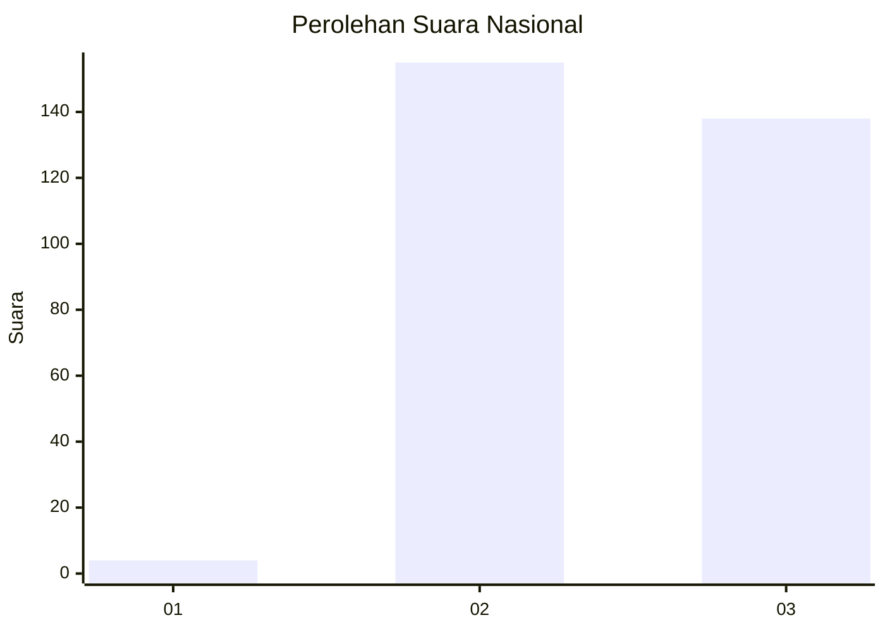
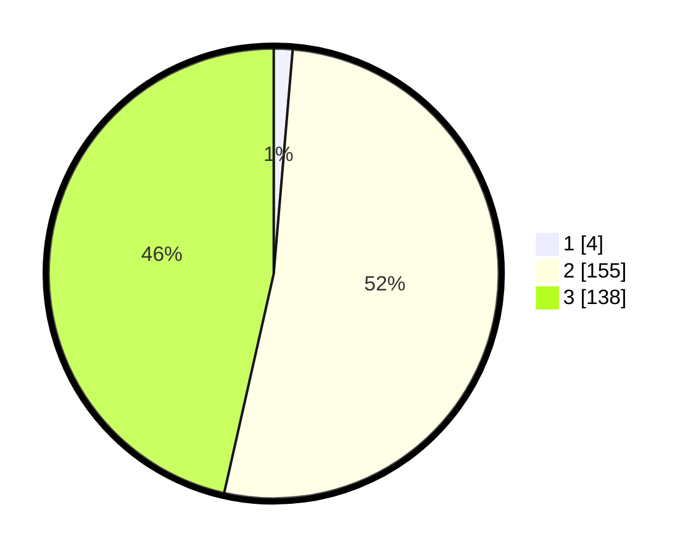

# Hasil

## Grafik

## Tabel

| No. | Nama Paslon    | Suara | Suara (raw) | Persentase |
|:--- |:-------------- | -----:| -----------:| ----------:|
| 1   | ANIES MUHAIMIN | 4     | [4][p-1]    | 1,35       |
| 2   | PRABOWO GIBRAN | 155   | [155][p-2]  | 52,19      |
| 3   | GANJAR MAHFUD  | 138   | [138][p-3]  | 46,46      |

[p-1]: https://github.com/gigit-pemilu/pemilu-2024/blob/main/pilpres/hitung-suara/sub/51-bali/sub/03-badung/sub/02-mengwi/sub/2006-penarungan/sub/004-tps/sub/paslon-1.txt
[p-2]: https://github.com/gigit-pemilu/pemilu-2024/blob/main/pilpres/hitung-suara/sub/51-bali/sub/03-badung/sub/02-mengwi/sub/2006-penarungan/sub/004-tps/sub/paslon-2.txt
[p-3]: https://github.com/gigit-pemilu/pemilu-2024/blob/main/pilpres/hitung-suara/sub/51-bali/sub/03-badung/sub/02-mengwi/sub/2006-penarungan/sub/004-tps/sub/paslon-3.txt

## Foto C Plano

https://sirekap-obj-formc.kpu.go.id/0916/pemilu/ppwp/51/03/02/20/06/5103022006004-20240215-213456--b01181bf-815c-439d-a48b-a99e866565af.jpg

https://sirekap-obj-formc.kpu.go.id/0916/pemilu/ppwp/51/03/02/20/06/5103022006004-20240214-155245--c218f115-96e7-479f-ac11-8ad149046bdb.jpg

https://sirekap-obj-formc.kpu.go.id/0916/pemilu/ppwp/51/03/02/20/06/5103022006004-20240215-213458--e30d964b-756e-4e4e-b67c-3018d4128312.jpg

## Metadata

| Key        | Value               |
| ---------- | ------------------- |
| Time Stamp | 2024-02-15 22:00:27 |

## DATA PEMILIH TETAP

Jumlah pemilih dalam DPT: **296**.
 * L: **137**.
 * P: **159**.

## DATA PENGGUNA HAK PILIH

Jumlah pengguna hak pilih dalam DPT: **294**.
 * L: **137**.
 * P: **157**.

Jumlah pengguna hak pilih dalam DPTb: **1**.
 * L: **1**.
 * P: **0**.

Jumlah pengguna hak pilih dalam DPK: **3**.
 * L: **2**.
 * P: **1**.

Jumlah pengguna hak pilih: **298**.
 * L: **140**.
 * P: **158**.

## JUMLAH SUARA SAH DAN TIDAK SAH

JUMLAH SELURUH SUARA SAH: **297**.

JUMLAH SUARA TIDAK SAH: **1**.

JUMLAH SELURUH SUARA SAH DAN SUARA TIDAK SAH: **298**.

