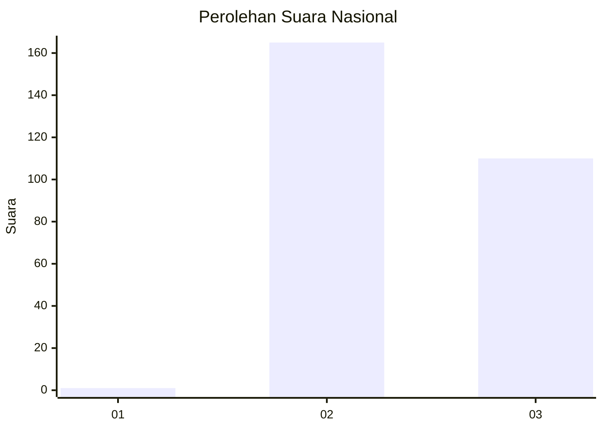
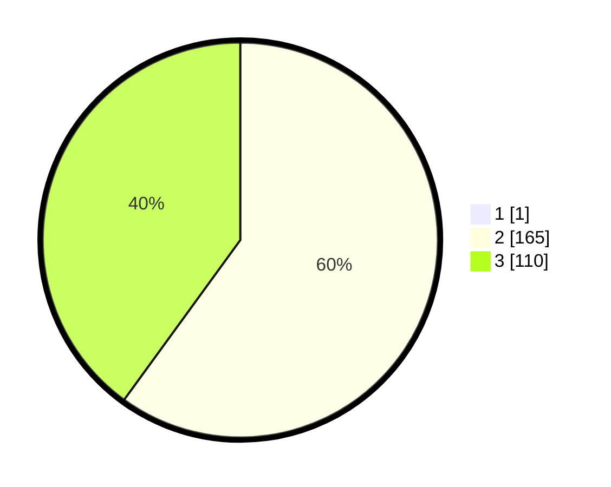

# Hasil

## Grafik

## Tabel

| No. | Nama Paslon    | Suara | Suara (raw) | Persentase |
|:--- |:-------------- | -----:| -----------:| ----------:|
| 1   | ANIES MUHAIMIN | 1     | [1][p-1]    | 0,36       |
| 2   | PRABOWO GIBRAN | 165   | [165][p-2]  | 59,78      |
| 3   | GANJAR MAHFUD  | 110   | [110][p-3]  | 39,86      |

[p-1]: https://github.com/gigit-pemilu/pemilu-2024/blob/main/pilpres/hitung-suara/sub/51-bali/sub/03-badung/sub/02-mengwi/sub/2006-penarungan/sub/005-tps/sub/paslon-1.txt
[p-2]: https://github.com/gigit-pemilu/pemilu-2024/blob/main/pilpres/hitung-suara/sub/51-bali/sub/03-badung/sub/02-mengwi/sub/2006-penarungan/sub/005-tps/sub/paslon-2.txt
[p-3]: https://github.com/gigit-pemilu/pemilu-2024/blob/main/pilpres/hitung-suara/sub/51-bali/sub/03-badung/sub/02-mengwi/sub/2006-penarungan/sub/005-tps/sub/paslon-3.txt

## Foto C Plano

https://sirekap-obj-formc.kpu.go.id/0529/pemilu/ppwp/51/03/02/20/06/5103022006005-20240214-160054--aedd2334-89a6-404a-b4af-fa97bc282376.jpg

https://sirekap-obj-formc.kpu.go.id/0529/pemilu/ppwp/51/03/02/20/06/5103022006005-20240214-160127--525fd61d-0d1b-4981-8ef7-6f18ec31c54e.jpg

https://sirekap-obj-formc.kpu.go.id/0529/pemilu/ppwp/51/03/02/20/06/5103022006005-20240215-022534--b94becb6-0538-43d0-83ea-61dbfe5c9530.jpg

## Metadata

| Key        | Value               |
| ---------- | ------------------- |
| Time Stamp | 2024-02-15 12:00:28 |

## DATA PEMILIH TETAP

Jumlah pemilih dalam DPT: **280**.
 * L: **145**.
 * P: **135**.

## DATA PENGGUNA HAK PILIH

Jumlah pengguna hak pilih dalam DPT: **273**.
 * L: **142**.
 * P: **131**.

Jumlah pengguna hak pilih dalam DPTb: **3**.
 * L: **2**.
 * P: **1**.

Jumlah pengguna hak pilih dalam DPK: **1**.
 * L: **1**.
 * P: **0**.

Jumlah pengguna hak pilih: **277**.
 * L: **145**.
 * P: **132**.

## JUMLAH SUARA SAH DAN TIDAK SAH

JUMLAH SELURUH SUARA SAH: **276**.

JUMLAH SUARA TIDAK SAH: **1**.

JUMLAH SELURUH SUARA SAH DAN SUARA TIDAK SAH: **277**.

