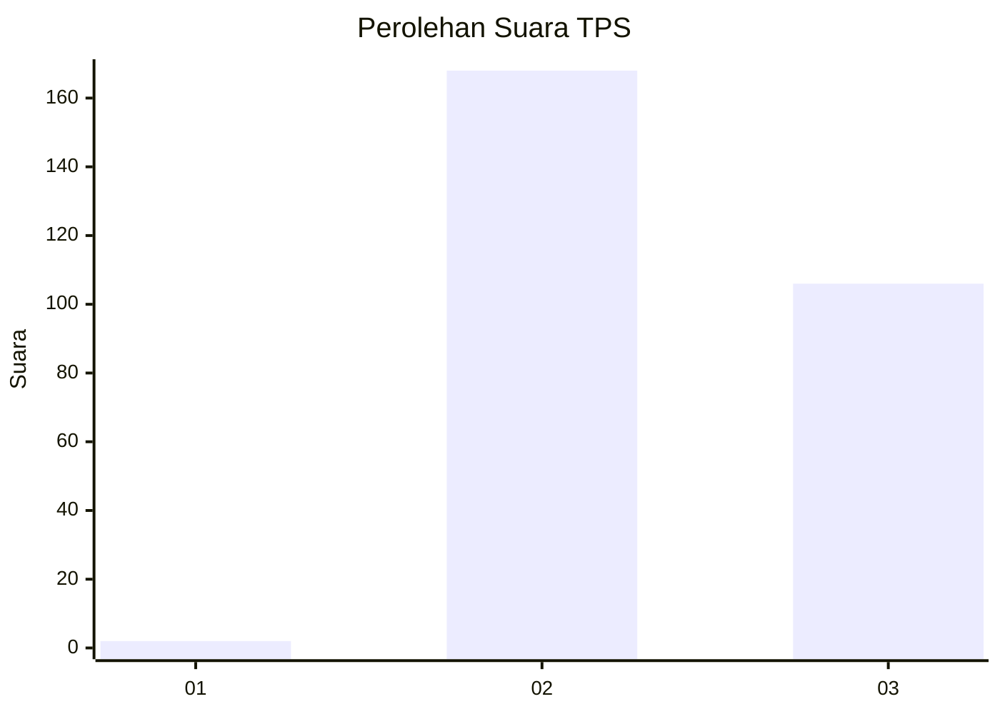
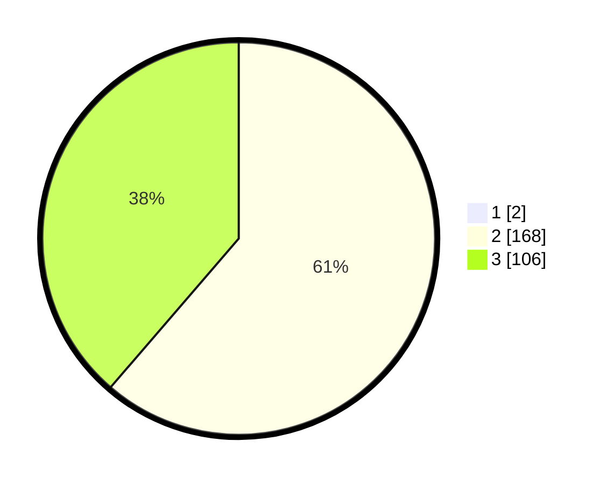

# Hasil

## Grafik

## Tabel

| No. | Nama Paslon    | Suara | Suara (raw) | Persentase |
|:--- |:-------------- | -----:| -----------:| ----------:|
| 1   | ANIES MUHAIMIN | 2     | [2][p-1]    | 0,72       |
| 2   | PRABOWO GIBRAN | 168   | [168][p-2]  | 60,87      |
| 3   | GANJAR MAHFUD  | 106   | [106][p-3]  | 38,41      |

[p-1]: https://github.com/gigit-pemilu/pemilu-2024-51-bali/blob/main/pilpres/hitung-suara/sub/51-bali/sub/03-badung/sub/02-mengwi/sub/2006-penarungan/sub/006-tps/sub/paslon-1.txt
[p-2]: https://github.com/gigit-pemilu/pemilu-2024-51-bali/blob/main/pilpres/hitung-suara/sub/51-bali/sub/03-badung/sub/02-mengwi/sub/2006-penarungan/sub/006-tps/sub/paslon-2.txt
[p-3]: https://github.com/gigit-pemilu/pemilu-2024-51-bali/blob/main/pilpres/hitung-suara/sub/51-bali/sub/03-badung/sub/02-mengwi/sub/2006-penarungan/sub/006-tps/sub/paslon-3.txt

## Foto C Plano

https://sirekap-obj-formc.kpu.go.id/7217/pemilu/ppwp/51/03/02/20/06/5103022006006-20240219-075631--fdd94936-c112-499d-b4e2-2451f80d12fd.jpg

https://sirekap-obj-formc.kpu.go.id/7217/pemilu/ppwp/51/03/02/20/06/5103022006006-20240216-171814--6ee8e1a5-6ce3-4502-9928-48317afd2a64.jpg

https://sirekap-obj-formc.kpu.go.id/7217/pemilu/ppwp/51/03/02/20/06/5103022006006-20240216-170250--7a61dc51-3dfc-4e8e-b2ec-5a3195b8bb23.jpg

## Metadata

| Key        | Value               |
| ---------- | ------------------- |
| Time Stamp | 2024-02-21 11:00:00 |

## DATA PEMILIH TETAP

Jumlah pemilih dalam DPT: **286**.
 * L: **138**.
 * P: **148**.

## DATA PENGGUNA HAK PILIH

Jumlah pengguna hak pilih dalam DPT: **277**.
 * L: **132**.
 * P: **145**.

Jumlah pengguna hak pilih dalam DPTb: **0**.
 * L: **0**.
 * P: **0**.

Jumlah pengguna hak pilih dalam DPK: **0**.
 * L: **0**.
 * P: **0**.

Jumlah pengguna hak pilih: **277**.
 * L: **132**.
 * P: **145**.

## JUMLAH SUARA SAH DAN TIDAK SAH

JUMLAH SELURUH SUARA SAH: **276**.

JUMLAH SUARA TIDAK SAH: **1**.

JUMLAH SELURUH SUARA SAH DAN SUARA TIDAK SAH: **277**.

