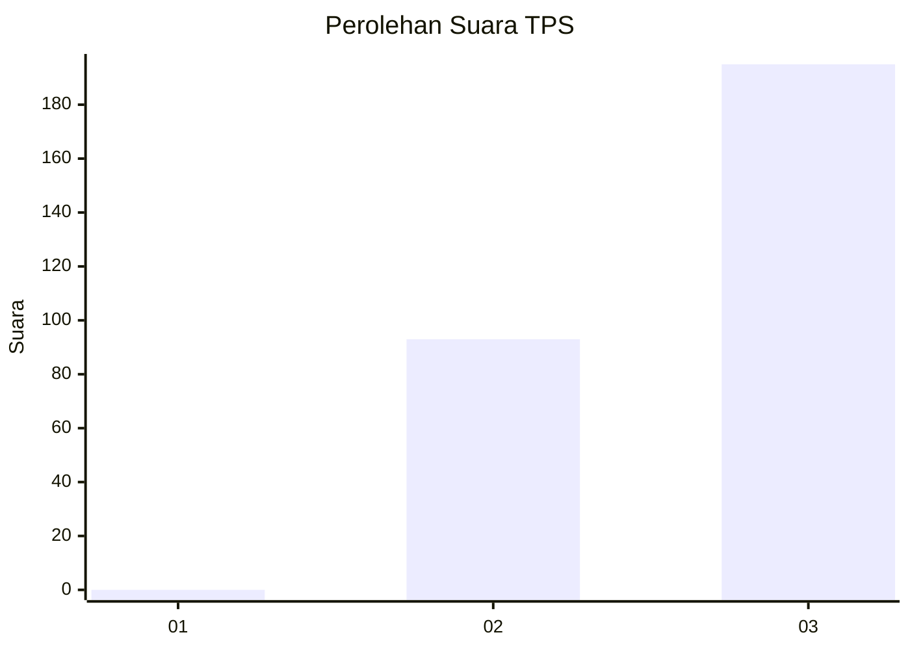
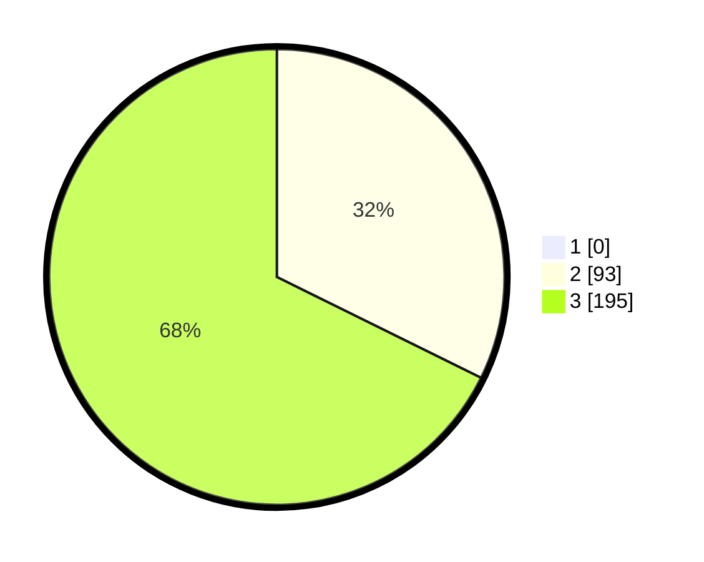

# Hasil

## Grafik

## Tabel

| No. | Nama Paslon    | Suara | Suara (raw) | Persentase |
|:--- |:-------------- | -----:| -----------:| ----------:|
| 1   | ANIES MUHAIMIN | 0     | [0][p-1]    | 0,00       |
| 2   | PRABOWO GIBRAN | 93    | [93][p-2]   | 32,29      |
| 3   | GANJAR MAHFUD  | 195   | [195][p-3]  | 67,71      |

[p-1]: https://github.com/gigit-pemilu/pemilu-2024-51-bali/blob/main/pilpres/hitung-suara/sub/51-bali/sub/03-badung/sub/02-mengwi/sub/2006-penarungan/sub/007-tps/sub/paslon-1.txt
[p-2]: https://github.com/gigit-pemilu/pemilu-2024-51-bali/blob/main/pilpres/hitung-suara/sub/51-bali/sub/03-badung/sub/02-mengwi/sub/2006-penarungan/sub/007-tps/sub/paslon-2.txt
[p-3]: https://github.com/gigit-pemilu/pemilu-2024-51-bali/blob/main/pilpres/hitung-suara/sub/51-bali/sub/03-badung/sub/02-mengwi/sub/2006-penarungan/sub/007-tps/sub/paslon-3.txt

## Foto C Plano

https://sirekap-obj-formc.kpu.go.id/e764/pemilu/ppwp/51/03/02/20/06/5103022006007-20240214-131952--0a274fa8-39d9-4bc2-9854-275eb53c1b84.jpg

https://sirekap-obj-formc.kpu.go.id/e764/pemilu/ppwp/51/03/02/20/06/5103022006007-20240214-132102--00e9d27b-f84c-4bff-9b75-e4fe1f51c0dd.jpg

https://sirekap-obj-formc.kpu.go.id/e764/pemilu/ppwp/51/03/02/20/06/5103022006007-20240214-132225--5f7e0445-55c7-44ef-b67a-3124b3bb8416.jpg

## Metadata

| Key        | Value               |
| ---------- | ------------------- |
| Time Stamp | 2024-02-24 22:31:28 |

## DATA PEMILIH TETAP

Jumlah pemilih dalam DPT: **283**.
 * L: **146**.
 * P: **137**.

## DATA PENGGUNA HAK PILIH

Jumlah pengguna hak pilih dalam DPT: **282**.
 * L: **146**.
 * P: **136**.

Jumlah pengguna hak pilih dalam DPTb: **7**.
 * L: **4**.
 * P: **3**.

Jumlah pengguna hak pilih dalam DPK: **0**.
 * L: **0**.
 * P: **0**.

Jumlah pengguna hak pilih: **289**.
 * L: **150**.
 * P: **139**.

## JUMLAH SUARA SAH DAN TIDAK SAH

JUMLAH SELURUH SUARA SAH: **288**.

JUMLAH SUARA TIDAK SAH: **1**.

JUMLAH SELURUH SUARA SAH DAN SUARA TIDAK SAH: **289**.

