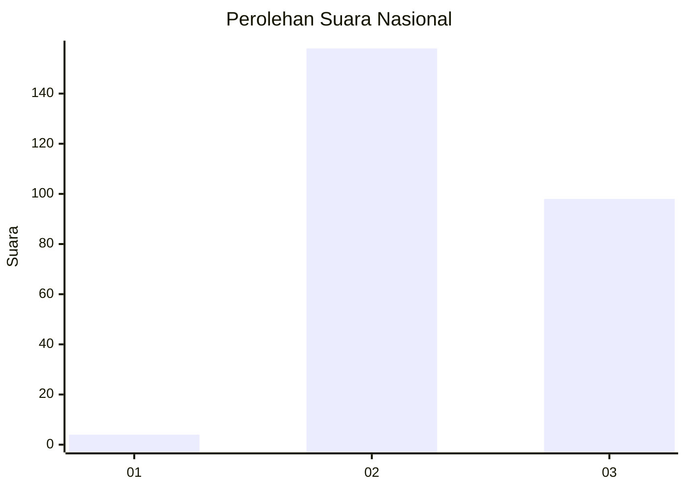
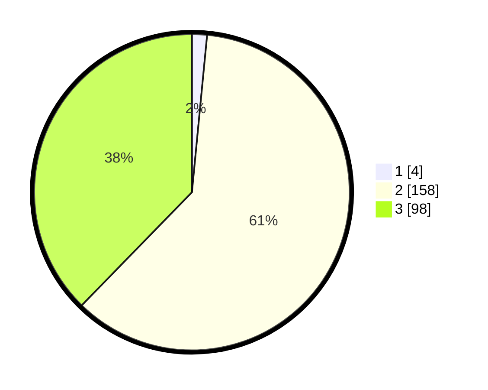

# Hasil

## Grafik

## Tabel

| No. | Nama Paslon    | Suara | Suara (raw) | Persentase |
|:--- |:-------------- | -----:| -----------:| ----------:|
| 1   | ANIES MUHAIMIN | 4     | [4][p-1]    | 1,54       |
| 2   | PRABOWO GIBRAN | 158   | [158][p-2]  | 60,77      |
| 3   | GANJAR MAHFUD  | 98    | [98][p-3]   | 37,69      |

[p-1]: https://github.com/gigit-pemilu/pemilu-2024/blob/main/pilpres/hitung-suara/sub/51-bali/sub/03-badung/sub/02-mengwi/sub/2006-penarungan/sub/011-tps/sub/paslon-1.txt
[p-2]: https://github.com/gigit-pemilu/pemilu-2024/blob/main/pilpres/hitung-suara/sub/51-bali/sub/03-badung/sub/02-mengwi/sub/2006-penarungan/sub/011-tps/sub/paslon-2.txt
[p-3]: https://github.com/gigit-pemilu/pemilu-2024/blob/main/pilpres/hitung-suara/sub/51-bali/sub/03-badung/sub/02-mengwi/sub/2006-penarungan/sub/011-tps/sub/paslon-3.txt

## Foto C Plano

https://sirekap-obj-formc.kpu.go.id/9fb2/pemilu/ppwp/51/03/02/20/06/5103022006011-20240214-162235--62839e0f-04f9-4ccd-a99e-714847358d68.jpg

https://sirekap-obj-formc.kpu.go.id/9fb2/pemilu/ppwp/51/03/02/20/06/5103022006011-20240216-122444--6b6623ae-dfa2-4e85-b87f-0a1be51bef1d.jpg

https://sirekap-obj-formc.kpu.go.id/9fb2/pemilu/ppwp/51/03/02/20/06/5103022006011-20240214-201800--1cbfe170-b7ca-430c-856d-6821bc6dbc08.jpg

## Metadata

| Key        | Value               |
| ---------- | ------------------- |
| Time Stamp | 2024-02-22 11:00:00 |

## DATA PEMILIH TETAP

Jumlah pemilih dalam DPT: **282**.
 * L: **142**.
 * P: **140**.

## DATA PENGGUNA HAK PILIH

Jumlah pengguna hak pilih dalam DPT: **259**.
 * L: **131**.
 * P: **128**.

Jumlah pengguna hak pilih dalam DPTb: **0**.
 * L: **0**.
 * P: **0**.

Jumlah pengguna hak pilih dalam DPK: **2**.
 * L: **1**.
 * P: **1**.

Jumlah pengguna hak pilih: **261**.
 * L: **132**.
 * P: **129**.

## JUMLAH SUARA SAH DAN TIDAK SAH

JUMLAH SELURUH SUARA SAH: **260**.

JUMLAH SUARA TIDAK SAH: **1**.

JUMLAH SELURUH SUARA SAH DAN SUARA TIDAK SAH: **261**.

