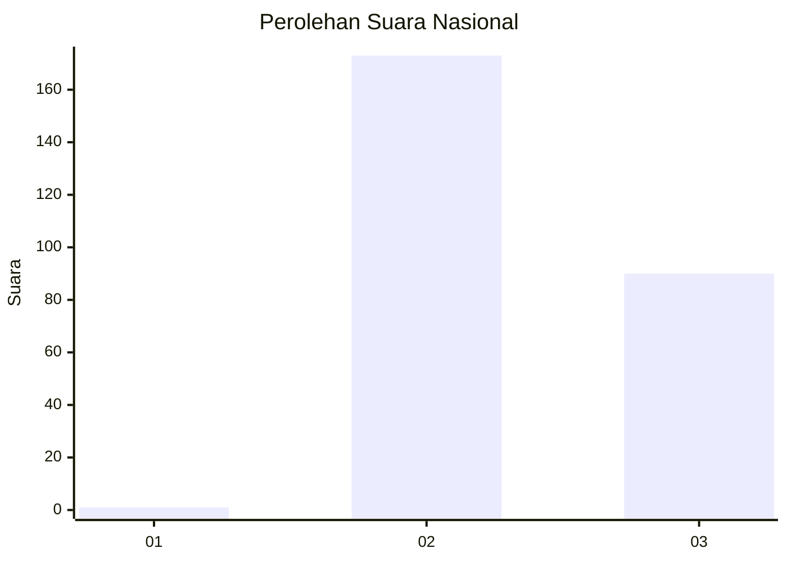
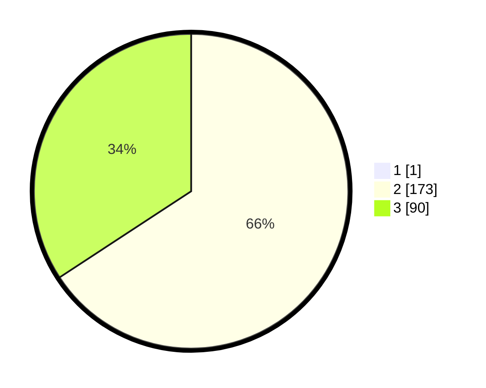

# Hasil

## Grafik

## Tabel

| No. | Nama Paslon    | Suara | Suara (raw) | Persentase |
|:--- |:-------------- | -----:| -----------:| ----------:|
| 1   | ANIES MUHAIMIN | 1     | [1][p-1]    | 0,38       |
| 2   | PRABOWO GIBRAN | 173   | [173][p-2]  | 65,53      |
| 3   | GANJAR MAHFUD  | 90    | [90][p-3]   | 34,09      |

[p-1]: https://github.com/gigit-pemilu/pemilu-2024/blob/main/pilpres/hitung-suara/sub/51-bali/sub/03-badung/sub/02-mengwi/sub/2006-penarungan/sub/017-tps/sub/paslon-1.txt
[p-2]: https://github.com/gigit-pemilu/pemilu-2024/blob/main/pilpres/hitung-suara/sub/51-bali/sub/03-badung/sub/02-mengwi/sub/2006-penarungan/sub/017-tps/sub/paslon-2.txt
[p-3]: https://github.com/gigit-pemilu/pemilu-2024/blob/main/pilpres/hitung-suara/sub/51-bali/sub/03-badung/sub/02-mengwi/sub/2006-penarungan/sub/017-tps/sub/paslon-3.txt

## Foto C Plano

https://sirekap-obj-formc.kpu.go.id/42fc/pemilu/ppwp/51/03/02/20/06/5103022006017-20240214-132947--27366091-4fe7-4a45-98cd-57031e011e89.jpg

https://sirekap-obj-formc.kpu.go.id/42fc/pemilu/ppwp/51/03/02/20/06/5103022006017-20240214-133019--8725e617-131f-4a0c-b767-2c9e36308666.jpg

https://sirekap-obj-formc.kpu.go.id/42fc/pemilu/ppwp/51/03/02/20/06/5103022006017-20240214-133055--043f5bd5-71d9-494b-a2c9-26b81c995754.jpg

## Metadata

| Key        | Value               |
| ---------- | ------------------- |
| Time Stamp | 2024-02-24 22:31:28 |

