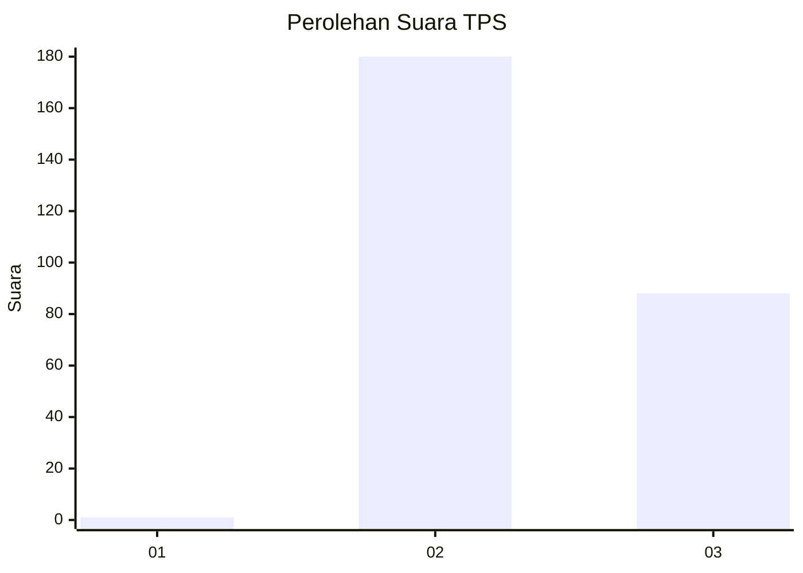
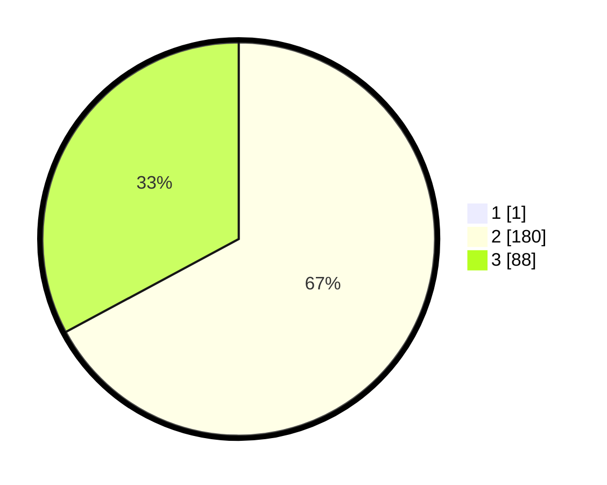

# Hasil

## Grafik

## Tabel

| No. | Nama Paslon    | Suara | Suara (raw) | Persentase |
|:--- |:-------------- | -----:| -----------:| ----------:|
| 1   | ANIES MUHAIMIN | 1     | [1][p-1]    | 0,37       |
| 2   | PRABOWO GIBRAN | 180   | [180][p-2]  | 66,91      |
| 3   | GANJAR MAHFUD  | 88    | [88][p-3]   | 32,71      |

[p-1]: https://github.com/gigit-pemilu/pemilu-2024-51-bali/blob/main/pilpres/hitung-suara/sub/51-bali/sub/03-badung/sub/02-mengwi/sub/2006-penarungan/sub/018-tps/sub/paslon-1.txt
[p-2]: https://github.com/gigit-pemilu/pemilu-2024-51-bali/blob/main/pilpres/hitung-suara/sub/51-bali/sub/03-badung/sub/02-mengwi/sub/2006-penarungan/sub/018-tps/sub/paslon-2.txt
[p-3]: https://github.com/gigit-pemilu/pemilu-2024-51-bali/blob/main/pilpres/hitung-suara/sub/51-bali/sub/03-badung/sub/02-mengwi/sub/2006-penarungan/sub/018-tps/sub/paslon-3.txt

## Foto C Plano

https://sirekap-obj-formc.kpu.go.id/43e7/pemilu/ppwp/51/03/02/20/06/5103022006018-20240215-130713--94b2eae2-65f3-4f61-85a0-e4cc543c93a8.jpg

https://sirekap-obj-formc.kpu.go.id/43e7/pemilu/ppwp/51/03/02/20/06/5103022006018-20240215-130731--34eaf613-ab18-402e-9d05-1779ed5c89b3.jpg

https://sirekap-obj-formc.kpu.go.id/43e7/pemilu/ppwp/51/03/02/20/06/5103022006018-20240215-130740--5b6afdef-5df0-4ecd-9fee-ad7edeabf2e9.jpg

## Metadata

| Key        | Value               |
| ---------- | ------------------- |
| Time Stamp | 2024-02-15 20:30:46 |

## DATA PEMILIH TETAP

Jumlah pemilih dalam DPT: **269**.
 * L: **129**.
 * P: **140**.

## DATA PENGGUNA HAK PILIH

Jumlah pengguna hak pilih dalam DPT: **269**.
 * L: **129**.
 * P: **140**.

Jumlah pengguna hak pilih dalam DPTb: **2**.
 * L: **1**.
 * P: **1**.

Jumlah pengguna hak pilih dalam DPK: **0**.
 * L: **0**.
 * P: **0**.

Jumlah pengguna hak pilih: **271**.
 * L: **130**.
 * P: **141**.

## JUMLAH SUARA SAH DAN TIDAK SAH

JUMLAH SELURUH SUARA SAH: **269**.

JUMLAH SUARA TIDAK SAH: **2**.

JUMLAH SELURUH SUARA SAH DAN SUARA TIDAK SAH: **271**.

