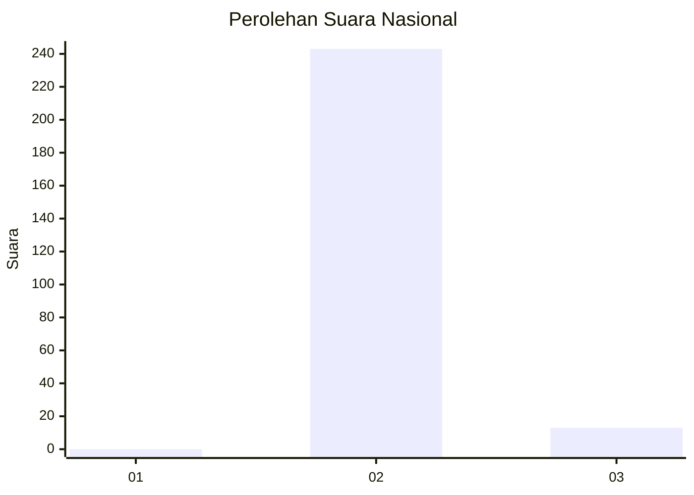
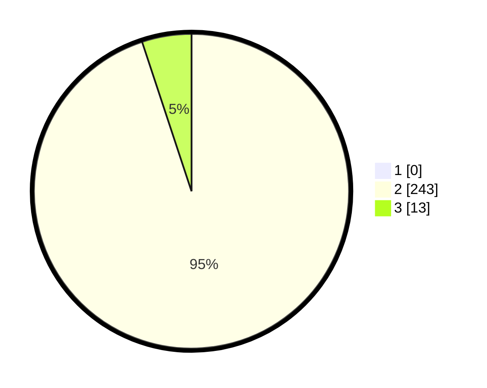

# Hasil

## Grafik

## Tabel

| No. | Nama Paslon    | Suara | Suara (raw) | Persentase |
|:--- |:-------------- | -----:| -----------:| ----------:|
| 1   | ANIES MUHAIMIN | 0     | [0][p-1]    | 0,00       |
| 2   | PRABOWO GIBRAN | 243   | [243][p-2]  | 94,92      |
| 3   | GANJAR MAHFUD  | 13    | [13][p-3]   | 5,08       |

[p-1]: https://github.com/gigit-pemilu/pemilu-2024/blob/main/pilpres/hitung-suara/sub/51-bali/sub/03-badung/sub/02-mengwi/sub/2006-penarungan/sub/019-tps/sub/paslon-1.txt
[p-2]: https://github.com/gigit-pemilu/pemilu-2024/blob/main/pilpres/hitung-suara/sub/51-bali/sub/03-badung/sub/02-mengwi/sub/2006-penarungan/sub/019-tps/sub/paslon-2.txt
[p-3]: https://github.com/gigit-pemilu/pemilu-2024/blob/main/pilpres/hitung-suara/sub/51-bali/sub/03-badung/sub/02-mengwi/sub/2006-penarungan/sub/019-tps/sub/paslon-3.txt

## Foto C Plano

https://sirekap-obj-formc.kpu.go.id/7158/pemilu/ppwp/51/03/02/20/06/5103022006019-20240214-220636--b24b62c6-ba65-4e1d-8c00-ca0265fadb88.jpg

https://sirekap-obj-formc.kpu.go.id/7158/pemilu/ppwp/51/03/02/20/06/5103022006019-20240214-221319--070b18ac-f112-4eee-861e-52619e3c747e.jpg

https://sirekap-obj-formc.kpu.go.id/7158/pemilu/ppwp/51/03/02/20/06/5103022006019-20240214-221618--2208d0fc-12f1-4c25-afd7-f37350d69df5.jpg

## Metadata

| Key        | Value               |
| ---------- | ------------------- |
| Time Stamp | 2024-02-24 22:31:28 |

