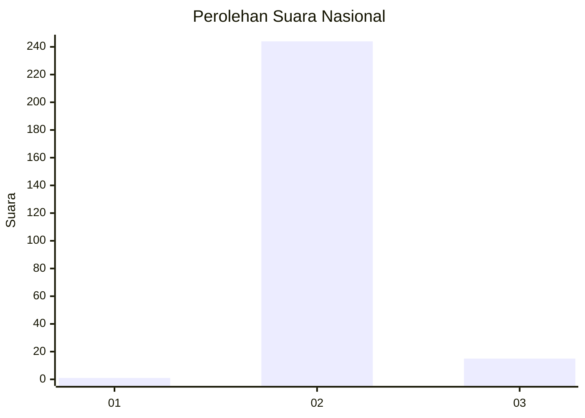
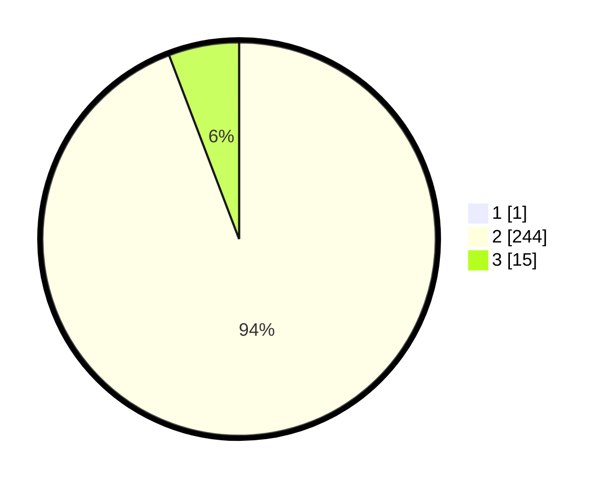

# Hasil

## Grafik

## Tabel

| No. | Nama Paslon    | Suara | Suara (raw) | Persentase |
|:--- |:-------------- | -----:| -----------:| ----------:|
| 1   | ANIES MUHAIMIN | 1     | [1][p-1]    | 0,38       |
| 2   | PRABOWO GIBRAN | 244   | [244][p-2]  | 93,85      |
| 3   | GANJAR MAHFUD  | 15    | [15][p-3]   | 5,77       |

[p-1]: https://github.com/gigit-pemilu/pemilu-2024/blob/main/pilpres/hitung-suara/sub/51-bali/sub/03-badung/sub/02-mengwi/sub/2006-penarungan/sub/021-tps/sub/paslon-1.txt
[p-2]: https://github.com/gigit-pemilu/pemilu-2024/blob/main/pilpres/hitung-suara/sub/51-bali/sub/03-badung/sub/02-mengwi/sub/2006-penarungan/sub/021-tps/sub/paslon-2.txt
[p-3]: https://github.com/gigit-pemilu/pemilu-2024/blob/main/pilpres/hitung-suara/sub/51-bali/sub/03-badung/sub/02-mengwi/sub/2006-penarungan/sub/021-tps/sub/paslon-3.txt

## Foto C Plano

https://sirekap-obj-formc.kpu.go.id/f9f7/pemilu/ppwp/51/03/02/20/06/5103022006021-20240217-190510--22da9c22-8745-4ef7-a3a8-bae13cc71b38.jpg

https://sirekap-obj-formc.kpu.go.id/f9f7/pemilu/ppwp/51/03/02/20/06/5103022006021-20240217-190816--3e6fd77a-4a0e-4aaa-addd-08fc3163228c.jpg

https://sirekap-obj-formc.kpu.go.id/f9f7/pemilu/ppwp/51/03/02/20/06/5103022006021-20240217-191137--262288aa-af55-43e5-9bd1-c77b6f94076b.jpg

## Metadata

| Key        | Value               |
| ---------- | ------------------- |
| Time Stamp | 2024-02-17 19:30:00 |

## DATA PEMILIH TETAP

Jumlah pemilih dalam DPT: **263**.
 * L: **125**.
 * P: **138**.

## DATA PENGGUNA HAK PILIH

Jumlah pengguna hak pilih dalam DPT: **259**.
 * L: **121**.
 * P: **138**.

Jumlah pengguna hak pilih dalam DPTb: **2**.
 * L: **1**.
 * P: **1**.

Jumlah pengguna hak pilih dalam DPK: **1**.
 * L: **0**.
 * P: **1**.

Jumlah pengguna hak pilih: **262**.
 * L: **0**.
 * P: **0**.

## JUMLAH SUARA SAH DAN TIDAK SAH

JUMLAH SELURUH SUARA SAH: **260**.

JUMLAH SUARA TIDAK SAH: **2**.

JUMLAH SELURUH SUARA SAH DAN SUARA TIDAK SAH: **262**.

