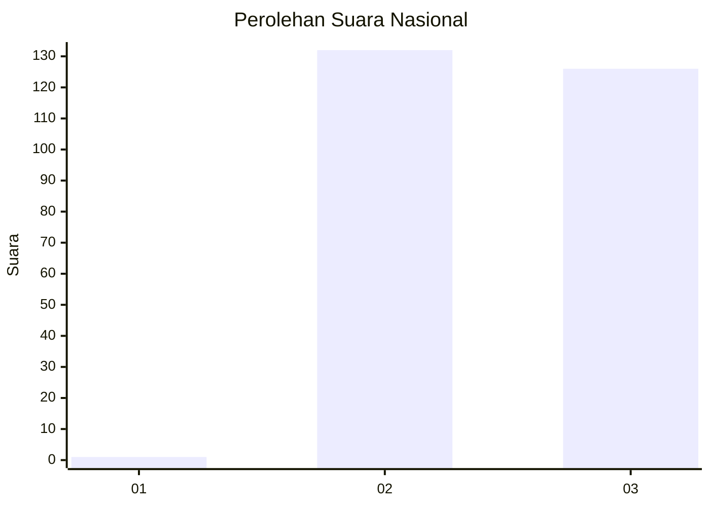
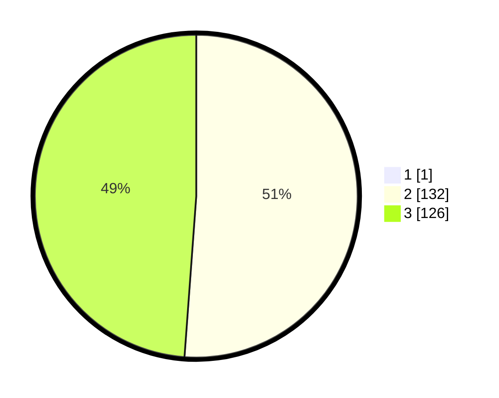

# Hasil

## Grafik

## Tabel

| No. | Nama Paslon    | Suara | Suara (raw) | Persentase |
|:--- |:-------------- | -----:| -----------:| ----------:|
| 1   | ANIES MUHAIMIN | 1     | [1][p-1]    | 0,39       |
| 2   | PRABOWO GIBRAN | 132   | [132][p-2]  | 50,97      |
| 3   | GANJAR MAHFUD  | 126   | [126][p-3]  | 48,65      |

[p-1]: https://github.com/gigit-pemilu/pemilu-2024/blob/main/pilpres/hitung-suara/sub/51-bali/sub/03-badung/sub/02-mengwi/sub/2007-sembung/sub/001-tps/sub/paslon-1.txt
[p-2]: https://github.com/gigit-pemilu/pemilu-2024/blob/main/pilpres/hitung-suara/sub/51-bali/sub/03-badung/sub/02-mengwi/sub/2007-sembung/sub/001-tps/sub/paslon-2.txt
[p-3]: https://github.com/gigit-pemilu/pemilu-2024/blob/main/pilpres/hitung-suara/sub/51-bali/sub/03-badung/sub/02-mengwi/sub/2007-sembung/sub/001-tps/sub/paslon-3.txt

## Foto C Plano

https://sirekap-obj-formc.kpu.go.id/f70e/pemilu/ppwp/51/03/02/20/07/5103022007001-20240215-043311--b6419bb9-4ed7-4791-8f23-c30bea7f4f4b.jpg

https://sirekap-obj-formc.kpu.go.id/f70e/pemilu/ppwp/51/03/02/20/07/5103022007001-20240215-043459--58961b16-99f0-46fa-b20f-38ae2b7a05c8.jpg

https://sirekap-obj-formc.kpu.go.id/f70e/pemilu/ppwp/51/03/02/20/07/5103022007001-20240215-043538--2f2149a4-089c-4a6e-9284-07db66003d08.jpg

## Metadata

| Key        | Value               |
| ---------- | ------------------- |
| Time Stamp | 2024-02-16 06:30:27 |

## DATA PEMILIH TETAP

Jumlah pemilih dalam DPT: **295**.
 * L: **153**.
 * P: **142**.

## DATA PENGGUNA HAK PILIH

Jumlah pengguna hak pilih dalam DPT: **270**.
 * L: **143**.
 * P: **127**.

Jumlah pengguna hak pilih dalam DPTb: **0**.
 * L: **0**.
 * P: **0**.

Jumlah pengguna hak pilih dalam DPK: **2**.
 * L: **0**.
 * P: **2**.

Jumlah pengguna hak pilih: **272**.
 * L: **143**.
 * P: **129**.

## JUMLAH SUARA SAH DAN TIDAK SAH

JUMLAH SELURUH SUARA SAH: **259**.

JUMLAH SUARA TIDAK SAH: **13**.

JUMLAH SELURUH SUARA SAH DAN SUARA TIDAK SAH: **272**.

