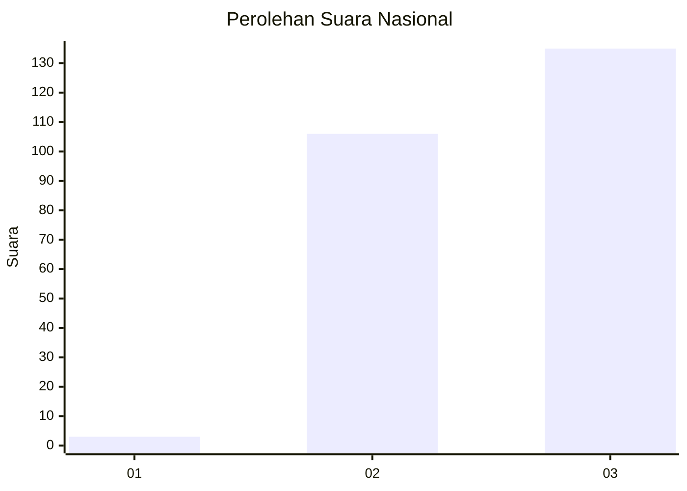
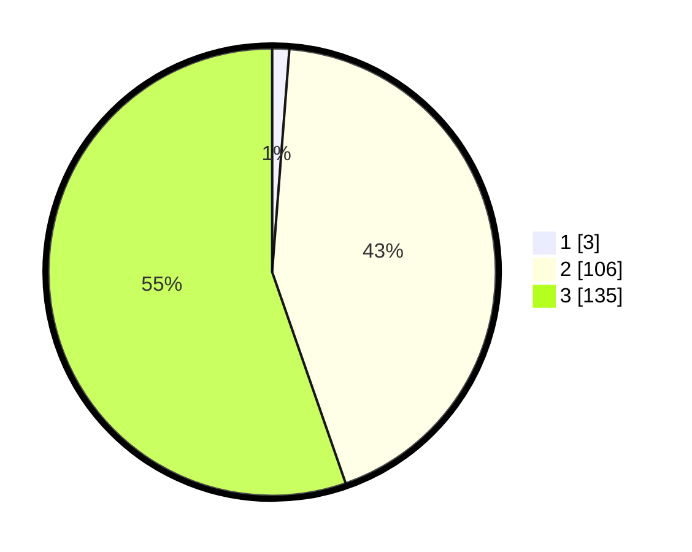

# Hasil

## Grafik

## Tabel

| No. | Nama Paslon    | Suara | Suara (raw) | Persentase |
|:--- |:-------------- | -----:| -----------:| ----------:|
| 1   | ANIES MUHAIMIN | 3     | [3][p-1]    | 1,23       |
| 2   | PRABOWO GIBRAN | 106   | [106][p-2]  | 43,44      |
| 3   | GANJAR MAHFUD  | 135   | [135][p-3]  | 55,33      |

[p-1]: https://github.com/gigit-pemilu/pemilu-2024/blob/main/pilpres/hitung-suara/sub/51-bali/sub/03-badung/sub/02-mengwi/sub/2007-sembung/sub/003-tps/sub/paslon-1.txt
[p-2]: https://github.com/gigit-pemilu/pemilu-2024/blob/main/pilpres/hitung-suara/sub/51-bali/sub/03-badung/sub/02-mengwi/sub/2007-sembung/sub/003-tps/sub/paslon-2.txt
[p-3]: https://github.com/gigit-pemilu/pemilu-2024/blob/main/pilpres/hitung-suara/sub/51-bali/sub/03-badung/sub/02-mengwi/sub/2007-sembung/sub/003-tps/sub/paslon-3.txt

## Foto C Plano

https://sirekap-obj-formc.kpu.go.id/c717/pemilu/ppwp/51/03/02/20/07/5103022007003-20240214-185407--8bc054fb-f034-4937-982c-087acbfc26b1.jpg

https://sirekap-obj-formc.kpu.go.id/c717/pemilu/ppwp/51/03/02/20/07/5103022007003-20240214-202252--212706e2-f915-4261-9ee1-e825a0b3c548.jpg

https://sirekap-obj-formc.kpu.go.id/c717/pemilu/ppwp/51/03/02/20/07/5103022007003-20240214-211123--8952e0e6-e69b-451f-b829-23887cac88fc.jpg

## Metadata

| Key        | Value               |
| ---------- | ------------------- |
| Time Stamp | 2024-02-21 13:00:00 |

## DATA PEMILIH TETAP

Jumlah pemilih dalam DPT: **296**.
 * L: **146**.
 * P: **150**.

## DATA PENGGUNA HAK PILIH

Jumlah pengguna hak pilih dalam DPT: **261**.
 * L: **134**.
 * P: **127**.

Jumlah pengguna hak pilih dalam DPTb: **0**.
 * L: **0**.
 * P: **0**.

Jumlah pengguna hak pilih dalam DPK: **2**.
 * L: **0**.
 * P: **2**.

Jumlah pengguna hak pilih: **263**.
 * L: **134**.
 * P: **129**.

## JUMLAH SUARA SAH DAN TIDAK SAH

JUMLAH SELURUH SUARA SAH: **244**.

JUMLAH SUARA TIDAK SAH: **19**.

JUMLAH SELURUH SUARA SAH DAN SUARA TIDAK SAH: **263**.

