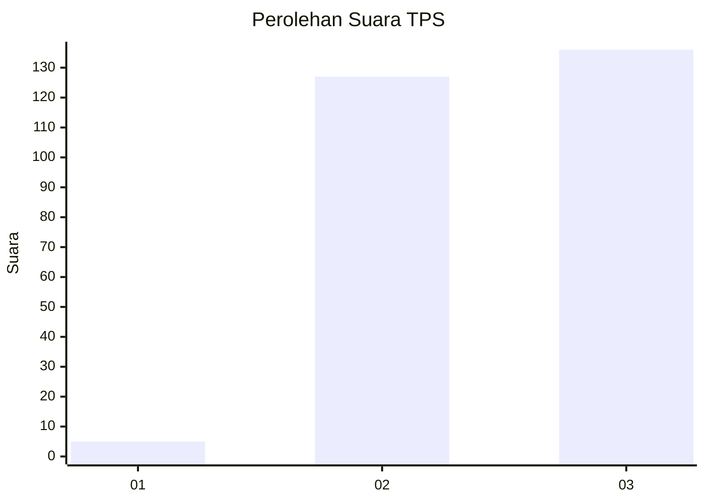
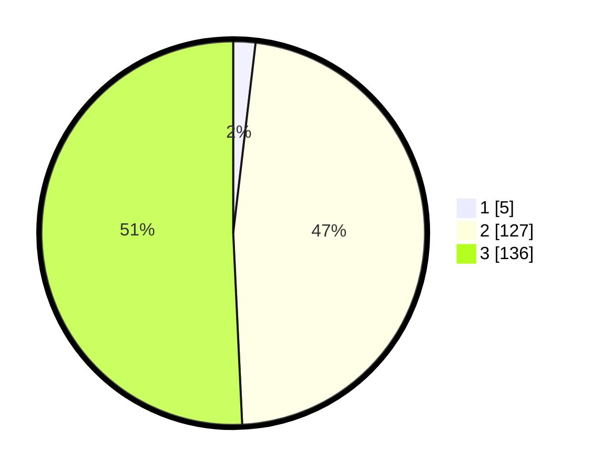

# Hasil

## Grafik

## Tabel

| No. | Nama Paslon    | Suara | Suara (raw) | Persentase |
|:--- |:-------------- | -----:| -----------:| ----------:|
| 1   | ANIES MUHAIMIN | 5     | [5][p-1]    | 1,87       |
| 2   | PRABOWO GIBRAN | 127   | [127][p-2]  | 47,39      |
| 3   | GANJAR MAHFUD  | 136   | [136][p-3]  | 50,75      |

[p-1]: https://github.com/gigit-pemilu/pemilu-2024-51-bali/blob/main/pilpres/hitung-suara/sub/51-bali/sub/03-badung/sub/02-mengwi/sub/2007-sembung/sub/004-tps/sub/paslon-1.txt
[p-2]: https://github.com/gigit-pemilu/pemilu-2024-51-bali/blob/main/pilpres/hitung-suara/sub/51-bali/sub/03-badung/sub/02-mengwi/sub/2007-sembung/sub/004-tps/sub/paslon-2.txt
[p-3]: https://github.com/gigit-pemilu/pemilu-2024-51-bali/blob/main/pilpres/hitung-suara/sub/51-bali/sub/03-badung/sub/02-mengwi/sub/2007-sembung/sub/004-tps/sub/paslon-3.txt

## Foto C Plano

https://sirekap-obj-formc.kpu.go.id/1629/pemilu/ppwp/51/03/02/20/07/5103022007004-20240218-102048--38eac7bc-7bed-46d9-a5c8-709440ccd5e7.jpg

https://sirekap-obj-formc.kpu.go.id/1629/pemilu/ppwp/51/03/02/20/07/5103022007004-20240218-102049--f091cc40-790f-49b6-9f80-2d67e9b78274.jpg

https://sirekap-obj-formc.kpu.go.id/1629/pemilu/ppwp/51/03/02/20/07/5103022007004-20240218-102048--9407de15-f044-4947-a591-a27ab2ce795b.jpg

## Metadata

| Key        | Value               |
| ---------- | ------------------- |
| Time Stamp | 2024-02-21 12:00:00 |

## DATA PEMILIH TETAP

Jumlah pemilih dalam DPT: **289**.
 * L: **147**.
 * P: **142**.

## DATA PENGGUNA HAK PILIH

Jumlah pengguna hak pilih dalam DPT: **272**.
 * L: **136**.
 * P: **136**.

Jumlah pengguna hak pilih dalam DPTb: **0**.
 * L: **0**.
 * P: **0**.

Jumlah pengguna hak pilih dalam DPK: **3**.
 * L: **2**.
 * P: **1**.

Jumlah pengguna hak pilih: **275**.
 * L: **138**.
 * P: **137**.

## JUMLAH SUARA SAH DAN TIDAK SAH

JUMLAH SELURUH SUARA SAH: **268**.

JUMLAH SUARA TIDAK SAH: **7**.

JUMLAH SELURUH SUARA SAH DAN SUARA TIDAK SAH: **275**.

