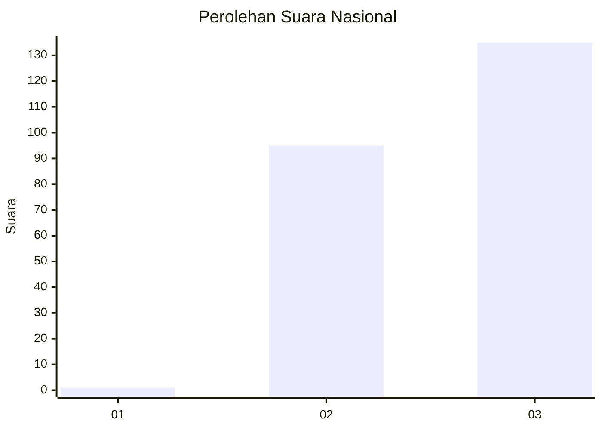
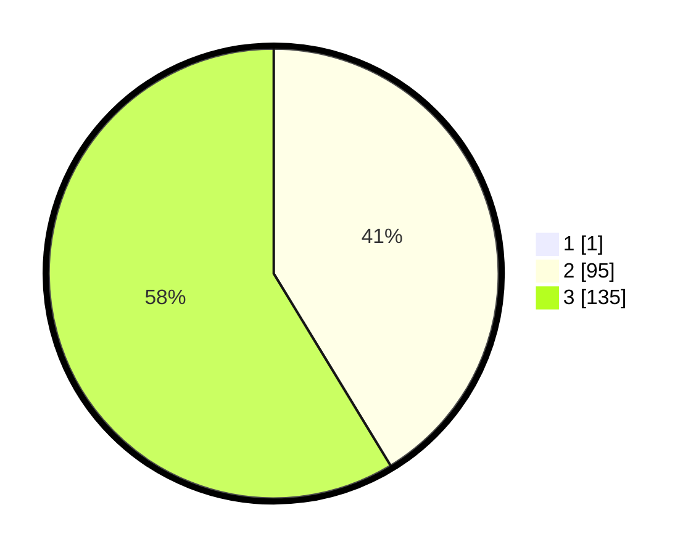

# Hasil

## Grafik

## Tabel

| No. | Nama Paslon    | Suara | Suara (raw) | Persentase |
|:--- |:-------------- | -----:| -----------:| ----------:|
| 1   | ANIES MUHAIMIN | 1     | [1][p-1]    | 0,43       |
| 2   | PRABOWO GIBRAN | 95    | [95][p-2]   | 41,13      |
| 3   | GANJAR MAHFUD  | 135   | [135][p-3]  | 58,44      |

[p-1]: https://github.com/gigit-pemilu/pemilu-2024/blob/main/pilpres/hitung-suara/sub/51-bali/sub/03-badung/sub/02-mengwi/sub/2007-sembung/sub/010-tps/sub/paslon-1.txt
[p-2]: https://github.com/gigit-pemilu/pemilu-2024/blob/main/pilpres/hitung-suara/sub/51-bali/sub/03-badung/sub/02-mengwi/sub/2007-sembung/sub/010-tps/sub/paslon-2.txt
[p-3]: https://github.com/gigit-pemilu/pemilu-2024/blob/main/pilpres/hitung-suara/sub/51-bali/sub/03-badung/sub/02-mengwi/sub/2007-sembung/sub/010-tps/sub/paslon-3.txt

## Foto C Plano

https://sirekap-obj-formc.kpu.go.id/ecd1/pemilu/ppwp/51/03/02/20/07/5103022007010-20240214-221358--2b2302be-f2ef-4f7a-ac19-8e89aa886d12.jpg

https://sirekap-obj-formc.kpu.go.id/ecd1/pemilu/ppwp/51/03/02/20/07/5103022007010-20240214-221430--b315bb30-9b82-4891-904e-64540e934f8c.jpg

https://sirekap-obj-formc.kpu.go.id/ecd1/pemilu/ppwp/51/03/02/20/07/5103022007010-20240214-221557--e2a53d76-f445-47df-8476-cdb7b729b392.jpg

## Metadata

| Key        | Value               |
| ---------- | ------------------- |
| Time Stamp | 2024-02-24 22:31:28 |

