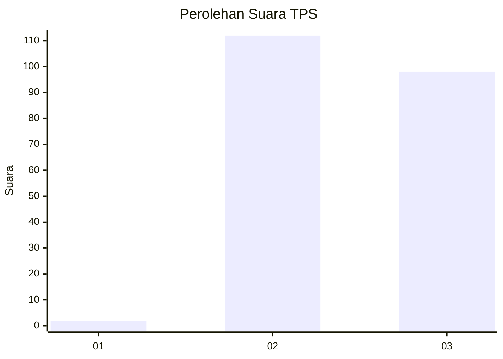
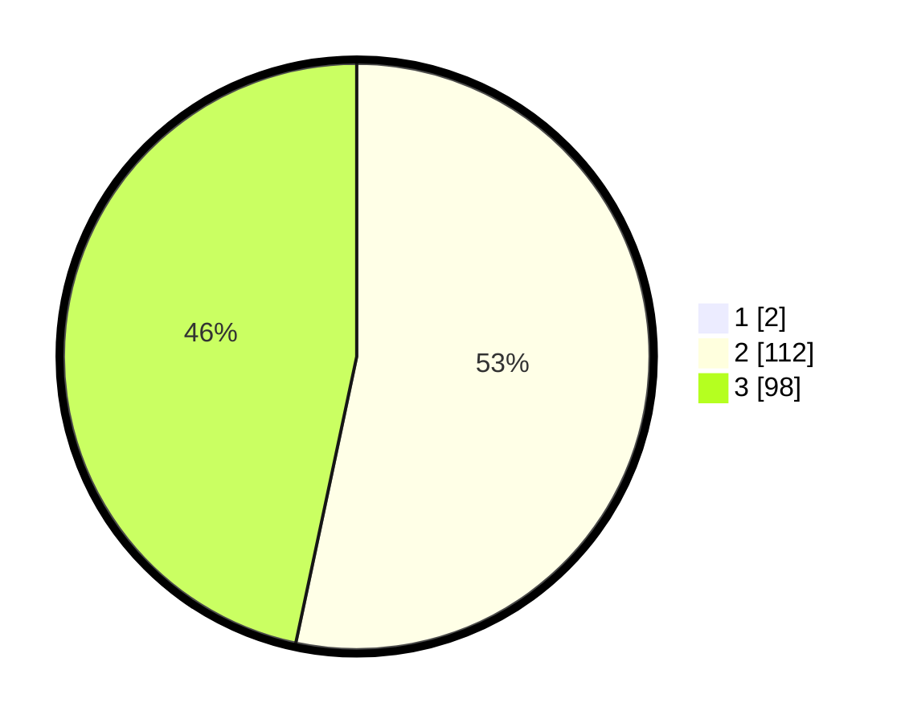

# Hasil

## Grafik

## Tabel

| No. | Nama Paslon    | Suara | Suara (raw) | Persentase |
|:--- |:-------------- | -----:| -----------:| ----------:|
| 1   | ANIES MUHAIMIN | 2     | [2][p-1]    | 0,94       |
| 2   | PRABOWO GIBRAN | 112   | [112][p-2]  | 52,83      |
| 3   | GANJAR MAHFUD  | 98    | [98][p-3]   | 46,23      |

[p-1]: https://github.com/gigit-pemilu/pemilu-2024-51-bali/blob/main/pilpres/hitung-suara/sub/51-bali/sub/03-badung/sub/02-mengwi/sub/2007-sembung/sub/012-tps/sub/paslon-1.txt
[p-2]: https://github.com/gigit-pemilu/pemilu-2024-51-bali/blob/main/pilpres/hitung-suara/sub/51-bali/sub/03-badung/sub/02-mengwi/sub/2007-sembung/sub/012-tps/sub/paslon-2.txt
[p-3]: https://github.com/gigit-pemilu/pemilu-2024-51-bali/blob/main/pilpres/hitung-suara/sub/51-bali/sub/03-badung/sub/02-mengwi/sub/2007-sembung/sub/012-tps/sub/paslon-3.txt

## Foto C Plano

https://sirekap-obj-formc.kpu.go.id/0cfc/pemilu/ppwp/51/03/02/20/07/5103022007012-20240218-103620--37a0a569-a665-41e5-96b5-d9b66fc509d3.jpg

https://sirekap-obj-formc.kpu.go.id/0cfc/pemilu/ppwp/51/03/02/20/07/5103022007012-20240218-114623--bde5dafa-0f5c-4e71-8591-6880f74d7b1c.jpg

https://sirekap-obj-formc.kpu.go.id/0cfc/pemilu/ppwp/51/03/02/20/07/5103022007012-20240218-081327--37cbe87c-d618-4968-b444-60df743a4dbf.jpg

## Metadata

| Key        | Value               |
| ---------- | ------------------- |
| Time Stamp | 2024-02-21 02:00:00 |

## DATA PEMILIH TETAP

Jumlah pemilih dalam DPT: **240**.
 * L: **120**.
 * P: **120**.

## DATA PENGGUNA HAK PILIH

Jumlah pengguna hak pilih dalam DPT: **214**.
 * L: **105**.
 * P: **109**.

Jumlah pengguna hak pilih dalam DPTb: **0**.
 * L: **0**.
 * P: **0**.

Jumlah pengguna hak pilih dalam DPK: **2**.
 * L: **1**.
 * P: **1**.

Jumlah pengguna hak pilih: **216**.
 * L: **106**.
 * P: **110**.

## JUMLAH SUARA SAH DAN TIDAK SAH

JUMLAH SELURUH SUARA SAH: **212**.

JUMLAH SUARA TIDAK SAH: **4**.

JUMLAH SELURUH SUARA SAH DAN SUARA TIDAK SAH: **216**.

