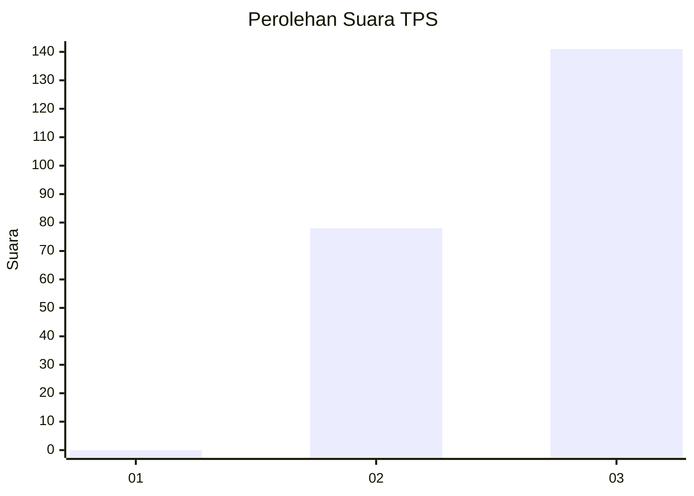
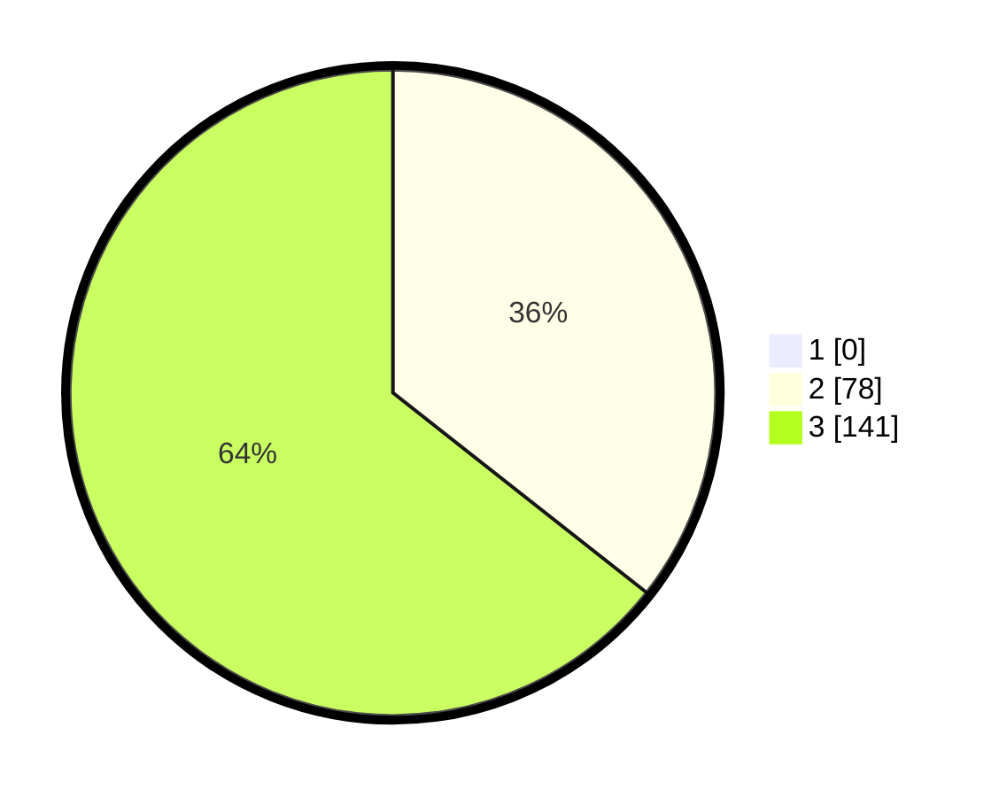

# Hasil

## Grafik

## Tabel

| No. | Nama Paslon    | Suara | Suara (raw) | Persentase |
|:--- |:-------------- | -----:| -----------:| ----------:|
| 1   | ANIES MUHAIMIN | 0     | [0][p-1]    | 0,00       |
| 2   | PRABOWO GIBRAN | 78    | [78][p-2]   | 35,62      |
| 3   | GANJAR MAHFUD  | 141   | [141][p-3]  | 64,38      |

[p-1]: https://github.com/gigit-pemilu/pemilu-2024-51-bali/blob/main/pilpres/hitung-suara/sub/51-bali/sub/03-badung/sub/02-mengwi/sub/2007-sembung/sub/014-tps/sub/paslon-1.txt
[p-2]: https://github.com/gigit-pemilu/pemilu-2024-51-bali/blob/main/pilpres/hitung-suara/sub/51-bali/sub/03-badung/sub/02-mengwi/sub/2007-sembung/sub/014-tps/sub/paslon-2.txt
[p-3]: https://github.com/gigit-pemilu/pemilu-2024-51-bali/blob/main/pilpres/hitung-suara/sub/51-bali/sub/03-badung/sub/02-mengwi/sub/2007-sembung/sub/014-tps/sub/paslon-3.txt

## Foto C Plano

https://sirekap-obj-formc.kpu.go.id/f2a6/pemilu/ppwp/51/03/02/20/07/5103022007014-20240215-205126--74897d70-d528-4f91-a075-cc55c1b62ea7.jpg

https://sirekap-obj-formc.kpu.go.id/f2a6/pemilu/ppwp/51/03/02/20/07/5103022007014-20240215-205254--c2ada8de-15b9-40a4-a7e7-b7cd4c6a6373.jpg

https://sirekap-obj-formc.kpu.go.id/f2a6/pemilu/ppwp/51/03/02/20/07/5103022007014-20240215-205459--f86834fb-f7f8-468c-9455-6c98736e57f5.jpg

## Metadata

| Key        | Value               |
| ---------- | ------------------- |
| Time Stamp | 2024-02-21 16:00:00 |

